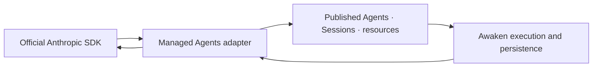

Choose this protocol when an application already uses the official Anthropic
SDK and you want that client to create and continue Agents and Sessions on
infrastructure your team operates.

If you are building a new application, begin with **[Run your first Awaken
Session](/docs/agents/get-started/)**. It provides the shortest tested path
from SDK setup to a Session returning to `idle`. This page explains the boundary
under that path.

## What changes, and what stays the same

| The application changes | The application keeps |
|---|---|
| SDK base URL, deployment authentication, and the applicable beta opt-in | Official SDK request and response types inside the tested compatibility boundary |
| Where the service is deployed and operated | Agent and Session resource identities |
| Provider, Worker, Environment, Sandbox, and storage configuration behind the API | Session events, history, and continuation through the Managed wire |

The exact tested SDK version, required beta headers, supported resource
families, known differences, and Awaken extensions have one owner:
**[Anthropic SDK compatibility](/docs/agents/compatibility/)**. Read that page
before migrating an existing client. Compatibility with a tested wire surface
is not a claim that Awaken implements every Anthropic API or provides the same
hosted service.

## Static structure: one wire adapter, one runtime

`awaken-protocol-managed` is the anti-corruption boundary for Anthropic
vocabulary. It owns wire DTOs, request validation, response projection, and the
HTTP router. It calls the existing Session runtime and does not construct a
second runtime or keep a second Agent and Session store.

The same published Agent, Session identity, permission decisions, and committed
events remain available to Console and to other protocol adapters.

## Dynamic behavior: from request to committed event

1. The adapter validates authentication, the route family's beta opt-in, and
   the Managed Agents request shape.
2. It resolves the published Agent and Session through the existing application
   and persistence ports.
3. A Worker executes the selected Native, ACP, or A2A backend.
4. The runtime commits events before the adapter projects them into event
   history and SSE.
5. Validation, placement, and execution failures use the Managed Agents error
   envelope. An unsupported backend is never selected as a silent fallback.

## Verify the connection before adding features

Create one Session with a recognizable input. Keep its id, stream events until
the Session returns to `idle`, and confirm that Console shows the same id, Agent,
status, and committed history. This proves the client and the self-hosted runtime
are observing one Session. It does not prove broader SDK compatibility; use the
canonical compatibility page for that decision.

Continue with **[Run your first Awaken Session](/docs/agents/get-started/)**.

## Reference

- [Anthropic SDK compatibility](/docs/agents/compatibility/): tested versions,
  beta headers, differences, and extensions
- [Public HTTP API](/docs/agents/reference/api/): canonical route-family index
- [Sessions and events](/docs/agents/concepts/sessions-and-events/): Session
  lifecycle and committed event model
