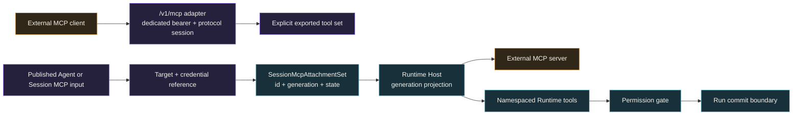
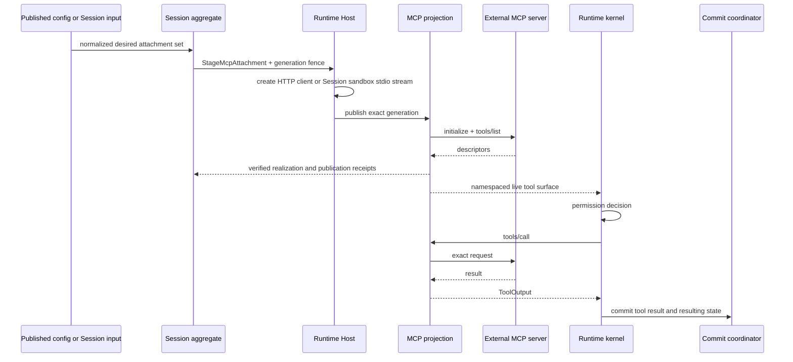

MCP connects in two directions. Choose the direction before configuring a
transport or credential.

| Goal | Awaken's role | The connection is ready when |
|---|---|---|
| Let an external MCP client call Awaken management tools | MCP server | The client initializes `/v1/mcp`, and `tools/list` contains only the explicit export set |
| Let an Awaken Agent call an external MCP server | MCP client and host | The exact namespaced tool id, its permission decision, and its committed result appear in the Session trace |

The two directions share tool governance, but they are separate connections.
Success in one direction says nothing about the other.

## What the current MCP integration supports

Awaken currently negotiates MCP revisions through `2025-11-25`. The table below
describes product behavior, not the presence of a wire type in the codebase.

| Capability | Agent connects to an MCP server | External client connects to Awaken |
|---|---|---|
| Tool discovery and calls | Supported. Tools use `mcp__server__tool` ids and the Agent's MCP ToolSet policy. | Supported for the explicit export set. |
| Transport | Streamable HTTP and Session-owned sandbox stdio. | Streamable HTTP with `POST`, `GET`, and `DELETE`; stdio is available to an embedded server. |
| Catalog changes | Tool changes refresh the live namespaced catalog. Prompt and Resource notifications are consumed at the transport boundary. | `tools/list_changed` is emitted when the export source changes. |
| Progress | Conditional. The transport can receive `notifications/progress`, but imported tools do not yet project those updates into Session Events or Trace. | Supported when the exported tool implements the progress interface and the caller supplies a `progressToken`. |
| Cancellation | Conditional. Replacing or draining a generation stops local admission and in-flight futures; peer cancellation delivery is not yet a product guarantee. | In-progress requests accept `notifications/cancelled`. |
| Prompts | Optional. Enable **Prompts as Skills** for the integration. | Not exported by the current tools-only server. |
| Resources | `resources/list` and `resources/read` exist at the transport boundary, but they are not yet an Agent input journey. | Not exported by the current tools-only server. |
| Sampling, Elicitation, and Roots | Not advertised by the current product composition. | Not advertised. |
| MCP Tasks | Not advertised or implemented. | Not advertised or implemented. |

MCP Tasks and Awaken background tool execution solve related but different
problems. MCP Tasks is a negotiated protocol extension between two MCP peers.
Awaken background execution is a Runtime policy for selected existing tools; it
does not add `tasks/get`, `tasks/update`, or `tasks/cancel` to an MCP connection.
The current MCP project describes Tasks as an
[experimental extension](https://modelcontextprotocol.io/extensions/tasks/overview),
so support must be negotiated and tested explicitly rather than inferred from a
`taskSupport` field.

The Console MCP page shows this same platform baseline. A configured binding is
not a live capability probe: run a real Session before relying on a particular
server's optional behavior.

## Static structure: the protocol boundary does not own authority

A healthy transport or a visible tool grants no Agent authority. Every model
call must still match a published descriptor and pass the existing permission
path. The server adapter does not enumerate the Runtime registry, so shell tools
and tools imported from another MCP server are not exported by accident.

## Awaken as an MCP server

Set a non-empty `mcp_bearer_token` in `config.toml` before startup. Without it,
the public `/v1/mcp` route is absent. When configured, every request must carry
the matching `Authorization: Bearer …` value.

| Method | Path | Purpose |
|---|---|---|
| `POST` | `/v1/mcp` | Send one JSON-RPC message; `initialize` creates a protocol session |
| `GET` | `/v1/mcp` | Open the SSE notification stream for an initialized protocol session |
| `DELETE` | `/v1/mcp` | End the protocol session named by `Mcp-Session-Id` |

`initialize` cannot carry an existing `Mcp-Session-Id`. Later requests use the
id returned by the server. The body is one JSON-RPC object, not a batch, and
bearer validation happens before protocol-session creation.

The current pre-release interface uses this configured bearer as its
authentication boundary. Do not present it as an implementation of MCP's full
OAuth authorization profile. Put the route behind the deployment's normal
network and identity controls before exposing it beyond a trusted boundary.

## Awaken consuming an external MCP server

The current 1.0-dev path accepts either an HTTP(S) target or an explicit
`sandbox_stdio` command from published Agent or Session input.

- An HTTP target has a canonical URL identity and may bind an exact credential
  reference.
- A sandbox stdio target has a secret-free command and argument identity. The
  executable is resolved and launched in the frozen Session Environment, not on
  the Runtime Host. Its credentials use an explicit secret-environment binding,
  not an HTTP-style target credential.

Both forms become secret-free `McpAttachmentDraft` values. The Session aggregate
owns the attachment id, generation, and state. Runtime must return a receipt that
matches the complete stage request before that generation becomes active.
Publication and drain effects use the exact `McpGenerationRef`, never the server
name alone.

In Console, configure this under **Agent → Build → Skills & MCP**. One MCP
server has one MCP ToolSet policy. Its default controls whether newly discovered
tools are available and whether they require approval. A named tool override can
narrow that default. The connection and policy must remain paired; a draft with
a missing, duplicate, or orphaned pair fails validation.

The attachment lifecycle is normal system behavior. A successful realization
moves from `Requested` to `Realizing` to `Active`; replacing an active generation
moves the old one through `Draining` to `Removed`. A request removed before
realization can go directly to `Removed`, and a realization error ends in
`Failed`. Reconciliation and receipt checks advance or reject these transitions.
The states are not repair instructions for an external maintainer.

A temporary Environment-readiness failure is retained for fenced system retry.
It can surface as `503` while the durable Session remains in `rescheduling`; do
not turn that state into an MCP repair procedure.

## Dynamic behavior: discover, authorize, call, commit

For an imported server, verify the published server and credential binding, the
exact tool id in the Session trace, the permission decision, and the committed
tool result. `tools/list` alone proves discovery, not authority or persistence.

## Troubleshooting

Only use this table for a failure that survives the system behavior above and
has a public correction.

| Symptom | Check | Action |
|---|---|---|
| Session creation returns `400 invalid_request_error` or names an unknown Vault id | Read the response type and message; compare the MCP target, server name, Environment policy, and Vault id with the submitted request | Correct the request or binding, then create a new Session |
| Updating an existing Session returns `500 api_error` | Read the Session again. The previously active `agent.mcp_servers` binding remains visible when the replacement could not be staged; compare the submitted target and credential references with the intended values | Correct any mismatch, then send the same `POST /v1/sessions/{id}` update once. If the values were already correct, stop and collect the evidence below |
| A new Session returns `500 api_error` and no Session is readable | Confirm that this is not the temporary `503` readiness case | Stop retrying and record the time, route, Agent and Environment ids, HTTP status, and error type and message for support |

If the table does not resolve the problem, record the exact command or route,
time, stable Agent or Session id when one exists, HTTP status, and response error.
Do not include bearer tokens, credential material, or unredacted request bodies.

Continue with **[Use MCP tools](/docs/agents/runtime/how-to/use-mcp-tools/)** for the
embedding recipe.

## Reference

- [Protocol connection matrix](/docs/agents/protocols/connect/)
- [Sessions and events](/docs/agents/concepts/sessions-and-events/)
- [Capabilities and permissions](/docs/agents/runtime/explanation/capability-and-permissions/)
- [Model publication and credential execution boundary](/docs/agents/reference/provider-model-config/)
