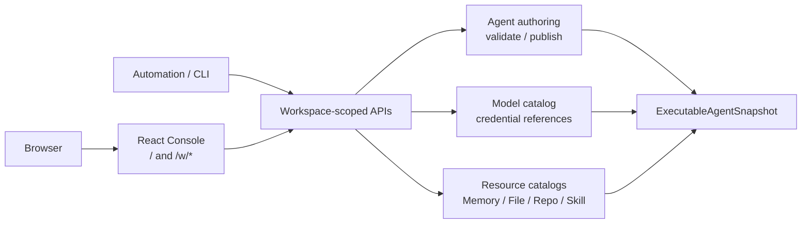
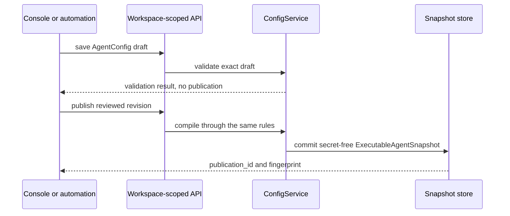

Use the Console for an interactive change you want to inspect before publishing.
Use the management API for automation, reviewable payloads, and repeatable
environments. Both paths call the same Workspace-scoped services and publish the
same `ExecutableAgentSnapshot`; the Console is not another configuration store.

| What you need to do | Path | Finished when |
| --- | --- | --- |
| Explore or review a change interactively | start `awaken` or `awaken all-in-one`, then open `/` | validation passes and the intended revision is explicitly published |
| Apply the same change from automation | call the management API with a trusted Workspace identity | the API returns the `publication_id` and `fingerprint`, and your automation records them |

The process serves the embedded React application at `/` and `/w/*`. Exact
routes belong to the [public API index](./api), and exact management fields belong
to the [generated OpenAPI contract](./management-openapi).

## Static structure

## One configuration lifecycle

The Agent editor stores a mutable `AgentConfig` draft. `validate` performs a
read-only check through the same resolution and compilation rules as publish;
`publish` creates the content-addressed, secret-free
`ExecutableAgentSnapshot`. Sessions and Workers consume only published
snapshots, never Console form state or mutable defaults.

MCP, Skill, and multi-Agent selection are fields of `AgentConfig`. Default File,
Memory, and Repository inputs are maintained by
`/v1/config/agents/:agent_id/resources`. Awaken has no `Project` scope
and no `/v1/config/projects/*` configuration branch.

Saving a draft and passing validation do not publish it. Closing the browser does
not lose an accepted write because the API and domain store, not form state, own
the result.

## Authenticate before writing

Every management request should resolve to a trusted Workspace at the edge. Use
`identity_mode = "no-login"` only for an explicitly local machine. With
`identity_mode = "self-managed"`, `/v1/config/*` and `/v1/vaults/*` use bearer
`ApiToken` or `x-api-key`; stored tokens are argon2id hashes. First boot over an
empty `data_dir` writes a bootstrap admin token to `<data_dir>/admin-token` with
owner-only permissions. `identity_mode = "awaken-cloud"` delegates identity to
the configured Cloud boundary.

Credential values enter sealed storage only on creation. Reads, catalogs,
publications, and audit views remain secret-free. Process environment is not a
provider or credential configuration source for the product command.

Only surfaced failures require action:

| Observable result | What the system has already done | What you do |
| --- | --- | --- |
| `401 authentication_error` | rejected the request before a configuration write | provide a current bearer token or `x-api-key`; on first self-managed boot, read the bootstrap token from the protected file |
| `403 permission_error` | authenticated the caller and refused the operation or foreign Workspace | use the intended Workspace and an authorization that permits the requested action |
| validation failure, `agent_publication_unresolvable`, or a stale source/resource revision | created no new executable registration | retrieve the current draft and resource revisions, correct the named fact, validate again, then publish explicitly |
| `503 agent_registration_unavailable` | kept the immutable publication if storage had already succeeded; it did not invent a second fingerprint | wait for registration readiness, then repeat the same publish; the retry reuses the durable fingerprint, and startup recovery also replays durable registrations |
| `409 agent_registration_conflict` | preserved the conflicting durable facts and refused to choose one silently | stop the publish; record the problem `code`, `detail`, Workspace, Agent id, and expected source/resource revisions before comparing the current configuration |

Do not repair domain storage after one of these responses. A rejected write has
not become a partial Console-only configuration, and a registration retry does
not require deleting its durable publication.

## Route ownership

To keep the Console page, procedures, and route reference from maintaining
three drifting inventories, this page no longer duplicates individual endpoints:

- [Public HTTP API](/docs/agents/reference/api/) is the canonical route-family index.
- [Configure providers, models, and credentials](/docs/agents/how-to/configure-providers-models-credentials)
  owns the executable procedure.
- [Model publication and credential execution boundary](/docs/agents/reference/provider-model-config)
  explains publication-time and run-time contracts.

## Code coordinates

- `web/src/`: React Console
- `crates/bin/awaken-cli/src/console_assets.rs`: embedded assets
- `crates/control/awaken-config-service/src/config_service.rs`: Agent draft, validation, and publication
- `crates/control/awaken-admin-config-api/src/router.rs`: catalog, credential, and resource configuration
- `crates/control/awaken-control/src/authz.rs`: management-route authorization map
