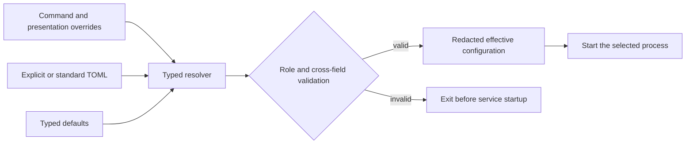
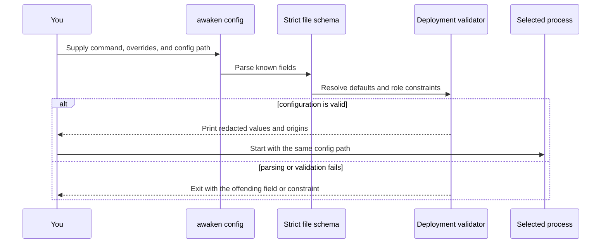

Choose the process you need before writing TOML. Use one file for that process,
validate the effective result, and start the same command with the same file.

| Task | Command | Configuration boundary |
| --- | --- | --- |
| Evaluate the complete local product | `awaken all-in-one` | Combined Control, Coordinator, Resources, local Worker, Console, and protocol APIs |
| Run authoring and publication separately | `awaken control` | Control stores and its authenticated Coordinator boundary |
| Run Session and Worker coordination separately | `awaken coordinator` | Coordinator stores, dispatch, commit, and its authenticated Control boundary |
| Add execution capacity | `awaken-worker --config <path> --server <url>` | Strict, database-free Worker schema |
| Prepare shared server schemas | `awaken database migrate --config <path>` | Explicit migration step before application processes |

Do not copy fields between these boundaries. The strict schema rejects unknown
or role-incompatible values instead of ignoring them.

## Value resolution

The `awaken` product command resolves exactly three sources, in order:

1. presentation overrides such as `--port`, `--data-dir`, and `--no-browser`;
2. an explicit `--config <path>` or the standard `~/.awaken/config.toml`;
3. typed defaults.

Process environment is not a deployment, model, business, or credential
configuration source. Use `awaken config` or `awaken config --json` to inspect
the effective, redacted result and value origins.



## Common fields

| TOML key | Purpose | Default / constraint |
| --- | --- | --- |
| `role` | `all-in-one`, `control`, `coordinator`, or `worker` | `all-in-one`; retired `serve`/`server` names are rejected |
| `mode` | `local` or `server` schema-lifecycle policy | `local` |
| `data_dir` | embedded data, generated local seal key, and local artifacts | `~/.awaken` |
| `bind` | service listener as `IP:PORT` | `127.0.0.1:8080` |
| `run_local_pool` | let AllInOne consume its own dispatch | `true`; AllInOne-only |
| `no_browser` | suppress browser opening | `false` |
| `suite_hub_url` | optional browser-console suite navigation | unset |
| `identity_mode` | `no-login`, `self-managed`, or `awaken-cloud` | deployment policy |
| `cloud_models` | `disabled` or `enabled` | `disabled`; enabled requires Awaken Cloud identity |
| `org_id`, `iam_workspaces` | local organization and allowed Workspace scope | validated typed values |

Unknown TOML fields fail parsing. Command-line role subcommands (`control`,
`coordinator`, `worker`) override `role` so the invoked process cannot silently
acquire a broader role from the file.

## Stores and schema lifecycle

| TOML key | Owner | Rule |
| --- | --- | --- |
| `runtime_database_url` | Coordinator dispatch/commit | PostgreSQL URL; required by split Coordinator |
| `resource_database_url` | Resources component | PostgreSQL URL for shared Resource content |
| `catalog_db`, `credential_db`, `config_db`, `admin_db`, `data_subject_db` | Control | embedded path or PostgreSQL URL |
| `environment_db`, `sessions_db`, `captured_content_db` | Coordinator | embedded path or PostgreSQL URL |
| `management_database_url_file` | AllInOne deployment shortcut | file containing one shared PostgreSQL URL; cannot be combined with per-store URLs |
| `postgres_max_connections` | shared PostgreSQL pools | positive integer |

Local mode migrates embedded stores during startup. Shared server deployments
must run this before application Pods:

```console
awaken database migrate --config /etc/awaken/config.toml
```

Application startup in server mode verifies the existing schema without writing
DDL. A Worker rejects all authority database fields. Control rejects Coordinator
execution databases; Coordinator rejects Control databases and the Control seal
key.

## Private service boundaries and secrets

| TOML key | Used by | Rule |
| --- | --- | --- |
| `coordinator_internal_url` | split Control | destination for exact executable-Agent registration |
| `executable_agent_registration_token_file` | Control and Coordinator | both read the same operator-projected least-scope bearer file |
| `control_internal_url` | split Coordinator | authenticated Control application boundary |
| `control_service_token_file` | Control and Coordinator | token file for that reverse boundary |
| `control_seal_key` / `control_seal_key_file` | AllInOne or Control | choose one; Worker and split Coordinator reject both |
| `mcp_bearer_token` | MCP export | the route is absent until non-empty |
| `cloud_iam_service_token_file` | Cloud identity integration | prefer file projection to inline token material |

`awaken config` never prints token values, database URLs, or seal-key material.

## Worker fields

The standalone process is `awaken-worker --config <path> --server
<coordinator-url>`; `worker_server` may supply the URL in TOML. Its config uses a
strict schema. The accepted fields are:

| TOML key | Purpose |
| --- | --- |
| `role`, `mode`, `worker_server`, `worker_server_ca_certificate_file` | optional role/mode assertions and the Coordinator connection |
| `worker_id`, `worker_zone`, `worker_build_digest`, `worker_capabilities`, `worker_max_concurrent` | Worker identity, placement facts, and capacity |
| `worker_request_credential_file` | Worker request authentication material |
| `worker_credential_material_root`, `worker_credential_trust_domain` | exact credential projection inside the Worker trust domain |
| `worker_admin_listen`, `worker_drain_grace_secs` | health/admin listener and graceful drain |
| `worker_credential_probe_interval_secs`, `worker_credential_observation_ttl_secs` | liveness observation; TTL must exceed the non-zero probe interval |
| `sandbox_tier`, `sandbox_dir`, `sandbox_allow_local_fallback`, `k8s_namespace`, `container_image`, `acp_clis` | the Sandbox subset accepted by the standalone Worker |

A Worker is database-free. It receives claim-fenced File, Memory, Skill,
Repository-verification, credential, and commit clients during registration.

## Product launcher execution, Sandbox, and wake fields

The following fields belong to the `awaken` product-launcher configuration. Do
not copy its warm-pool, proxy, package-builder, or wake fields into a standalone
`awaken-worker` file; the strict Worker schema rejects unknown keys.

| TOML key | Values / role |
| --- | --- |
| `sandbox_tier` | `local`, `namespace`, `docker`, `podman`, or `k8s`; default `namespace` |
| `sandbox_dir`, `container_image`, `container_forward_proxy`, `k8s_namespace` | Sandbox placement and container inputs |
| `sandbox_allow_local_fallback` | explicit opt-in; default `false` |
| `sandbox_warm_pool_size` | non-negative warm capacity; default `0` |
| `package_image_registry`, `package_registry_auth_file`, `package_registry_insecure` | derived-image repository, Worker-side registry credentials, and explicit insecure-registry opt-in |
| `package_image_builder` | `docker`, `podman`, or `k8s`; requires `package_image_registry` |
| `package_local_cache_ttl_secs` | non-zero local derived-image retention |
| `acp_clis`, `acp_default_cli`, `acp_session_blob_root` | accepted local ACP Brains and portable Session storage |
| `dispatch_wake` | `none`, `pg-notify`, or `nats` |
| `dispatch_wake_channel`, `nats_url`, `dispatch_owner` | wake channel/broker and unique claim owner |

See [Configure Sandbox tiers](../how-to/configure-sandbox-tiers) and
[Use a NATS wake signal](../how-to/use-nats-wake-signal) for task guidance.

## Observability and content capture

The product command reads `log_filter`, `log_format`, `trace_file`, the
`otlp_*` / `otel_*` fields, `content_capture`, and `content_redaction` from the
same TOML document. `log_format` is `text` or `json`; content capture is `off`,
`structured`, or `full`. Configure retention and privacy before enabling full
content capture.

## Minimal profiles

AllInOne local:

```toml
role = "all-in-one"
mode = "local"
data_dir = "/srv/awaken"
bind = "127.0.0.1:8080"
run_local_pool = true
no_browser = false
```

Database-free Worker:

```toml
role = "worker"
mode = "server"
worker_server = "http://awaken-coordinator:8080"
worker_credential_material_root = "/run/awaken/credentials"
worker_credential_trust_domain = "awaken.worker"
```

## Validate before startup



| Result | System behavior | Required action |
| --- | --- | --- |
| `awaken config --config <path>` prints the redacted configuration | The file, defaults, and command overrides form one valid profile | Review the effective role and paths, then start the same process |
| An unknown field, retired role, or incompatible field is reported | Validation stops before a service is started | Correct the named field or move it to the configuration owner shown above |
| A local profile needs embedded schema migration | Local startup applies it | None |
| A shared server schema is missing or stale | Application startup checks but does not write DDL | Run `awaken database migrate` with the same config, then start the application process |
| Startup reports that a listener address is already in use | Binding fails and the process exits; no alternate port is selected | Change `--port`, `bind`, or `internal_bind`, then start again |

Hand placement is deliberately absent from deployment TOML. A claimed Worker
realizes the Session's frozen Environment, and that Environment owns the one
Hand used by Native or ACP execution. The standalone `awaken-sandbox hand`
relay is a low-level execution primitive, not a second product placement path.
