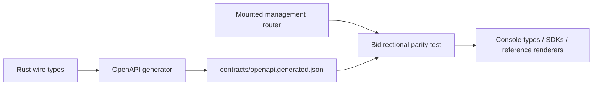

Use `contracts/openapi.generated.json` when you need to inspect a management
request, generate a client, or review an API change. It is generated from the
Rust wire types and checked against the router that the process actually mounts.
Do not copy its fields or operations into another reference.

The artifact is ready to consume only when both checks below pass:

```console
scripts/contract/generate-contracts.sh --check
cargo test -p awaken-admin-config-api --features schema --test openapi_contract
```

The first command proves that the committed artifact matches the generator. The
second proves that the document and the mounted router agree in both directions.

## Choose the owning contract

| You need | Use |
| --- | --- |
| Exact `/v1/config/*` fields and operations | `contracts/openapi.generated.json` |
| All application route families | [HTTP API](./api) |
| Managed Agents request and response types | the tested Anthropic SDK plus [compatibility](../compatibility) |
| AI SDK, AG-UI, A2A, ACP, or MCP payloads | the matching [protocol page](../protocols/) |

The generated contract covers provider connections, executable models,
credentials, pools, inference profiles, resolution, and Agent resource bindings
below `/v1/config/*`. Other surfaces keep their existing owners.

## Static generation chain



The wire types own schemas, the route registry owns operations, and the parity
test prevents either side from becoming a second, incomplete API.

## Change the contract

From the Awaken source checkout, regenerate the complete contract bundle:

```console
scripts/contract/generate-contracts.sh
```

The script writes the OpenAPI document, JSON Schemas, and TypeScript types from
the same source. The OpenAPI document declares `3.1.0`. Do not edit any generated
artifact by hand.

Then run the two checks from the opening. Their failure meanings are distinct:

| Check result | Meaning | Next action |
| --- | --- | --- |
| `--check` reports a stale artifact | source and committed generated files differ | regenerate, review the generated diff, and rerun the check |
| a documented operation returns routing `404` or `405` | the document names an operation the router does not mount | correct the route registry or mount before publishing |
| a mounted operation is absent | the running API has no generated contract entry | add it to the registry before generating clients |
| a schema reference does not resolve | the generated component graph is incomplete | correct the wire schema or generator |

These are change-gate failures, not runtime incidents. No action is needed when
both checks pass and a consumer can read the pinned artifact.

## Consume the artifact

```console
npx @redocly/cli lint contracts/openapi.generated.json
npx openapi-typescript contracts/openapi.generated.json -o management-api.d.ts
```

These commands are consumers, not additional contract owners. Pin the Awaken
source revision alongside generated clients so a deployment can reproduce the
exact schema it used.

## Related

- [Public HTTP API](./api): route-family map across all public surfaces;
- [Provider connection guide](../how-to/configure-providers-models-credentials): canonical provider write path;
- [Model publication and credential boundary](./provider-model-config): publication-time ownership and execution behavior.
