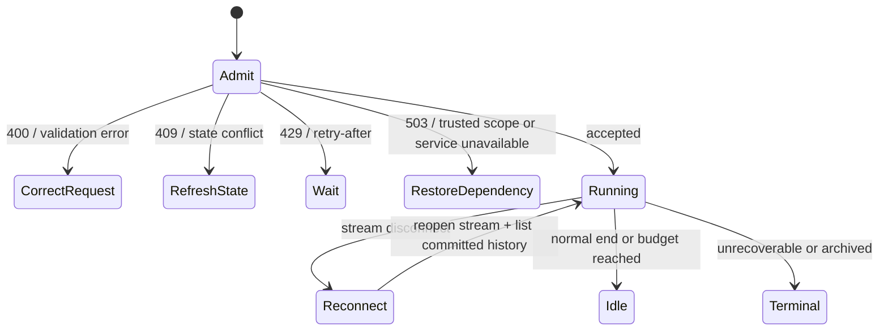

Start with the returned status and committed Session history. Many results that
look like faults are already handled by the system or are intentional policy
outcomes. Act only when the observable contract requires a changed request,
restored dependency, or explicit business decision.

## Decide whether to act

| Observable result | What Awaken does | What you need to do |
| --- | --- | --- |
| `429 rate_limit_error` with `retry-after` | rejects this admission while the bucket refills | wait for `retry-after`; keep the same idempotency key for the same create intent |
| stream disconnect | keeps committed history; live deltas remain previews | reconnect and list committed history; do not repair storage or replay deltas |
| temporary provider or tool failure followed by success | retries within the owning execution policy | nothing for that attempt |
| `session.budget_reached` | commits the transition once and stops the next model request | decide explicitly whether the work should receive a new budget |
| retry exhaustion | commits the documented terminal or indeterminate outcome | inspect committed facts only if the business intent still needs another attempt |
| lower-than-requested content capture with a reason | applies the deployment, request, and consent bounds | nothing unless an authorized policy or consent change is intended |
| repeated erasure receipt | returns the idempotent result without recreating data | nothing |

These cases need no repair procedure. The sections below define the limits and
the smaller set of surfaced results that can be corrected.

## Static structure

| Concern | Authority | Observable contract |
| --- | --- | --- |
| Managed request admission | organization-scoped limiter after trusted Workspace resolution | create/read buckets, response headers, `429 rate_limit_error`, `retry-after` |
| Session cost admission | Session-root budget state and immutable price snapshot | cumulative `session.usage`, one `session.budget_reached` transition, no new model request past the ceiling |
| Runtime failure | owning protocol and application service | typed status and error envelope; no silent backend or credential fallback |
| Content capture | deployment ceiling × request × data-subject consent | effective capture never exceeds the lowest permitted level and includes a reason |
| Erasure | neutral data-subject aggregate | idempotent receipt reporting the number of removed records |

Self-hosted deployments own the persistence, backups, retention jobs, identity,
network, and secret-management controls that realize these contracts. Hosted
delivery may supply those controls, but it must not change the application-visible
state machine.

## Request limits

The default Managed API buckets are organization-scoped:

| Operation class | Default capacity |
| --- | ---: |
| Create operations | 300 requests per minute |
| Read operations | 1,200 requests per minute |

Metered responses include `anthropic-ratelimit-requests-limit`,
`anthropic-ratelimit-requests-remaining`, and
`anthropic-ratelimit-requests-reset`. A rejected request also includes
`retry-after`. If the edge cannot resolve a trusted Workspace scope or the limiter
is unavailable, admission fails closed with `503`; it does not fall back to a
caller-invented tenant.

## Session budgets and usage

A Managed Session or Deployment may set a USD list-cost ceiling. The amount is a
positive canonical integer string in minor currency units. Awaken freezes the
price inputs used by the budget, reconciles cumulative model and tool usage, and
emits `session.usage` snapshots.

When cumulative list cost reaches the ceiling, Awaken commits
`session.budget_reached` once and stops admitting the next model request. The
Session can return to `idle` with a budget stop reason; reaching a budget is not a
successful business outcome and does not erase prior history.

## Dynamic behavior

Only the following outcomes require a correction outside automatic convergence:

| Evidence | Required action |
| --- | --- |
| `400 invalid_request_error` | correct fields, beta selector, count, or state precondition; do not retry unchanged |
| `409` conflict | retrieve current resource/version, recompute the command, and retry only if the intent still applies |
| `503 api_error` | confirm trusted Workspace resolution and deployment readiness; restore the unavailable dependency before retrying |
| explicit dead letter | fix the recorded cause, then requeue one named Run only when repeating its external effects is safe |

A `503` is fail-closed. Repeating it unchanged does not create a valid Workspace
or restore an unavailable service. An explicit dead letter is also not produced
by ordinary retry exhaustion: it exists only after a reviewed quarantine command.

## Content capture and erasure

Effective capture is the meet of three independent bounds: typed deployment
ceiling, caller-requested level, and data-subject consent. No consent caps a full
request at structured capture; granting consent does not force a caller to request
full capture. Ambient environment variables are not a second configuration path.

Awaken extends User Profiles with `POST /v1/user_profiles/{id}/erasure`. The command
requires the User Profiles beta, returns an erasure receipt, and is idempotent. An
unknown subject has no erasure authority and returns `404` instead of fabricating a
successful deletion.

The receipt is the completion signal. A zero count for an existing subject is a
valid result, including on a repeated command; it is not evidence that a hidden
cleanup procedure must be run.

## Related

- [Deploy and operate Awaken](../how-to/self-host): topology, stores, migrations, secrets, and rollback;
- [Production reliability](../concepts/production-reliability): dispatch, fencing, recovery, and side-effect boundaries;
- [Managed Agents compatibility](../compatibility): beta selectors and compatible resource families.
