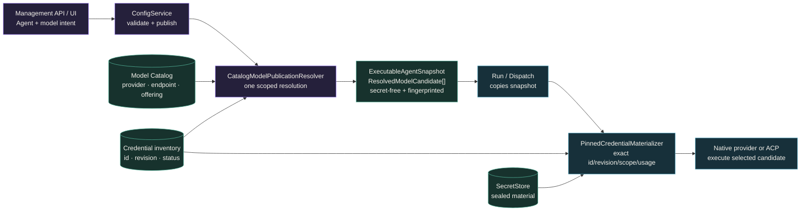
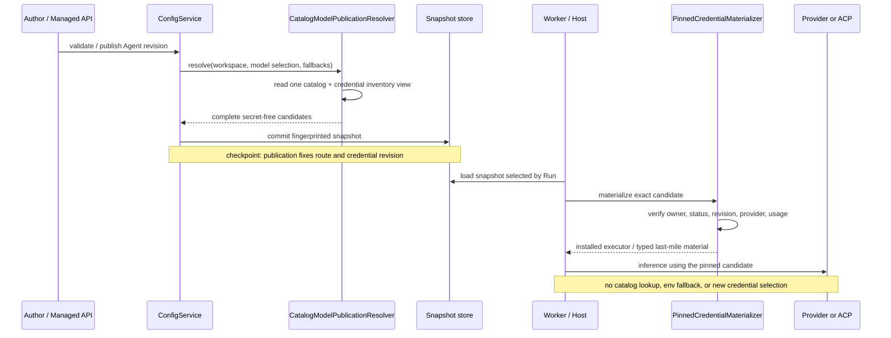

Use this page when you need to answer two questions before publishing an Agent:

1. Which provider route, endpoint, and credential revision will each candidate use?
2. Can execution change that choice after the Agent is published?

The answer to the second question is no. **The configuration plane selects; the
execution plane realizes exactly.** Publishing an Agent freezes its model,
provider route, endpoint, credential reference, and ordered fallback candidates
into an `ExecutableAgentSnapshot`.

Operational API steps live in
[Configure providers, models, and credentials](/docs/agents/how-to/configure-providers-models-credentials/)
and are not repeated here. This page owns the architecture and contract boundary.

## Decide where the change belongs

| Intended change | Change it in | Required finish |
| --- | --- | --- |
| provider metadata, endpoint, or offering | Model Catalog and Provider Connection path | validate and republish the Agent |
| credential material or status | credential store through the management API | validate the exact candidate and republish when its pinned revision changes |
| primary model or ordered fallback | Agent model selection | validate and publish a new Agent revision |
| one Run after publication | nowhere in the catalog | execute the frozen candidates or return a typed failure |

## Static structure: one publication is the execution input

| Owner | Facts it owns | It must not do |
|---|---|---|
| Model Catalog | providers, protocol endpoints, offerings, model attributes | store plaintext or decide a Run's terminal state |
| Config publication | resolve authoring intent into complete candidates and fingerprint it | pass unresolved references to Runtime |
| `ResolvedModelCandidate` | complete `ModelBinding`, versioned route pin, Workspace scope, exact `CredentialAccess`, endpoint | carry plaintext |
| Materializer | validate and open the credential already named by the snapshot | enumerate credentials, change revision, or select another route/holder |
| Runtime / ACP adapter | execute the selected candidate | read the catalog, fill configuration from process env, or downgrade silently |

`ModelBinding` is the small runtime identity:
`provider_identity_ref + model_ref + backend_ref`. `ResolvedModelCandidate` adds
the provisioning facts needed for execution while remaining secret-free. Local
providers, compatibility gateways, and self-hosted endpoints are the same
`Provider` case; only explicit embedded or test composition uses `HostExecutor`.

## Dynamic behavior: select once, then validate exactly

Model-only authoring (only `model_ref`) is completed at publication only: exactly
one Active offering must match. No match or ambiguity rejects publication, and
explicit provider/backend axes are never rewritten. Primary and fallback order
are fingerprinted too; execution cannot search a global catalog for replacements.

## Read the outcome before changing configuration

| Observable outcome | System behavior | Required action |
| --- | --- | --- |
| publication reports no match or more than one match | no snapshot is published | make the model selection unambiguous, then validate again |
| a temporary attempt fails and retry succeeds on the same endpoint | the selected candidate remains unchanged | none; this is normal retry behavior |
| a frozen fallback candidate succeeds | execution uses only the next published candidate | none for that Run; review the primary later only if the pattern persists |
| materialization rejects credential owner, status, revision, provider, or usage | execution fails closed before using other credential material | repair the named credential fact and publish a snapshot that pins the intended revision |
| every frozen candidate is exhausted | the Run reaches its documented failure or indeterminate outcome | inspect the committed Run before deciding whether a new attempt is safe |

Do not search the global catalog or inject an environment value to make one Run
continue. That would create a second selection path and make replay describe a
different execution from the published fingerprint.

## Implemented boundary in 1.0-dev

- `ConfigService` requires a `ModelPublicationResolver`; there is no implicit
  provider fallback.
- `CatalogModelPublicationResolver` produces complete, secret-free
  `ResolvedModelCandidate`s inside one Workspace.
- `CredentialKind::Env` remains decode-only for legacy data; creation and
  materialization fail closed. Environment inspection can only propose
  secret-free authoring data.
- Native and ACP share `PinnedCredentialMaterializer`, which checks the exact
  credential id, revision, Workspace, provider, status, and usage.
- Management inference-profile and credential-pool resolution is a
  **pre-publication dry-run**. It can test catalog wiring, but it is not a second Run authority;
  the publication is authoritative.

Inference retry and published candidate fallback are distinct. Retry repeats a
temporary failure on one selected endpoint; fallback may only move to another
complete candidate already frozen into the snapshot.

## Related

- [Configure providers, models, and credentials](/docs/agents/how-to/configure-providers-models-credentials/)
- [Select models and ACP runtimes through the API](/docs/agents/how-to/select-models-and-acp-runtimes/)
- [Agents architecture](/docs/agents/concepts/architecture/)
- [Governance](/docs/agents/concepts/governance/)
