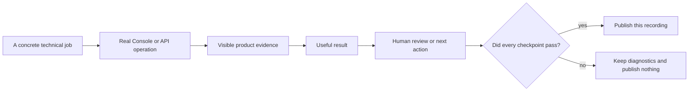

These six videos answer different product questions. Pick the question that matches
your work rather than watching them in order.

The demonstrations use controlled test inputs. The SDK calls, Sessions, Console
state, tool execution, approval boundaries, restarts, and artifacts come from a
running release build. Some stories use a fixed Agent response so the demonstration
does not depend on a model deciding whether to call a tool. The video states this
when it applies. These are product demonstrations, not customer deployments.

## Choose a story

| Story | Job shown | Evidence you see | What you learn |
| --- | --- | --- | --- |
| Evidence to decision | Read a fixed evidence file and return a reviewable decision | Read-only input, tool trace, grounded `HOLD`, next actions, and retained approval authority | Awaken can deliver a traceable result instead of an answer with no source |
| Build entirely in Console | Configure an API compatibility reviewer, test a breaking contract diff, then publish the reviewed Agent | Model, instructions, tools, permissions, resources, context, both protocol views, the compatibility result, and publication diff | Consequential Agent controls are visible and reviewable in the UI before the exact revision becomes reusable |
| Connect with the Anthropic SDK | Start work from an Anthropic Managed Agents client and inspect the same Session in Console | Official SDK request, committed events, one Session identity, and Console readback | An existing backend can connect without creating a second history model |
| Human-controlled action | Inspect a pinned repository source and prepare a protected review artifact | Source revision and hash, completed read, pending write, human approval, and downloadable artifact | An Agent can reach a consequential tool while a person keeps authority |
| Survive restart | Restart Awaken while an approved work item waits, then continue it | Original Session, pending approval, new AllInOne process, one resumed write, and attached artifact | Accepted work and its approval boundary survive routine service recovery |
| Scheduled operation | Turn a repository snapshot into a recurring exception report | Read-only snapshot, Deployment, Run once, separate result Session, and human next action | A tested Agent can become repeatable work without becoming an opaque cron task |

Together, the videos cover the main journey: build an Agent, connect an application,
run real work, keep authority over protected actions, recover committed work, and
schedule a repeatable operation.

## What makes a video publishable

A public story has a concrete job, a useful result, a visible human-control point,
and a clear next action. It does not need a fictional customer, job title, deadline,
or emergency to make the work sound important.

The recording is current only when a fresh release run reaches every checkpoint.
If a dependency, product action, or assertion fails, the run keeps its diagnostics
and rejects the recording. An older successful file cannot stand in for the failed
run.

The source evidence for this page establishes the product mechanisms, not whether
a particular MP4 passed. Recording commands stay with the release assets and are
not published on this page. When a checkpoint fails, that run does not establish
the claimed effect and publishes no current recording.

## Check what the video proves

Before you rely on a demonstration, confirm four things on screen:

1. The opening names the job and the result you will receive.
2. Each claim points to visible Console or API evidence.
3. The result closes the loop with an artifact, decision, or next action.
4. The recording identifies the Awaken revision used for verification.

Use [Get started with Awaken](/docs/agents/get-started/) to reproduce the basic
journey. Continue with [build an Agent](/docs/agents/how-to/configure-agent-behavior/),
[connect an application](/docs/agents/protocols/), or
[manage a Session](/docs/agents/how-to/manage-a-session/) for the workflow shown in
the video you selected.

Review the implementation in the
[Awaken repository](https://github.com/AwakenWorks/awaken). If the evidence is useful
to your evaluation, star the repository so other teams can find it.
