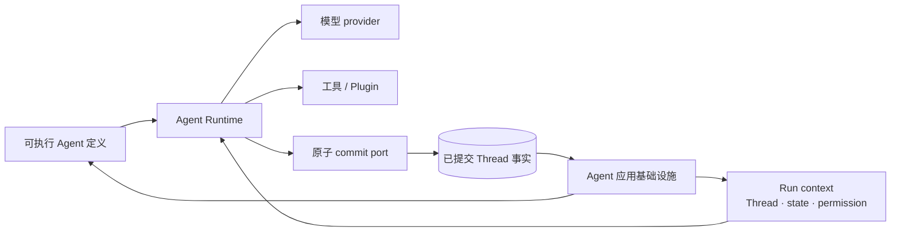
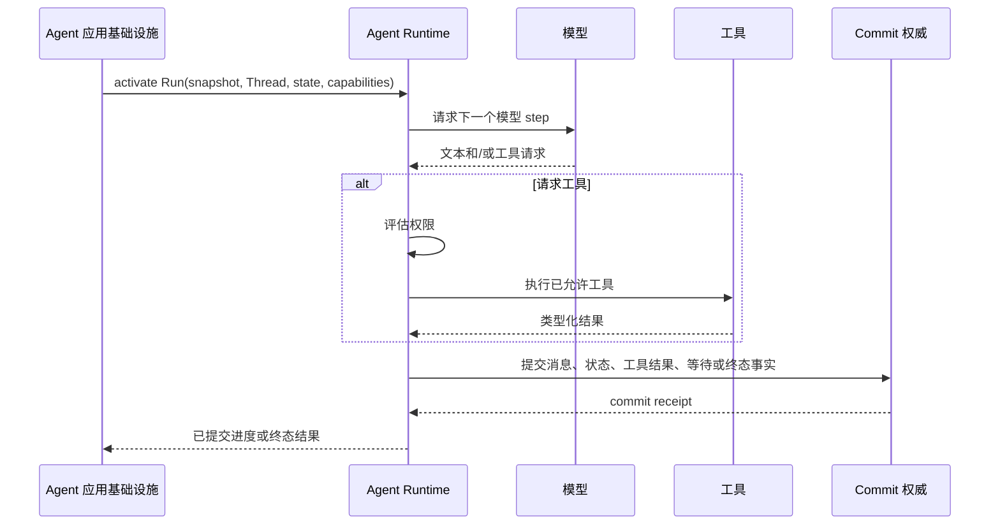

**AI Agent Runtime** 是运行 Agent 模型与工具循环的执行层：它应用权限决定、推进
类型化状态，并提交每个 step 产生的事实。它使用可执行 Agent 定义与 Run context，
但本身并不等于完整的、面向用户的 Agent 应用。

## Runtime 边界

| Runtime 拥有 | 外围 Agent 应用平台拥有 |
| --- | --- |
| 模型调用与流式输出 | 已发布 Agent 的身份与 revision |
| 工具选择、权限 gate 与工具结果 | 持久 Session identity 与面向客户端的 event |
| 执行期间的类型化状态变化 | 分派、Worker 放置与 Sandbox 生命周期 |
| 通过 commit port 完成原子 step commit | 认证、协议 API、恢复操作与管理能力 |

这一区分很重要：一个本地 loop 可以成功执行，但并未解决发布、重连、恢复、隔离和运营；
反过来，平台也不应为每种 API 协议重新实现一套 Agent loop。

## 静态结构

Runtime 通过窄接口取得能力。持久权威留在 loop 之外，因此重试或另一台 Worker 可以依据
已提交事实重建执行，而不是依赖进程内存。

## 动态行为

事实提交前发生的失败不会变成持久历史。恢复从最后一批已提交 Thread 事实和适用的工具
恢复策略开始。准确的 claim、重试与不确定副作用规则由[生产可靠性](./production-reliability)
说明，不在本定义页重复。

## Awaken 的实现

**Awaken Runtime** 是 **Awaken Agents** 内部的 Rust 执行内核，拥有 Agent loop、
工具、类型化状态、权限检查、Plugin 与分阶段原子提交。Awaken Agents 在它周围增加持久
Session、发布、协议 adapter、Worker、Sandbox、配置和恢复。

选择所需层级时，阅读[Framework、Runtime 与 Agent 应用基础设施的区别](./framework-runtime-infrastructure)。
只有需要扩展执行行为时才进入 [Runtime 内部机制](/zh/docs/agents/runtime/)；需要接入应用时，
从[运行第一个 Awaken Session](/zh/docs/agents/get-started/)开始。
