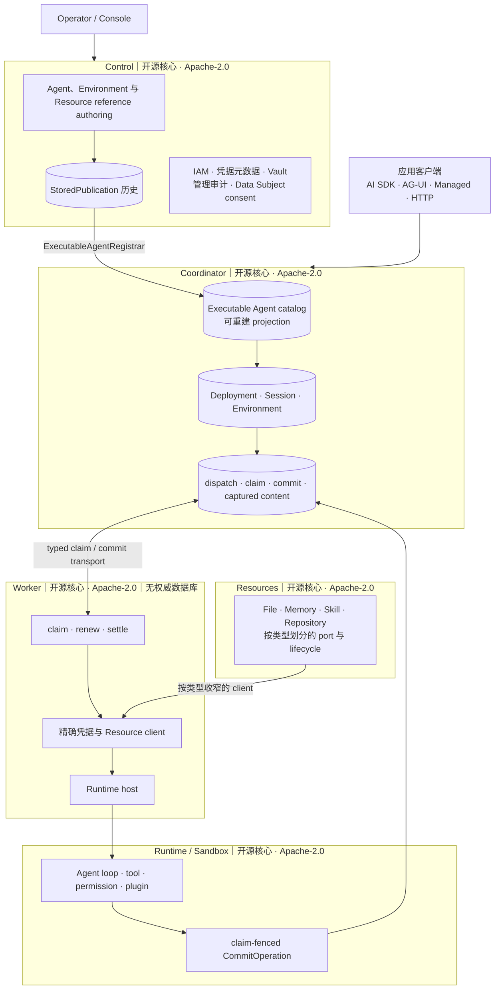
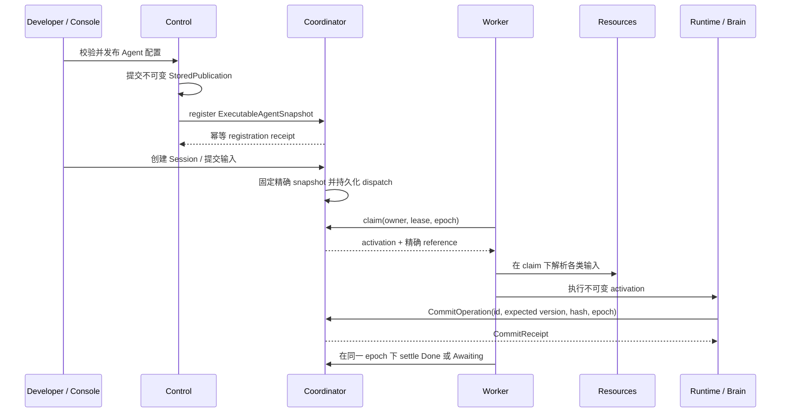
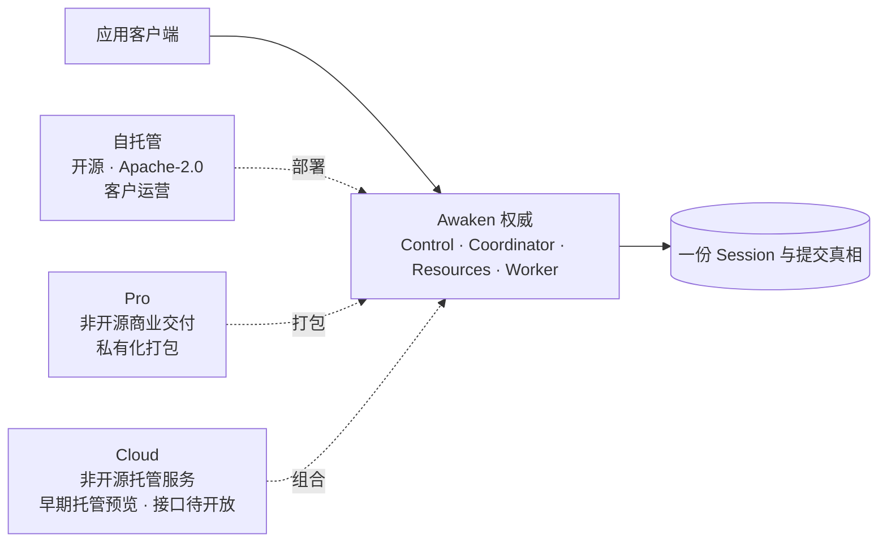

这张整体架构先回答三个实际问题：应用接入哪里，工作完成后由谁保存事实，以及哪些组件
需要你的团队运营。Awaken Agents 的执行核心以 Apache-2.0 开源；Awaken Pro 与 Awaken
Cloud 是围绕同一核心提供的非开源商业交付，不会复制另一套 Agent 或 Session 真相。

需要决定 Awaken 应运行几个进程时，本地评估或一个可信团队使用从
`awaken all-in-one` 开始；当管理人员、扩缩容要求或信任边界不同时，再拆分 Control、
Coordinator 与 Worker。Agent 的发布和执行方式不会随部署形态改变。

## 先选择部署形态

| 你要做什么 | 从哪里开始 | 哪些部分不变 |
| --- | --- | --- |
| 在本地评估 Awaken，或供一个可信团队使用 | `awaken all-in-one` | Agent 发布、Session 历史、Resource 所有权和 Runtime 提交路径 |
| 让管理与配置远离实时执行 | 分开运行 Control 与 Coordinator | Control 仍发布不可变 Agent revision；Coordinator 仍拥有 Session 与 dispatch 状态 |
| 扩展执行容量，或按环境隔离工作负载 | 增加独立 Worker 与 Sandbox | Worker 仍从 Coordinator claim 工作，并通过同一提交协议返回结果 |
| 提供托管或专属企业部署 | 用相同服务组合 Pro 或 Cloud | 交付形态增加运维与 policy，不增加第二个 Agent catalog 或 runtime |

如果要在一台机器上部署，下一步进入
[自托管指南](/zh/docs/agents/how-to/self-host/)。如果要修改配置如何变成一次
Agent 运行，读完本页后进入[从配置到已提交执行](./configuration-to-execution)。
如果要升级旧版 Runtime 或本地 Server，请先使用
[Awaken 1.0 迁移指南](/zh/docs/agents/how-to/migrate-to-1-0/)；本页继续作为其引用的部署模型权威。

本文只说明全局 context map。发布到提交的精确状态机见
[从配置到已提交执行](./configuration-to-execution)；租约、重试与恢复见
[生产可靠性](./production-reliability)。Runtime loop 的细节见
[Runtime 内部文档](/zh/docs/agents/runtime/)。

## 静态结构：每项持久职责只有一个所有者

| 组件 | 持久权威 | 使用 | 禁止拥有 |
| --- | --- | --- | --- |
| Control | Agent authoring 与不可变 publication 历史；IAM；凭据元数据和变更；管理审计；Data Subject consent/accountability | `ExecutableAgentRegistrar`、Environment authoring、已认证的 Coordinator application port | Session、Deployment、dispatch、runtime commit、captured runtime content 或 Resource 内容 |
| Coordinator | executable-Agent registration；Deployment/DeploymentRun；Session；Environment 执行状态；dispatch、commit、replay、captured content | Control read/command port、Resources component、Worker transport | 可变 Agent authoring、凭据变更、Control seal key 或 Worker 本地执行状态 |
| Resources | Resource catalog 以及 File、Memory、Skill、Repository 各自的内容/lifecycle port | 精确 reference 与 claim context | 一个用可选字段容纳所有行为的通用 Resource service，或 Agent/Session 真相 |
| Worker | 临时 attempt 状态、lease、本地进程、mount 和已安装 client | Coordinator claim/commit 协议；按类型划分的 Resource 与凭据 client | 任意权威数据库、Control seal key、publication 历史或 Session 真相 |
| Runtime / Sandbox | Agent loop 行为、permission gate、tool effect、plugin 与暂存提交 | 不可变 `ExecutableAgentSnapshot`、live run context、commit port | 公共协议 DTO、publication workflow、dispatch 权威或产品 policy |
| AllInOne | 不引入新权威；组合相同的 Control、Coordinator、Resources 与可选 Worker builder | 同一组 port 的本地 adapter | 替代 store、warm-install 路径或第二个 Agent catalog |

因此，`ProcessStores` 是按角色收窄的 bundle，不是共享数据库句柄包。拆分的
Coordinator 不能打开 Control 的 catalog、credential、config、admin 或 Data
Subject store。拆分的 Worker 会拒绝所有权威数据库字段以及 Control 到
Coordinator 的私有 token。这些是配置错误，不只是建议。

## 产品边缘在执行前汇聚

协议 adapter 在边缘翻译 AI SDK、AG-UI、Managed Agents、A2A、MCP 与 HTTP
shape，不会为每个协议创建一套 Session 实现。所有被接受的输入都会汇入
Coordinator 的 Session/Run identity 与同一份已提交历史。

MCP、ACP 与 A2A 表示不同边界：

- MCP 向 Agent 暴露 tool 与 Resource；
- ACP 把外部 Agent harness 适配为 Brain attempt；
- A2A 委派远程 Agent task；
- Awaken Agents 原生执行内核运行内置 loop。

可以选择不同 Brain，但 permission 路径、claim fence、commit 权威和 Session
账本不会随之改变。

## 动态行为：发布与执行共享唯一规范路径

这条短序列背后没有另一条 fast path。本地发布使用 local registrar，拆分部署使用
已认证 HTTP registrar，但二者调用同一个 port。本地执行与远程 Worker 执行也使用
相同 activation 和 commit contract。

在应用界面，Session 要么告诉使用者 Awaiting Run 需要什么操作才能继续，要么显示已提交的
终态 `RunState`。精确状态和 event 属于[Session 与 event](./sessions-and-events)；本页只说明
这个结果在哪里变成权威事实。

## 一致性、重试与失败边界

- Control 先提交 `StoredPublication`，再注册。Coordinator 不可用时 publication
  历史仍然持久，同一 registration 可以安全重试。
- Registration 以 Workspace、Agent、source revision 幂等。同 fingerprint 收敛；
  同 identity 不同 fingerprint 失败即关闭。旧的精确 revision 仍可寻址。
- Session 创建固定已注册的精确 snapshot。Worker 不解析可变 draft 或 latest pointer。
- 执行前先持久化 dispatch。Wake signal 只降低延迟。
- Worker 使用 operation id、预期 Thread version、payload hash 与当前 claim epoch
  提交。旧 lease 不能追加真相，也不能替代新 owner settle。
- File、Memory、Skill、Repository 仍按类型 materialize。claim 丢失后禁止凭据
  materialization 与可变 Resource write-back。
- streaming output 是交互证据，不是持久权威；恢复和公共 replay 均来自已提交事实。

## Environment realization 不在 live Session 中安装 package

Coordinator 把 Environment revision 冻结进 activation；其中立 network 与 package requirement
通过 provisioning contract，只有 Worker 负责把它们转换成 Sandbox 实现。Container tier 根据
精确 base identity、package requirement 与冻结 resolution id 派生不可变 OCI image。

OCI registry 拥有 image 字节。Coordinator 拥有持久 image-build demand、state、
lease 与不可变 Registry digest；build Worker 或有界 rootless Kubernetes job
只执行构建，不取得 authority database。Registry credential 留在 Session 之外。
Environment preparation 可以延迟或拒绝 Session creation，但不能改写 Session 事实、
放宽 isolation 或创建第二个 Environment authority。

## 安全遵循同一组边界

安全链条连续生效：publication 校验 reference 并排除 secret material；协议入口认证
并限定 scope；placement 检查 Worker eligibility；Sandbox 选择执行 isolation floor；
Runtime permission gate 授权每次 tool 调用；commit fence 拒绝重复与 stale writer。

服务拆分同时缩小爆炸半径。Coordinator 只从 Control 获得不含 secret 的凭据 pin；
Worker 只得到投射到自身 trust domain 的精确 material，绝不会得到 Control seal key。
Data Subject consent 归 Control；captured runtime content 与 erasure adapter 归
Coordinator，二者通过已认证 application port 协作。

## 交付组合：自托管、Pro 与 Cloud 不创建新权威

交付方式改变运营责任，不改变产品的领域模型。

| 方式 | 组合关系 | 运营责任 | 当前公开边界 |
| --- | --- | --- | --- |
| 自托管 Awaken | 使用规范 AllInOne，或拆分 Control、Coordinator、Resources 与 Worker builder | 采用方负责部署、升级、安全、观测与恢复 | 开源 · Apache-2.0 |
| Awaken Pro | 围绕同一组 Awaken 权威进行离线或私有单租户打包 | 采用方与 AwakenWorks 共同明确私有化打包、集成、升级与运营责任 | 非开源商业交付 · [商务合作](/zh/enterprise#apply) |
| Awaken Cloud | 在 Awaken 周围组合 Product Workspace、provider routing 与用量服务 | 采用方与 AwakenWorks 在早期预览阶段共同验证托管运营边界 | 非开源托管服务 · 早期托管预览 · [公开接口待开放](/zh/enterprise#apply) |

Cloud 拥有订阅、Product Workspace、provider route、用量与冻结 charge 等商业和
多租户组合事实。它消费 Awaken 的精确产品契约，不复制 Agent 配置、publication、
Session、Run、Worker 或 commit store。Pro 的离线单租户交付遵循同一规则。因此：

1. Cloud entitlement 可以准入或拒绝新的产品工作，但不能成为 Session 真相；
2. provider usage fact 可以形成冻结 billing charge，但 billing 不能结算 Awaken Run；
3. 本地、Pro 与 Cloud adapter 必须进入同一组 publication、Session、dispatch、
   permission 与 commit port；
4. 部署标签不能证明生产可用性、支持或 SLA；这些必须通过独立资格判断和双方签署的
   责任边界确认。

## 架构不变量

1. Control 中只有一份不可变 publication 历史；Coordinator 中只有一份可重建的
   executable registration projection。
2. 无论客户端协议、Brain、Worker 或 Sandbox 如何变化，Session 与已提交事实权威唯一。
3. AllInOne 组合规范组件，不是另一套实现。
4. Worker 不持有数据库与业务权威。
5. Resource 保持按类型划分的 contract，不合并为通用 service。
6. queue、wake、stream 与 read projection 都不能成为执行真相。
7. Runtime extension 可以限制或暂存 effect，但不能绕过 permission 或 commit boundary。
8. Pro 与 Cloud 只在 Awaken 周围组合交付责任，不复制领域权威，也不引入第二条执行路径。

## 非目标

Awaken 不定义团队的业务 Workflow，也不判断业务结果是否可接受；这个决定属于
Workforce 或采用 Awaken 的应用。stream、queue、部署标签和 Cloud billing record 可以
观测、唤醒、打包或计费，但不会变成 Agent 执行事实。

继续阅读[从配置到已提交执行](./configuration-to-execution)，查看完整状态机与失败矩阵。
