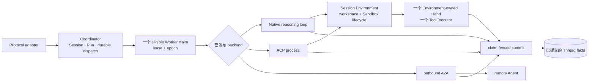
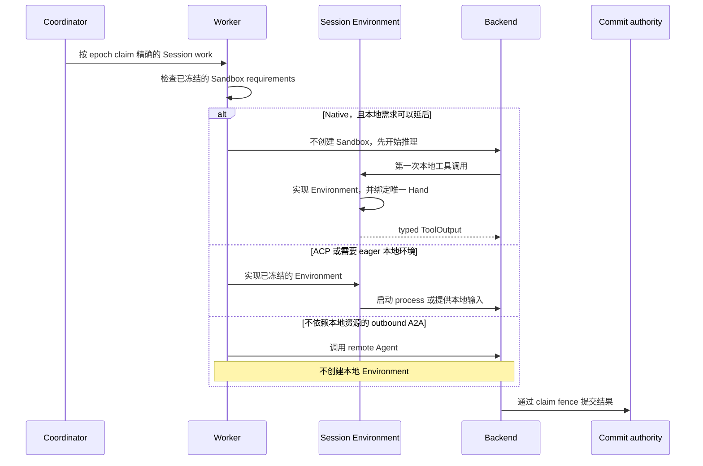

只有当工作依赖 filesystem、本地 process、已挂载资源或本地工具时，Session 才需要
本地执行环境。单纯的模型推理不需要 Sandbox。这样可以避免为从未使用本地能力的工作
创建环境，同时也不会形成第二条执行路径。

## 先判断哪些工作必须在本地执行

| Session 中的工作 | Environment 决定 |
| --- | --- |
| 不使用本地输入或工具的 Native 模型工作 | 使用 `on_tool_use` 时，无需 Sandbox 即可开始。 |
| 执行到本地工具的 Native 工作 | 在第一次本地工具真正执行前实现 Session Environment。 |
| 依赖挂载文件、Repository、可执行 Skill，或使用 `eager` policy | 在执行依赖这些输入前实现 Environment。 |
| ACP process | 在已经实现的 Session Environment 中运行；不接受延迟创建。 |
| 不依赖本地资源的 outbound A2A 调用 | 直接调用 remote Agent，不创建本地 Environment。若 Session 同时要求本地输入，则明确拒绝，不会静默切换 backend。 |

不变条件是一个 Worker claim、一个 Session Environment 和一个 tool executor。
Brain 与 Hand 表示同一条路径里的不同职责，不是可以独立调度的 service。

## 静态结构

| 所有者 | 拥有 | 不拥有 |
| --- | --- | --- |
| Coordinator | Session 与 Run 真相、dispatch、eligibility、claim epoch | live Sandbox 或 tool process |
| Worker | 一个 claimed attempt，以及由它实现的物理 Environment | Agent catalog 或持久对话历史 |
| Session Environment | workspace、Sandbox lifecycle、本地 process、一个 Hand channel | model selection 或 commit authority |
| Native backend | model loop；本地调用通过 Environment | 另一份工具放置决定 |
| ACP backend | 同一 Environment 内的外部 process | host-global 工作路径 |
| outbound A2A backend | 已认证的 remote Agent I/O | 本地 mount、本地工具或本地 Hand |

`ConnectionPlan` 只携带不含 secret 的 topology，不会选择另一只 Hand，也不会产生
另一位执行所有者。Agent publication 与部署配置同样没有单独的 Hand selector。

## 动态行为

`sandbox_provisioning` 属于已发布的 Environment policy。`eager` 会在 backend
需要环境前完成实现；`on_tool_use` 允许 Native Run 在没有 Sandbox 时开始，但本地
输入仍可能要求系统在第一次模型执行前完成实现。

Image preparation、capacity、mount、network、credential delivery 与 health check
是相互独立的实现阶段。冻结的要求无法满足时，placement 会失败关闭，不会回退到更弱的
Sandbox，也不会切换 backend。

## 系统会自动处理什么

空闲的 Hand 会休眠，但 Environment 与 workspace 的所有权不变。下一次尚未 dispatch
的本地调用仍由同一个 Environment 重建 Hand，不产生维护任务。采用 `on_tool_use` 的
Session 因此可能直到出现本地需求时才拥有 Sandbox。

工具已经 dispatch 后，如果 channel 丢失，系统不会静默 replay，因为外部效果可能已经
发生。该 Run 按[生产可靠性](./production-reliability)中的不确定外部效果规则处理。
Environment 一旦终态释放便不可恢复。

继续阅读[执行模式](./execution-modes)、
[配置 Sandbox tier](/zh/docs/agents/how-to/configure-sandbox-tiers/)与
[生产可靠性](./production-reliability)。Managed Agents 的精确 wire 差异由
[兼容矩阵](/zh/docs/agents/compatibility/)统一维护。
