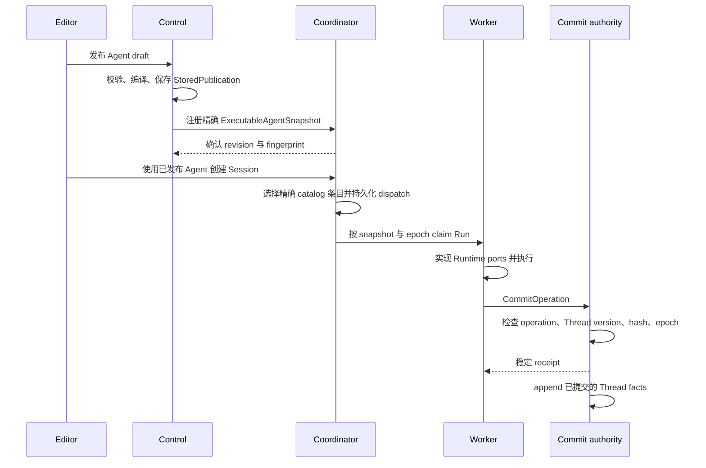

如果一次 Run 的行为与刚修改的 Agent 不一致，先查看该 Session 选择的 revision 与
fingerprint。Run 不会读取最新 draft，而会执行 activation 中携带的精确、不可变
publication。

## 沿着 revision 与 fingerprint 追踪

按以下顺序检查：

1. draft 已经通过校验，并保存为不可变 publication；
2. Coordinator 注册了相同 revision 与 fingerprint；
3. 创建 Session 时选择了 catalog 中的精确条目；
4. Worker 执行了 activation 携带的 snapshot；
5. 结果通过 claim-fenced commit 边界，成为已提交的 Thread facts。

这是一条路径，每个边界只有一个权威。Worker 不会再次读取 latest config，Thread 之外
也没有第二份 transcript。

## 静态结构

```mermaid
flowchart LR
    Draft["AgentConfig draft<br/>mutable · Control-owned"]
    Publication["StoredPublication<br/>immutable Control truth"]
    Snapshot["ExecutableAgentSnapshot<br/>revision + fingerprint"]
    Catalog["ExecutableAgentCatalog<br/>rebuildable Coordinator projection"]
    Activation["RunActivation<br/>Session + Run + exact snapshot"]
    Runtime["RuntimeRunContext<br/>process-local ports"]
    Commit["CommitOperation<br/>operation + version + hash + epoch"]
    Facts[(已提交的 Thread facts)]

    Draft -->|"validate · compile · persist"| Publication
    Publication -->|"注册精确值"| Snapshot
    Snapshot --> Catalog
    Catalog -->|"选择精确条目"| Activation
    Activation -->|"实现一个 attempt"| Runtime
    Runtime --> Commit --> Facts
```

| 边界 | 所有者 | 稳定 identity | 禁止包含 |
| --- | --- | --- | --- |
| Draft | Control authoring | Workspace 与 Agent draft revision | runtime handle 或 Session facts |
| `StoredPublication` | Control publication history | Workspace、Agent、source revision、fingerprint | plaintext credential 或 live registry |
| `ExecutableAgentCatalog` | Coordinator projection | 精确 revisions 与 current pointer | draft 编辑或 publication history 权威 |
| `RunActivation` | Coordinator dispatch | Session、Thread、Run、精确 snapshot、placement requirements | mutable Control state |
| `RuntimeRunContext` | Worker attempt | 当前 claim 与 attempt | 持久真相 |
| `CommitOperation` | Coordinator commit boundary | operation id、预期 Thread version、payload hash、claim epoch | 未经 fence 的写入 |

Catalog 可以由 publication 重建，不是另一份 authoring store。Worker 接收可执行值，
不会取得两份 store 中任何一份的访问权。

## 动态行为

AllInOne 与分离部署使用同一个 registrar command，只有 adapter 不同。启动 rehydration
也注册相同的精确 snapshot，不会安装第二条 whole-catalog 路径。

对于同一个 Workspace、Agent 与 source revision，registration 是 idempotent 的。相同
fingerprint 会返回已有结果；同一 identity 下出现不同 fingerprint 是 semantic conflict，
不会覆盖已有条目。

## 为什么 commit 可以安全重试

只有 stable operation id、预期 Thread version、payload hash 与当前 claim epoch 四项一致，
commit 才会被接受。响应不明确时，使用同一个 operation 与相同 bytes 重试会得到之前的
receipt。Payload 改变、Thread prefix 过期或 Worker epoch 过期都会失败关闭。

Accepted receipt 才是持久边界，不是 streamed token 或 queue status。另一个 Worker 可以
从已提交 prefix 恢复，无需读取 mutable Control state。

## 只处理 dispatch 之前明确返回的错误

| 明确返回的结果 | 仍然成立的事实 | 应该怎么做 |
| --- | --- | --- |
| Draft validation 或 compilation 失败 | 不存在新 publication | 修改错误中点名的字段或 dependency；原样重试不会有帮助。 |
| Publication 已保存，但 registration 暂时不可用 | 不可变 `StoredPublication` 仍在；catalog 条目尚不存在 | 恢复 Coordinator 连接，再重复同一 publish intent。 |
| 同一 registration identity 携带另一 fingerprint | 已有 catalog 条目不变 | 检查 source revision 与预期 publication，不要把 semantic conflict 当成暂时不可用。 |
| Session resolution 报告精确 revision 未注册 | 尚未产生 dispatch | 恢复该 publication 的 registration，或明确选择一个可用 revision。 |

Dispatch 之后，claim 丢失、commit response 丢失、过期 Worker 返回以及 retry exhaustion
由 queue、稳定 receipt、Thread version 与 claim epoch 自动处理，不是彼此独立的修复流程。
Persistent dependency failure、明确终态或不确定外部效果由
[生产可靠性](./production-reliability)说明。

## 验证一条执行路径

选择一个已发布 Agent，记录它的 revision 与 fingerprint。创建新 Session，确认 activation
携带相同 identity；运行一条容易辨认的输入，然后在重连后读取已提交结果。如果要验证
takeover，应在 dispatch 已持久化后中断 Worker，并确认下一次 attempt 从最后一段已提交
Thread prefix 继续。

完整组件图见 [Awaken 架构](./architecture)。精确字段与 route 见
[配置参考](/zh/docs/agents/reference/configuration/)和
[HTTP API 参考](/zh/docs/agents/reference/api/)。
