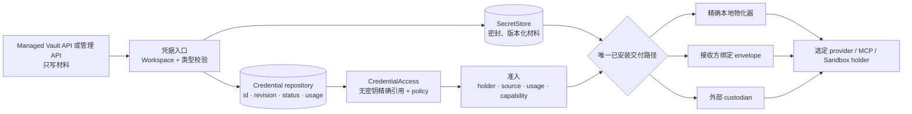
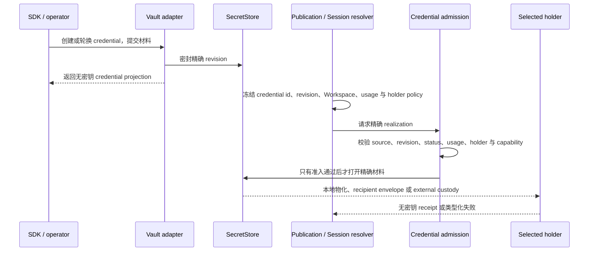

请在发布 Agent 或创建 Session 前选择凭据保管路径。不要把密钥材料写进 Agent 配置；
只发布精确的凭据引用，由已安装的保管路径在持有者通过准入后打开材料。

## 发布前选择一条凭据保管路径

| 部署方式 | 需要选择并承担什么 |
| --- | --- |
| 开源版或自托管 | 使用运营方 `SecretStore` 和选定 provider 或 MCP 路径所需的精确本地物化器；运营 seal key、备份、轮换、Worker 信任边界与审计。 |
| 云端托管 | 使用平台已安装契约具名的 recipient envelope 或 external custody 路径；平台说明保管与隔离边界，租户管理凭据生命周期和访问。 |
| 企业部署或客户自持保管 | 在部署 profile 中具名 KMS、Vault、网络边界、holder 与交付机制，并明确所有权、轮换、撤销、恢复和审计责任。 |
| 没有通过准入的 holder 或已安装交付路径 | 失败关闭，不回退到环境变量、另一份凭据或第二条材料路径。 |

发布前依次完成：

1. 通过只写 API 创建或轮换凭据。
2. 只保存返回的 credential id 和精确 revision，不保存明文。
3. 选择唯一已安装交付路径和允许的 holder。
4. 把无密钥引用冻结进 publication 或 Session。
5. 只有 source、revision、status、usage、holder 与 capability 全部通过准入后，才打开材料。

Awaken 因而把保存凭据和使用凭据分开。材料进入唯一 `SecretStore`；Agent publication
和 Session 只保存精确、无密钥的引用；执行确实需要时，指定 revision 才会到达一个经过
准入的最后一跳持有者。

本页是跨模型和 MCP 的凭据保管设计所有者。[模型发布边界](/zh/docs/agents/reference/provider-model-config/)
负责模型选择，[MCP](/zh/docs/agents/protocols/mcp/)负责 attachment realization；二者都不
定义另一个 SecretStore 或凭据交付路径。

## 静态结构：一个材料权威、一个选定持有者

| 所有者 | 拥有 | 禁止做 |
| --- | --- | --- |
| Managed Vault adapter | SDK DTO、Vault ACL、只写 secret 入口、无密钥响应 | 保留第二份材料或回传明文 |
| `SecretStore` | 精确 credential revision 的密封材料 | 选择模型、MCP server、Run 或明文持有者 |
| Credential repository | identity、revision、Workspace、status、type 与 usage metadata | 在公共记录中保存明文 |
| 发布或 Session resolver | 精确 `CredentialAccess` 与 allowed-holder policy | 把明文写进快照，或在执行期枚举替代凭据 |
| Material delivery composition | 本地、envelope 或 external custody 三者中的唯一一条路径 | 向两个保管边界披露同一份材料 |
| 最后一跳持有者 | 只为已准入的 target 与 usage 使用材料 | 把“持有”变成“授权”，或写入 event/log |

因此 Vault identity 不是授权。入口授权决定谁可以管理 Vault；发布策略决定可以引用哪一个
精确凭据；Runtime permission 仍决定受保护的工具动作是否可以执行。

## 设计考量

| 考量 | 设计决定 |
| --- | --- |
| 减少明文暴露 | API 响应、发布快照、Session baseline、dispatch envelope、event 和普通日志都不保存明文。 |
| 保证执行可重现 | 快照固定 credential id、revision、Workspace、usage 和 holder policy；执行期不重新扫描凭据。 |
| 避免双重保管 | 一次 realization 只能选择本地物化、recipient envelope 或 external custody 中的一条路径。 |
| 支持不同部署边界 | `SecretStore` 与最后一跳交付由部署组合安装，公共的 `CredentialAccess` 契约保持不变。 |
| 凭据不等于授权 | holder 有能力取得材料，只说明执行条件满足；入口授权和 Runtime permission 仍需分别通过。 |
| 失败时不降级 | revision、Workspace、status、usage、holder 或 capability 任一不匹配都返回错误，不回退到环境变量或其他凭据。 |

## 动态行为：先选择并冻结，再打开材料

轮换会产生新 revision，不会修改已经冻结的执行快照。凭据被撤销或归档、Workspace 或
revision 不匹配、holder 不受支持、envelope 过期或 custody publication 失败时都会失败关闭；
系统不会回退到环境变量、另一凭据或未密封的交付方式。

## 部署方式与责任边界

这些部署组合共用同一份公开 Vault contract，但可以安装不同的 SecretStore 和最后一跳
交付实现。具体责任由部署边界决定。

| 部署组合 | 材料权威 | 最后一跳物化 | 运营责任 |
| --- | --- | --- | --- |
| 开源版 / 自托管 | 运营方配置的 `SecretStore` | 由选定 provider 或 MCP 路径安装的精确本地物化器 | 配置 seal key、备份、轮换、Worker 信任边界与审计 |
| 云端托管组合 | 平台选定的 custody implementation | 为该 holder 安装 recipient envelope 或 external custody 中的一条路径 | 平台公开已安装的保管和隔离契约；租户管理 credential lifecycle |
| 企业部署 | 部署合同选择运营方或客户拥有的 custody | 部署 profile 固定精确 holder 与交付机制 | 明确 KMS/Vault 所有权、网络边界、轮换、撤销与恢复 |

具体商业部署必须声明实际安装了哪一种实现。除非部署合同明确约定，否则不能据此推断
特定 KMS、地域、HSM 或客户自持密钥能力。

## 兼容性说明

- Awaken 的 Vault 与 Credential CRUD、archive 和 MCP OAuth validation 使用兼容的
  Managed 路由与 DTO。
- Anthropic Managed Agents 定义了外部 wire；Awaken 另外定义 SecretStore、精确 revision、
  holder policy 和最后一跳物化。这些是内部执行与部署设计，不会增加 wire 字段。
- `vault_ids` 在创建 Session 时冻结，现有 Session 暂不支持更新。外部可见的完整差异见
  [Anthropic Managed Agents 兼容矩阵](/zh/docs/agents/compatibility/)。
