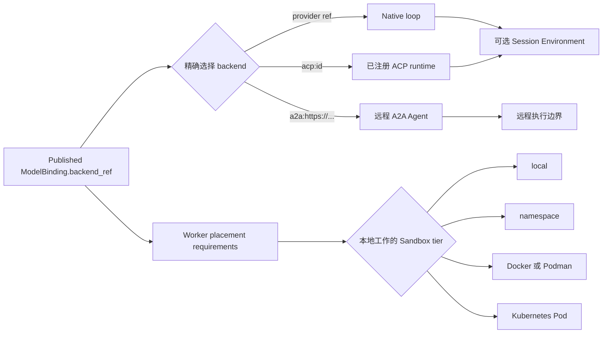
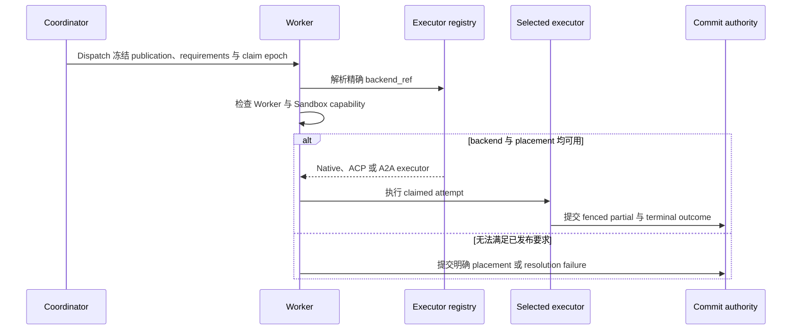

为每个已发布 Agent 做两个决定：谁负责 reasoning loop，以及本地文件、命令或工具可以在
哪里运行。两者相互独立。

| 要运行的工作 | 执行 backend | Sandbox 决定 |
| --- | --- | --- |
| 通过 Awaken loop 调用已配置模型 | Native | 只有工具或 Resource 需要本地执行时才增加 Environment |
| 使用受支持的 coding-agent CLI | 精确 ACP runtime，例如 `acp:codex` | 按隔离要求选择 `namespace`、`docker`、`podman` 或 `k8s` |
| 把整个 Agent 委托给另一套系统 | 已发布的 `a2a:<absolute-endpoint>` | 不要附加远程 Agent 无法接收的本地 Resource |

选择 ACP 不会提供隔离；选择 Sandbox tier 也不会改变已发布 backend。

## 静态结构

不可变 publication 拥有 `backend_ref`。`AttemptExecutorRegistry` 拥有一个 Native
executor 和精确注册的 ACP 或 A2A executor。Deployment 提供可用的 Sandbox 实现。
Session Environment 拥有 workspace、process lifecycle、mount、credential 与至多一个 Hand。

## Backend 边界

| Backend | 已发布 reference | 执行 owner | 选择规则 |
| --- | --- | --- | --- |
| Native | 不是 ACP 或 A2A 的 provider reference | Awaken 进程内 model 与 tool loop | 解析一条已配置 provider route |
| ACP | 精确 `acp:<catalog-id>` | 受监督外部 CLI | 精确匹配已注册 runtime |
| A2A | 精确 `a2a:<absolute-endpoint>` | 远程 Agent | 固定 endpoint 与 Agent Card contract |

Runtime 版本、credential、模型交付和持久化差异由
[ACP runtime 矩阵](/zh/docs/agents/protocols/acp/)维护；精确 API 语法由
[模型与 ACP selector 指南](/zh/docs/agents/how-to/select-models-and-acp-runtimes/)维护。

## Sandbox 边界

| `sandbox_tier` | 隔离边界 | 使用前提 |
| --- | --- | --- |
| `local` | 无 Sandbox 的 host subprocess | 显式启用并信任代码 |
| `namespace` **（默认）** | Linux user namespace 或 macOS Seatbelt | Host 支持可用，例如 Linux 上的 `bwrap` |
| `docker` | Docker container | 已启用 backend、daemon 与不可变 image |
| `podman` | Podman container | 已启用 backend、runtime 与不可变 image |
| `k8s` | Kubernetes Pod | 已启用 backend、cluster access 与不可变 image |

除非 deployment 显式允许 local fallback，Awaken 不会把无法执行的要求静默降级为
`local`。配置与验收步骤见[配置 Sandbox tier](/zh/docs/agents/how-to/configure-sandbox-tiers/)。

## 动态行为

只有当前 step 尚未提交 partial 且 policy 允许时，model candidate 才能 failover。
Candidate failover 不会改变 backend；缺少 `acp:codex` 注册时不能改用 Native。

## 系统会处理什么，何时需要动作

| 观察到的状态 | 系统行为 | 外部动作 |
| --- | --- | --- |
| Dispatch 短暂等待 eligible Worker | Durable dispatch 保持可领取状态 | 预期的 Worker 尚在注册过程中时无需动作 |
| Worker crash 或 lease expiry | Claim 与 epoch fencing 拒绝旧 owner；其他 eligible Worker 可以重领 attempt 并恢复已持久化 Resource | 除非 Environment 始终没有 eligible Worker，否则无需动作 |
| Model candidate 在 partial commit 前干净失败 | Runtime 尝试 policy 允许的下一个 candidate | 无 |
| 精确 backend 未注册，或 Sandbox minimum 无法执行 | Attempt fail closed，并提交明确 placement 或 resolution 结果 | 提供所需 Worker capability，或修正 publication；不要用更弱 fallback 掩盖不匹配 |
| Partial commit 后执行失败 | Runtime 保留已提交事实，不会换 provider replay 本 step | 先检查 terminal outcome，再判断新建 Run 是否安全 |

验收时检查已发布 `backend_ref`、effective Sandbox tier、Worker capability、resolved model
candidate 与已提交 Session outcome。它们说明实际执行选择；客户端协议不能说明这些事实。
