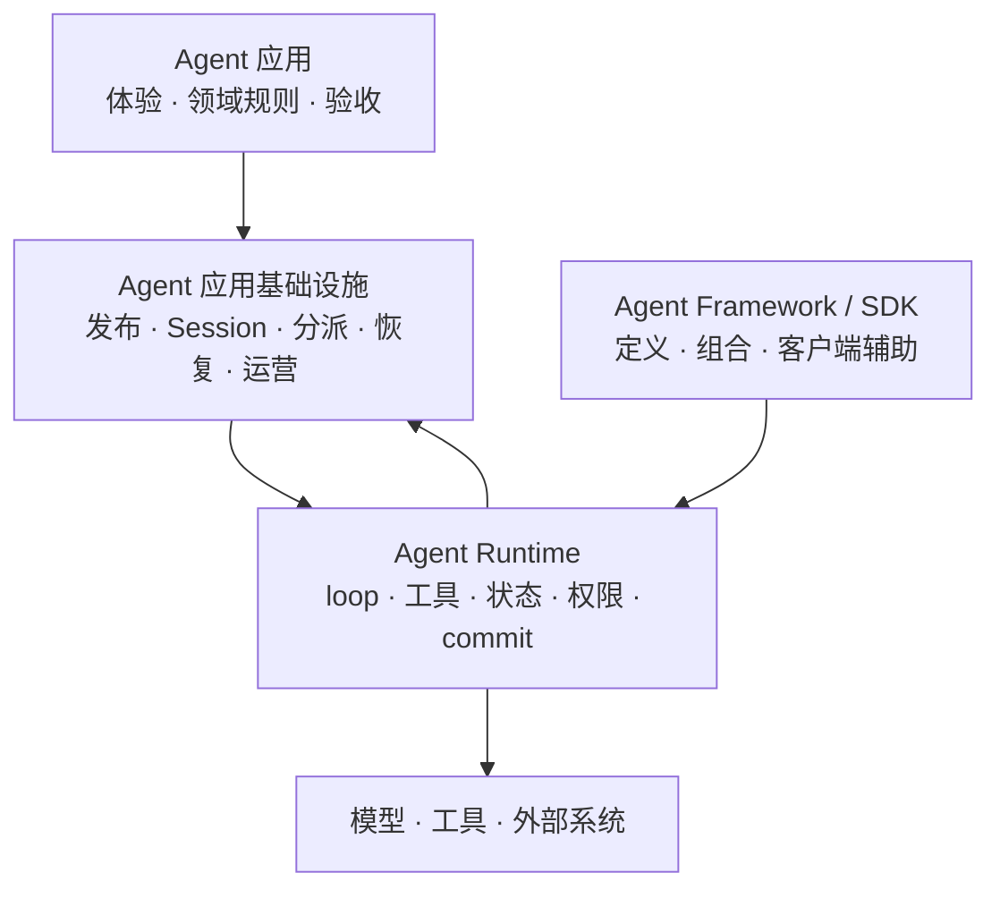
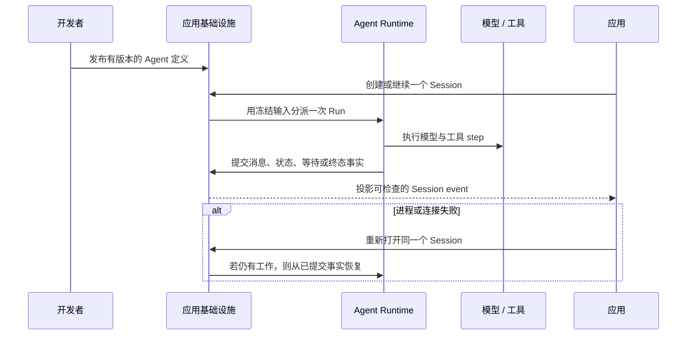

**Agent Framework** 帮助开发者定义 Agent 行为；**Agent Runtime** 执行这些行为；
**Agent 应用基础设施**则让结果可以跨用户、Session、部署、故障和运营边界持续使用。
一个产品可以同时使用三层，一个实现也可能覆盖不止一层。

## 比较责任，而不是产品标签

| 责任 | Agent Framework | Agent Runtime | Agent 应用基础设施 |
| --- | --- | --- | --- |
| 定义 prompt、工具和 Agent 组合 | 主要关注点 | 使用定义 | 发布定义并管理版本 |
| 运行模型与工具循环 | 可能提供本地 loop | 主要关注点 | 放置并监督执行 |
| 执行权限并提交类型化状态 | 取决于实现 | Runtime 责任 | 提供策略和持久权威 |
| 让面向用户的 Session 跨重连存在 | 通常留给应用 | 针对 Thread 或状态输入执行 | 主要关注点 |
| 将工作分派给 Worker 与 Sandbox | 通常由外部提供 | 使用执行环境 | 主要关注点 |
| 恢复、检查和运营已部署工作 | 通常由外部提供 | 暴露执行事实 | 主要关注点 |

这张表描述责任，不是产品合规评分。比较产品前，应先确认每个持久事实由哪一层拥有，
以及不同层是否在暗中保存互相竞争的副本。

## 静态结构

应用继续拥有客户体验和业务结果；基础设施拥有持久的应用生命周期；Runtime 拥有一条
执行路径。Framework 或 SDK 可以帮助编写行为，但不应因此成为第二套 Session 或恢复权威。

## 动态行为

## Awaken 位于哪一层

Awaken Agents 同时覆盖 **Runtime** 与 **Agent 应用基础设施**两层。Awaken Runtime
是内部的 Rust 执行内核；Awaken Agents 在它周围增加已发布 Agent、持久 Session、
协议 adapter、Worker、Sandbox、配置和恢复。它不会取代上层应用的产品界面、领域模型
或验收规则。

继续阅读[什么是 AI Agent Runtime？](./agent-runtime)了解 Runtime 边界，阅读
[Session 与事件](./sessions-and-events)了解持久身份，并通过[系统架构](./architecture)
确认部署责任。
