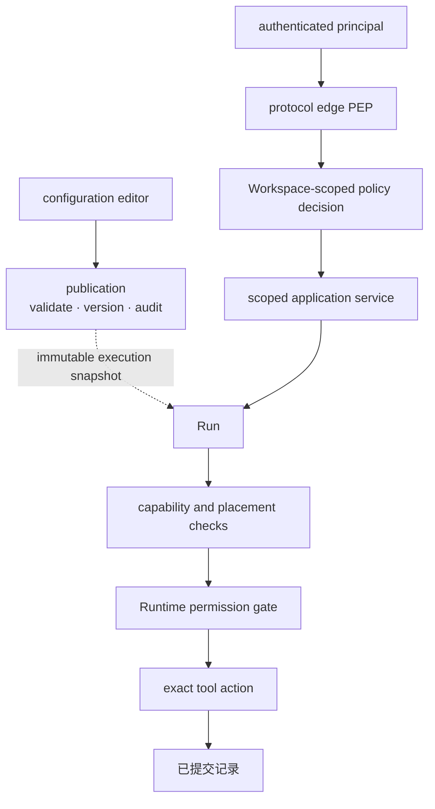
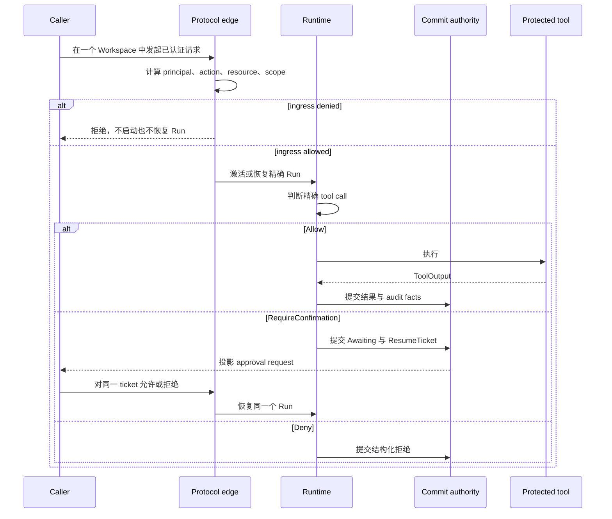

每种决定只回答一个问题，治理才容易维护。改变 Agent 可以做什么、接受一项请求，以及
批准一次工具调用，发生在不同时间，也由不同权威负责。

## 先判断正在做哪一种决定

| 决定 | 发生时间 | 权威结果 |
| --- | --- | --- |
| 哪一版 Agent 行为可以运行？ | publication | 不可变、带版本的 publication |
| 这个 principal 能否对该 Workspace resource 执行此 action？ | protocol ingress | 配置授权 profile 返回的 allow 或 deny |
| 这一次精确 tool call 现在能否执行？ | Run 内部 | Runtime permission gate 返回 `Allow`、`Deny` 或 `RequireConfirmation` |

通过其中一项决定，不代表通过另外两项。Tool 可见、Worker 匹配、MCP server 健康或
credential 可用都只是执行条件，不是授权 grant。

## 静态结构

Publication 拥有行为历史，ingress policy 拥有资源访问决定，Runtime gate 是唯一能让
受保护工具执行的路径。Placement 与 materialization 可以保留或收窄权限，不能增加权限。

## Awaken Agents role grant 固定，不等于产品访问等级

Awaken Agents 发布固定的 role grant。IAM implementation 把这些 role id 绑定到
精确 Workspace。托管产品可以组合多份 binding，形成面向用户的访问等级，但不能重新定义
Awaken 拥有的 action 或 scope。

Workspace action vocabulary 是 `workspace.*`、`apikey.*`、`model_supply.*`、
`file.*`、`skill.*` 与 `tunnel.manage`。下表中的每个 role 只能取得列出的子集。

| Profile | 固定 role id | 精确 Workspace 内的 grant |
| --- | --- | --- |
| `awaken.workspace` | `awaken.workspace:hosted_admin` | `workspace.*`、`apikey.*`、`model_supply.read`、`file.*`、`skill.*`、`tunnel.manage` |
| `awaken.workspace` | `awaken.workspace:hosted_builder` | `workspace.*`、`model_supply.read`、`file.*`、`skill.*` |
| `awaken.workspace` | `awaken.workspace:workspace_user` | `workspace.read`、`model_supply.read`、`file.read`、`skill.read` |
| `awaken.workspace` | `awaken.workspace:publisher` | `workspace.*`、`model_supply.read`、`skill.*` |
| `awaken.workspace` | `awaken.workspace:credential_ingress` | `apikey.*` |
| `awaken.workspace` | `awaken.workspace:tunnel_manager` | `tunnel.manage` |
| `awaken.runtime` | `awaken.runtime:workspace_admin` | `run.*` |
| `awaken.runtime` | `awaken.runtime:workspace_user` | `run.read` |
| `awaken.runtime` | `awaken.runtime:agent_executor` | `run.*` |

Workspace 与 Runtime 使用不同 profile，因为它们的 relying party 与 lifecycle 不同。
托管产品可以组合两个 profile，形成自己的访问模型，但不能重新定义 Awaken Agents 的
action、scope 或固定 role grant。
`awaken.runtime:agent_executor` 是工作负载身份，不是面向人的访问等级。

## 动态行为

只有在 `Awaiting` 与 `ResumeTicket` 一起提交后，外部才会看到 approval task。因此服务
重启后仍可展示同一个待决定事项，不会创建第二个 task。响应必须匹配同一个 Run、ticket
与 tool call。

授权拒绝是一项已经完成的 policy decision，不是平台故障。调用者应修改请求，或由
administrator 通过权威 IAM system 修改 binding。不存在通过重试把拒绝、capability
match 或成功打开 credential 变成 permission 的路径。

## 分开保存三类记录

Configuration history 回答谁修改了已发布行为；authorization record 回答带 scope 的请求
为何被允许或拒绝；Runtime committed facts 回答一次 Run 尝试并完成了什么。把三者合并
成一份可变日志，会抹去各自不同的 consistency 与 retention 边界。

Credential reference 只标识 material 及其允许的交付路径，不会授权 ingress 或 tool
action。继续阅读[凭据保管](./credential-custody)与
[Provider model 配置](/zh/docs/agents/reference/provider-model-config/)。
