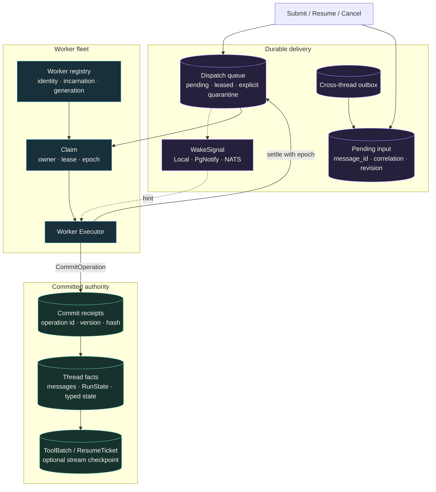
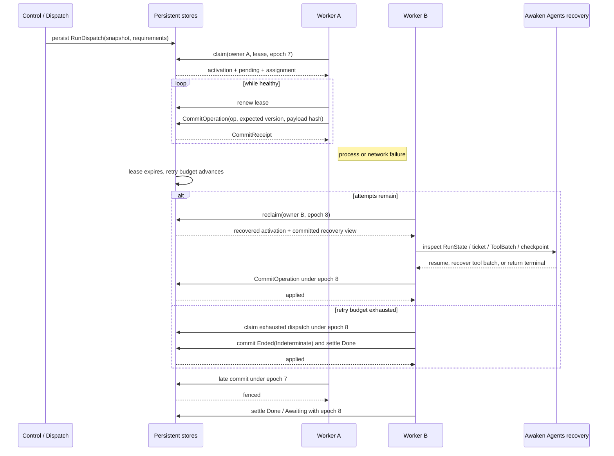
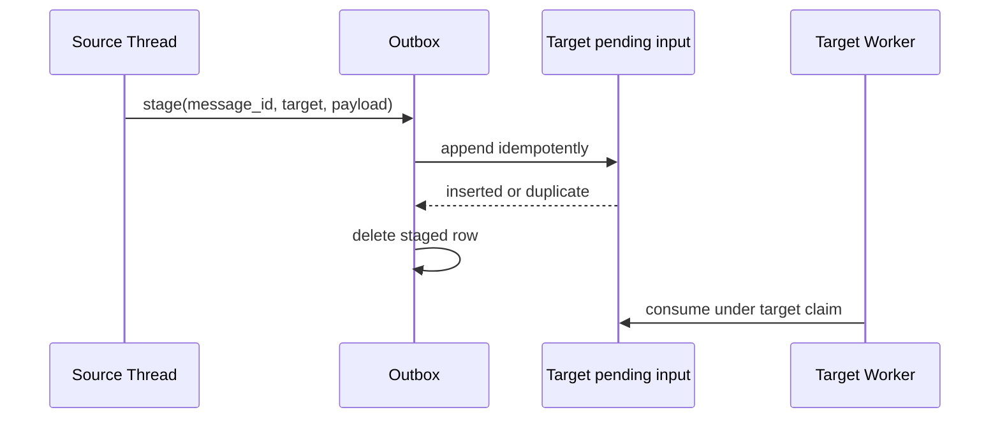

大多数进程、网络、wake 与 lease 故障不需要人工修复。Awaken 会重新领取持久任务，并从
已提交事实恢复。只有应用已经给出终态、明确的 dependency error 持续存在、外部副作用
无法判断，或 Run 被显式隔离时，才需要开始排查。

## 先判断是否需要处理

| 可观察结果 | Awaken 如何处理 | 何时介入 |
| --- | --- | --- |
| Worker 或 wake signal 消失，但没有终态错误 | 其他符合条件的 Worker 可以领取持久 dispatch；周期 drain 会覆盖丢失的 wake signal。 | Run 仍在推进时，不要修复或复制它。 |
| commit 响应丢失 | 相同 `operation_id` 与 payload 返回原 receipt。 | 只能重试完全相同的 operation；改变字节表示新的 intent。 |
| 接管后旧 Worker 返回 | 当前 claim epoch 会拒绝它的 renew、commit 与 settle。 | 除非当前 owner 也报告持续的 dependency error，否则无需处理。 |
| 模型流中断 | Runtime 使用有价值的 checkpoint，或从已提交 Thread facts 重新开始当前推理。 | 重新连接并读取已提交历史；不要用 partial delta 重建状态。 |
| retry budget 耗尽 | drainer 通过普通的 fenced terminal path 提交 `Ended(Indeterminate)`，再 settle dispatch。 | 看到该终态后决定业务结果；不要寻找系统自动生成的 dead letter。 |
| 工具可能已经修改外部系统，但没有提交结果 | `ToolRecoveryPolicy` 可以重放幂等调用、重连可恢复调用，或保留 `Indeterminate`。 | 再次执行前，先核对原业务 operation 的真实结果。 |

如果最后一列没有要求动作，就没有需要排查的故障。Awaken Agents 会先持久化 dispatch，再由一个
Worker 租约领取；执行进度通过执行 checkpoint 提交；最终事实只有在当前 claim 围栏内
才能写入。重试可以继续工作，但不能把未知的外部副作用变成成功。

## 静态结构：队列负责交付，Thread store 负责真相



Wake 只是提示：丢失会增加延迟，重复会多触发一次 drain，但不会改变正确性。Worker
恢复时读取 `RunState`、`ResumeTicket`、`ActiveToolBatch` 和 Thread version，而不是把
queue status 当成 Agent truth。

## 动态行为：崩溃、接管与陈旧写入围栏



Worker identity 由 logical `worker_id`、每次启动变化的 `incarnation_id` 和 registry
分配的 `generation` 组成。dispatch `epoch` 是当前 claim 的 fencing token。旧 Worker
即使恢复，也不能续租替代者的 lease，不能提交新事实，也不能把陈旧 settle 伪装成成功。

## 提交为何可以安全重试

一次跨节点提交不是裸 `ThreadCommit`，而是：

```text
CommitOperation {
  operation_id: { run_id, ordinal },
  expected_thread_version,
  payload_hash,
  commit
}
```

- 相同 operation id 与相同 payload 重试，返回原 `CommitReceipt`。
- 相同 operation id 携带不同 payload，失败关闭。
- Thread version 已前进时，陈旧 recovery prefix 不能追加事实。
- claim epoch 已变化时，旧 owner 的提交在进入权威 store 前被围栏。

这保证 Awaken Agents 内部的**已提交事实**不会因为 HTTP 响应丢失而重复追加。它不等于任意
外部副作用天然 exactly once。

## 工具副作用的恢复边界

| 崩溃位置 | 已提交证据 | 恢复动作 |
|---|---|---|
| executor 进入前 | ToolBatch `Requested` | 重新通过 gate 后首次执行 |
| executor 已进入 | `Executing { attempt }` + `ToolRecoveryPolicy` | replay、重连或 `Indeterminate` |
| 某个结果已返回 | `Completed` / result state | 复用结果，不把调用当成新的 |
| 整批完成 | `Finalized` + ordered tool-result messages | 下一次推理可安全消费 |
| Awaiting | matching `ResumeTicket` | 只接受匹配 correlation/snapshot 的恢复 |

Remote Hand 还能用稳定 operation id 和自身幂等账本抑制重复执行。对于没有幂等接口的
第三方系统，应选择 `NeverReplay` 或在 tool adapter 中增加业务幂等键/事务。准确的承诺是：

> 交付可以至少一次；已提交事实与支持幂等的效果可以去重；无法判断的外部结果保持
> `Indeterminate`，不会被猜成成功。

## 流式恢复的边界

模型流在可重试中断时，可以把 partial text 和 partial tool arguments 写入
`StreamCheckpointStore`。新的进程可继续文本、复用已经完整解析的 tool calls，或在没有
可用 partial 时重新开始当前推理。

该 checkpoint 是 best-effort 的短期恢复优化：

- 只覆盖一个进行中的 inference step；
- 写入失败不会让 Run 失败；
- 恢复完成后删除；
- committed transcript 仍由 `ThreadCommit` 拥有。

因此不能把它表述为“每个 token 都持久化”或“任何崩溃都不损失进行中生成”。

## 重试预算与显式隔离

持续崩溃的 dispatch 会消耗 retry budget。预算耗尽后，下一个 drainer 会领取该 dispatch，
提交 `Ended(Indeterminate)`，通知 terminal observer，再以 `Done` settle。这是自动路径，
不会产生 dead letter。

Dead letter 只用于一项显式维护决定：把已经耗尽重试的任务移出自动 terminal resolution。
不要把 quarantine 当作普通重试后的固定动作。只有明确希望停止自动 terminalization 时才
使用它。[公共 HTTP API](../reference/api)是 quarantine、检查、requeue 与 purge 精确路由、
参数和删除边界的唯一说明。

取消同样先持久化意图。running dispatch 的 cancel 会推进 epoch 并释放旧 lease，使旧
owner 的后续 commit 被围栏；新的领取者提交 `Cancelled` 终态后再清理 delivery state。

## 跨 Thread 交付

`send_message` 的底层是 durable outbox 与幂等 inbox append：



relay 在 append 后、delete 前崩溃时，下一次会重复 append；相同 `message_id` 让它成为
no-op。这里的 exactly-once effect 只指这个受控的 store transaction/idempotency
组合，不应泛化到任意业务系统。

## 验证边界

代码库使用同一组 dispatch conformance tests 驱动 memory、SQLite 和 Postgres；
Postgres claim 使用 `FOR UPDATE SKIP LOCKED`。另外还有 crash-before-settle、
committed-resume、worker fencing、Remote Hand 幂等/indeterminate 和 Sandbox recovery
场景。

这些测试证明命名的存储、协议和故障路径，不证明 LLM 语义永远正确，也不替代真实
provider、数据库、网络、Sandbox backend 和第三方幂等能力的部署验收。

继续阅读 [Run、Step 与工具批次](/zh/docs/agents/runtime/explanation/run-lifecycle-and-phases/)、
[大脑与手](/zh/docs/agents/concepts/brain-and-hand/)和
[会话与事件](/zh/docs/agents/concepts/sessions-and-events/)。
