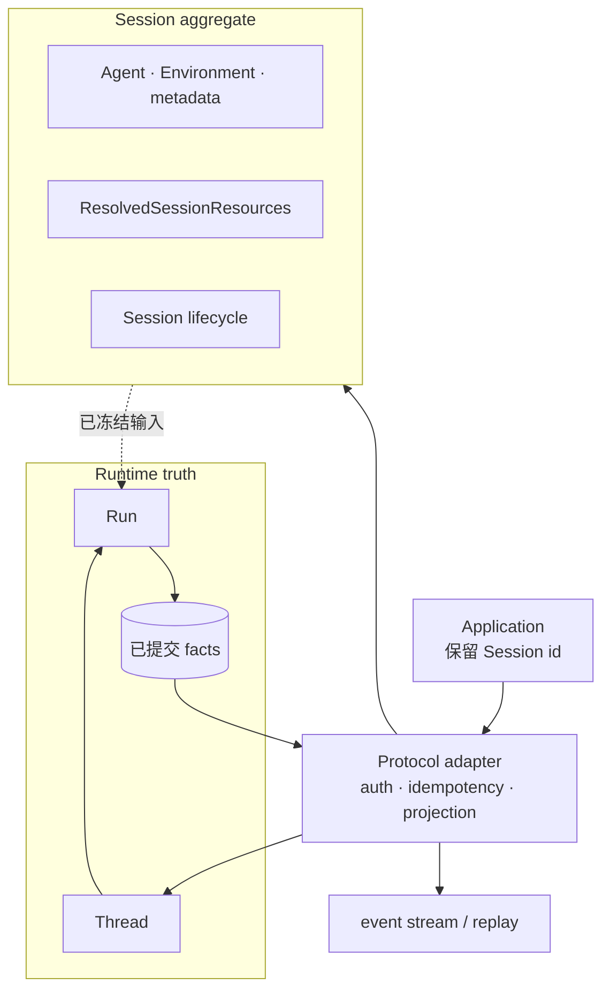
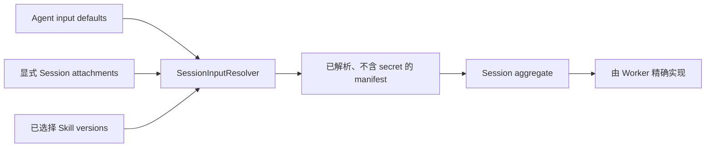
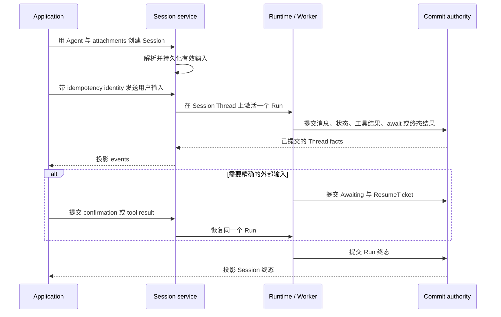

**Agent Session** 是跨多轮输入、网络重连与进程重启继续同一段 Agent 对话的持久应用
身份。应用应保留 Session id，并把后续输入继续发送到该 Session；不要用浏览器状态或
未接收完整的 stream 重建持久历史。

## 先选择持久身份

| 概念 | 拥有什么 | 不是什么 |
| --- | --- | --- |
| Session | 应用对话身份、已选择的 Agent 与 Environment、已解析资源和协议 lifecycle | 一次 model request，也不是另一份执行 ledger |
| Thread | append-only 的已提交消息、状态变化、工具结果与 Run 历史 | 可变的 Session 配置 |
| Run | Thread 上的一次 activation，包括 running、awaiting 与 terminal state | 长期对话身份 |
| Event stream | Session 与已提交 Runtime facts 的低延迟 projection | 不是另一份存储，也不是恢复权威 |

Session status 可以概括应用看到的状态。执行是否真正结束、是否仍在等待输入，则由
已提交的 Thread facts 中的 Run state 决定。

## 静态结构

Session repository 保存不属于 transcript 的应用事实。Thread 保存 replay 与恢复需要的
执行事实。两边不会复制彼此的状态。

## 资源在 Session 运行前解析

Agent 默认输入与显式 Session attachment 使用同一套 input-binding contract。创建
Session 时，系统先把它们解析为一份不含 secret 的 `ResolvedSessionResources`，
然后才会打开执行环境。

Manifest 只固定各类资源能够如实固定的配置。File 使用不可变 File identity；Repository
与 Memory 保留已选择的配置版本，但不会把可变内容假装成 Git commit 或 byte snapshot；
Skill 保留精确 version 与 bundle hash。

当前所有权、授权、credential 有效性与 lifecycle 仍可能拒绝使用。冻结 identity 是为了
让输入选择可重现，不代表永久授权。

## 动态行为

Live stream 用于显示进度。Replay、重连以及必须跨重启生效的决定，都读取已提交的
Thread facts。Stream 断开后，应用使用同一个 Session identity 重连，系统会重新投影
已提交历史。这种正常重连不需要修复。

如果 Session aggregate 已经持久化，而 dispatch projection 暂时不可用，lifecycle
reconciler 会重试这份 projection，不会要求客户端创建第二个 Session。

## 把相邻规则留给各自的权威页

本页只负责 Session、Thread、Run 与 event 的心智模型。精确 event DTO、batch 限制与
Managed Agents 差异由[兼容矩阵](/zh/docs/agents/compatibility/)维护；MCP attachment
的精确状态与 transport 行为由 [MCP protocol](/zh/docs/agents/protocols/mcp/)维护；
claim takeover、commit ambiguity 与 indeterminate effect 由
[生产可靠性](./production-reliability)维护。

接入应用时，继续阅读
[把一个已发布 Agent 接入应用](/zh/docs/agents/how-to/connect-a-published-agent/)。
