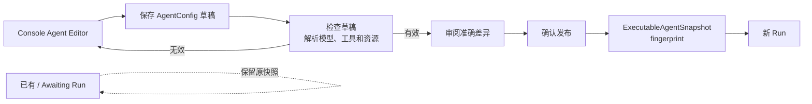

当 Agent 需要改变行为、但不需要修改平台代码时，使用这份指南。你将保存一份草稿，
修正校验问题，明确发布，再创建一个使用新发布版本的 Session。已经绑定到现有 Session
的工作继续使用启动时的版本。

## 目标

最终得到一个已发布 Agent，并在新 Session 中看到预期的指令或能力变化。已经使用旧发布
版本的工作不受影响。

## 先决定要改什么

| 如果希望 Agent…… | 修改位置 | 发布前检查 |
| --- | --- | --- |
| 用不同方式回答或规划 | system instructions、模型、fallback candidates 或 `max_steps` | 模型可以解析，指令描述了可观察的行为 |
| 执行不同操作 | Tools、Skills 或 MCP servers | 所选能力存在，所需凭据或资源已经就绪 |
| 委派工作 | 多 Agent roster 与委派限制 | 每个允许的 Agent 都能解析，roster 没有超出需要 |
| 改变工作上下文的保留方式 | Memory/资源绑定、context-window policy 或 compaction | 所选资源可解析，策略适合目标 Session |
| 改变某个 Tool 的恢复方式 | 该 Tool 的 recovery policy | 重试或停止行为已经明确 |

本表只帮助选择编辑位置。完整字段定义与生命周期仍由
[Agent 配置参考](/zh/docs/agents/runtime/reference/config)统一说明。

## 前置条件

- Awaken 部署正在运行，并且你可以访问 `/w/<workspace>/agents`；
- 已有能够解析目标模型的 Provider Connection；
- Agent 将使用的 Tools、Skills、MCP servers、凭据与资源已经存在。

如果模型尚未就绪，先完成[配置 provider、模型与凭据](./configure-providers-models-credentials)。

## 1. 编辑并保存草稿

在 Console 中创建或打开 Agent。只修改下一个 Session 所需的行为，然后保存草稿。


在线配置只能选择或收窄系统已经提供的能力。它不能新增 Rust Tool、provider adapter、
Plugin 或 Sandbox backend，也不能授予当前 Workspace 原本没有的权限。

## 2. 检查草稿

选择 **检查草稿**。逐项修正字段问题，直到模型、能力、凭据与资源都能解析。检查不会
替换当前已安装的发布版本。

### 把 MCP 连接与 ToolSet 策略一起配置

Agent 需要调用外部 MCP server 时，打开 **构建 → Skills 与 MCP**。每个 MCP 集成同时
保存连接信息和管理其动态工具的 ToolSet 策略：

1. 选择 HTTP 或 Sandbox stdio，再填写唯一的 server name 与 target；
2. 如果 HTTP server 需要认证，选择对应的 credential reference；
3. 将默认权限设为 **使用前询问** 或 **无需询问即可使用**；
4. 只有某个工具需要不同权限或需要停用时，才添加指定工具覆盖。

该 server 后续发现的新工具会继承 ToolSet 默认值。重命名集成时，Console 会同步 MCP
ToolSet 引用；删除集成时，也会清理相关 override 与 recovery 条目，不会留下已经没有
server 的策略。

内置 Agent Tool 与客户端执行的 Custom Tool 位于 **工具与权限**。Custom Tool 只声明
模型可见的名称、说明与 input schema；调用方应用负责执行，并返回匹配的结果。这个声明
不会在 Awaken 服务端生成一份工具实现。

## 3. 明确发布

草稿检查通过后，选择 **审阅并发布**，检查草稿与当前发布版本之间的准确差异；只有差异
符合预期时才确认 **发布**。Admin Assistant 可以用自然语言起草或修改同一份源配置，但
它没有发布工具；发布始终是开发者的明确操作。

## 4. 创建新 Session

从该 Agent 创建一个新 Session，确认它使用新的 publication fingerprint，再发送一条
能够看出目标变化的输入。不要期待已有或 awaiting Run 自动切换版本。



## 使用 API 自动化

Console 与自动化使用同一条边界。下面的 managed-shaped payload 由服务器转换为唯一的
`AgentConfig`，不会形成第二种 Agent 定义：

把下面的内容保存为 `agent.json`：

```json
{
  "name": "Research assistant",
  "system": "Answer from the configured sources and cite evidence.",
  "model": {"id": "claude-sonnet", "provider_identity_ref": "anthropic", "backend_ref": "genai"},
  "mcp_servers": [{"name": "issues", "url": "https://mcp.example.com/issues"}],
  "tools": [
    "web_search",
    {
      "type": "mcp_toolset",
      "mcp_server_name": "issues",
      "default_config": {"enabled": true, "permission_policy": {"type": "always_ask"}},
      "configs": [{"name": "search_issues", "enabled": true, "permission_policy": {"type": "always_allow"}}]
    }
  ],
  "skills": ["source-review"],
  "max_steps": 12,
  "context_policy": {"kind": "keep_last", "keep_last": 40}
}
```

保存草稿和只读校验都使用这一个文件：

```bash
curl -sS -X PUT http://localhost:8080/v1/config/agents/research-assistant \
  -H 'content-type: application/json' \
  -d @agent.json

curl -sS -X POST http://localhost:8080/v1/config/agents/research-assistant/validate \
  -H 'content-type: application/json' -d @agent.json

curl -sS -X POST http://localhost:8080/v1/config/agents/research-assistant/publish
```

未知 Tool、无法解析的模型、无效凭据引用或错误的配置结构会停止校验，但不会改变当前
已安装的发布版本。Publish 生成供新 Run 使用的无密钥执行快照。

## 验证

- Agent 显示校验成功；
- 发布返回 fingerprint；
- 新建 Session 显示该 fingerprint；
- 测试输入表现出预期的新行为；
- 现有 Session 仍使用之前的发布版本。

## 故障排查

如果表中步骤仍未解决问题，请先记录 Workspace、Agent ID、draft revision、validation
field path 与 error code、publication fingerprint 和 correlation ID，再联系支持。不要附带
prompt content、token 或 credential material。

| 现象 | 检查 | 处理 |
| --- | --- | --- |
| 模型解析失败 | Provider Connection 与模型 selector | 修复连接，或选择该连接公开的模型，然后重新校验 |
| Tool、Skill、MCP server 或资源未知 | catalog 条目与 Workspace 访问权限 | 通过对应的权威路径安装或授权已有能力；不要在 Agent 配置中发明新能力 |

## 下一步

- [查看 Agent 配置的完整字段与生命周期](/zh/docs/agents/runtime/reference/config)；
- [配置 provider、模型与凭据](/zh/docs/agents/how-to/configure-providers-models-credentials)
  处理尚未就绪的模型；
- [管理新 Session](/zh/docs/agents/how-to/manage-a-session)。
