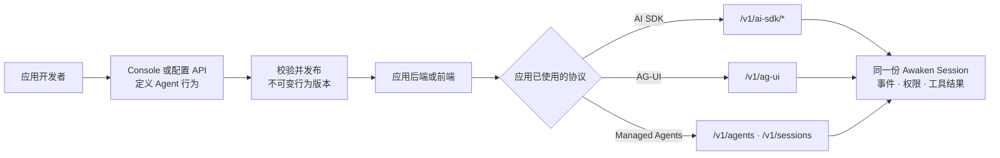

从应用已经使用的协议开始。应用收到原生 stream，并且 Console 中出现同一个 Session，
可以读取历史、状态和工具活动，才算完成接入。

## 目标

从应用发送一项容易识别的任务，收到该协议的原生 stream，并在 Console 中重新打开同一份
已提交 Session。

## 前置条件

- 一个正在运行的 Awaken deployment 及其 application base URL；
- 一个可运行的已发布 Agent；
- 所选 application protocol 要求的认证；
- 能够查看 application log 与 Console Session。

## 1. 选择一条应用接入路径

1. 准备并发布一个可运行的 Agent。
2. 打开[协议接入矩阵](/zh/docs/agents/protocols/connect/)，选择一行 **Client → Awaken Agents**。
3. 按该协议链接的集成指南完成配置。
4. 发送一项之后容易辨认输入和结果的任务。
5. 检查应用中的 stream，再到 Console 打开同一个 Session。

第一次只走一种协议。共享 Session 路径跑通后，再增加第二个前端或后端。

## 2. 准备可运行的 Agent

Awaken Agents 启动后，先在 Console 或 API 中准备 provider、model 和 credential，再保存、校验并
发布 Agent。发布时 Awaken Agents 会固定本次行为所依赖的模型、工具、Skills、Memory、资源和
配置 revision；新的 Session 使用新版本，已经运行或处于等待状态的 Session 不会漂移。

- [配置 provider、模型与凭据](/zh/docs/agents/how-to/configure-providers-models-credentials/)；
- [在线配置并发布 Agent](/zh/docs/agents/how-to/configure-agent-behavior/)；
- [Console、认证与配置权威](/zh/docs/agents/reference/admin-console/)。

在本地可用 `awaken all-in-one` 同时启动 API 和 Console。面向公网时，先完成
[自托管与认证](/zh/docs/agents/how-to/self-host/#authentication)，再让应用调用服务。

## 3. 通过权威矩阵接入

[协议接入矩阵](/zh/docs/agents/protocols/connect/)统一维护每种连接的方向、endpoint、
Console 入口与完成信号。由应用发起工作时，选择 **Client → Awaken Agents**；如果是 Awaken
调用远端 provider、tool server 或 Agent，就离开这份指南，改走对应的
**Awaken Agents → remote** 路径。

选择的线路不会改变 Agent 行为。AI SDK、AG-UI 与 Managed Agents 可以读取和推进同一个
Awaken Session，不必各自维护聊天历史。

## 4. 绑定产品特有能力

应用特有的能力仍由你的团队提供，但不必在每个前端重复描述：

- 用配置绑定已有的 Memory、文件、代码仓和 Skills；
- 用 MCP 连接第三方工具服务；
- 用 Rust Tool 为 Awaken Agents 增加产品专有能力；
- 用工具别名、描述、状态机和权限策略约束模型可见的动作。

其中“绑定和选择”属于应用开发路径；新增 Rust Tool、provider adapter、Plugin 或
Sandbox backend 属于[贡献与扩展](/zh/docs/agents/runtime/)路径。这样不会把一次产品集成变成
另一套 Agent 执行实现。

## 验证

一次接入完成后，检查：

1. Console 中能看到应用使用的已发布 Agent；
2. 前端或后端收到该协议自己的流式响应；
3. 同一个 thread / Session 的历史可以被读取；
4. Console 中能检查到对应 Session、状态与工具活动。

如果目前只能看到浏览器文本，就继续检查。能够重新打开并检查 Session 后，接入才算完整。

精确字段与 route 请查看选定协议的集成指南和
[公共 HTTP API](/zh/docs/agents/reference/api/)。

## 故障排查

如果表中步骤仍未解决问题，请先记录所选 protocol、已脱敏 base URL、Agent ID 与
publication revision、thread 或 Session ID、HTTP status、response content type、最后一个
event type 与 correlation ID，再联系支持。不要附带 token、service key 或 message content。

| 现象 | 检查 | 处理 |
| --- | --- | --- |
| 应用收到 404 | connection direction、所选 protocol guide、base URL 与 route | 回到协议矩阵，使用确切的 **Client → Awaken Agents** 路径 |
| 应用收到 401 或 403 | token expiry、scope、protocol 与请求 operation | 获取新的最小权限 application token；不要把 service key 移入浏览器 |
| 界面已有文本，却无法重新打开 Session | response 中的 Session/thread ID，以及所选指南中的 history read | 保留返回的 identity 并读取已提交历史；不要把浏览器文本当作存储 |
| 应用与 Console 显示不同历史 | base URL、Workspace、Agent publication 与 Session/thread ID | 让两边使用同一个 deployment，并在继续时复用同一 identity |

## 下一步

- 把所选集成指南放在应用代码旁边。
- [管理产生的 Session](./manage-a-session)。
- 检查生产环境的[凭据保管](../concepts/credential-custody)与[部署](./self-host)。
