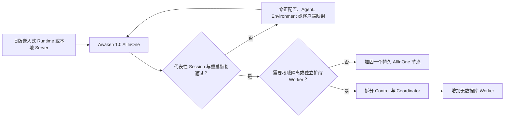

如果应用使用旧版 Awaken Runtime library、本地 starter server 或独立 Admin Console，请从
这里开始。第一个迁移目标是用 Awaken 1.0 AllInOne 跑通并恢复一份 Session；拆分部署是之后的
运营决定，不是另一条应用迁移路径。

本页是 **Awaken 产品版本迁移** 的唯一公开权威。[Managed Agents 兼容矩阵](../compatibility)
负责 SDK 与 wire 兼容；[Agents 架构](../concepts/architecture)负责组件权威；
[自托管指南](./self-host)负责部署配置与运营。本页只链接这些权威，不复制其内容。

## 目标

把一项能辨认的旧版任务迁移为已发布的 Awaken 1.0 Agent，在进程重启后重新读取同一份已提交
Session event，并保留经过验证的回滚边界。完成以后，再决定停在 AllInOne，还是拆分 Control、
Coordinator 与 Worker。

## 选择 1.0 入口

| 旧版使用方式 | 1.0 目标 | 迁移决定 |
| --- | --- | --- |
| 在应用进程内使用 Rust Runtime library | `awaken-runtime`，或 Awaken 中的已发布 Agent | 只有应用仍应自行负责 hosting、I/O 与集成时才保留直接嵌入；需要 Session 持久化、dispatch、placement 与恢复时，改为发布 Agent。不要假设旧 `awaken` facade 与 1.0 源码兼容。 |
| `ai-sdk-starter-agent` 或其他本地 Server binary | `awaken all-in-one` | 用正式产品 launcher 替换 starter composition。AllInOne 已组合 Control、Coordinator、Resources、本地 Worker、协议 API 与 Console。 |
| 单独启动的 Admin Console | `awaken` 内嵌 Console | 运行时不再需要 Node.js。打开同一进程提供的 Console，并确认它指向预期的 data directory 和 listener。 |
| AI SDK、AG-UI、A2A、MCP 或 Managed Agents 客户端 | 对应的 1.0 protocol adapter | 尽量保留应用协议，但重新核对当前 route、认证、header、请求形状、error envelope、stream 与 replay。 |
| Host 本地 tool 或 coding-agent process | 已发布 Environment 加 Worker 与 Sandbox 选择 | 本地执行现在是显式 placement 与隔离决定。`local` 表示可信 host 执行；支持时默认隔离为 `namespace`。 |
| 原来一个本地进程，现在需要独立扩缩或信任隔离 | 先 AllInOne，再拆分 Control、Coordinator 与 `awaken-worker` | 拆分只改变进程和 transport adapter，不能形成第二份 Agent、Session 或 Runtime 路径。 |

## 映射启动与配置

旧版开发命令和环境变量不能成为 1.0 的第二套配置入口：

| 旧版坐标 | 1.0 坐标 | 必须采取的动作 |
| --- | --- | --- |
| `cargo run -p ai-sdk-starter-agent` | `awaken all-in-one --config <file>` | 构建或安装 `awaken` binary，启动规范 AllInOne composition。 |
| `AWAKEN_HTTP_ADDR` | TOML 中的 `bind`，或文档化的本地 `--port` override | 显式选择一个 listener，并更新所有客户端 base URL。 |
| 旧版 storage-directory 环境变量 | 本地 TOML profile 中的 `data_dir` | 使用新的 1.0 目录启动；旧目录保留为回滚证据。 |
| `AWAKEN_ADMIN_API_BEARER_TOKEN` | 当前 `identity_mode` 与按用途签发的 application 或 Workspace credential | 不要机械改名。配置当前身份边界，并为所选 route 签发正确 credential。 |
| 其他 `AWAKEN_*` 部署设置 | 类型化 TOML 配置 | 用 `awaken config --json` 检查脱敏后的生效配置；环境变量不是备用部署 schema。 |
| Application startup 自动创建共享 schema | 拆分服务启动前运行 `awaken database migrate` | 本地 embedded store 在 local startup 时迁移；共享 server schema 只能由显式 migration command 写入。 |

完整当前字段见[部署配置](../reference/configuration)。不要根据旧环境变量名称猜测 1.0 key。

## 改变行为前先保全数据

当前公开契约没有承诺 1.0 可以原地打开旧版本地 store。除非 release notes 明确说明支持该精确
迁移路径，不要让 1.0 指向旧 data directory 的唯一副本。

启动 1.0 前：

1. 记录旧版 Awaken version 或 revision、启动命令、客户端 SDK version、协议 route 和已配置
   provider；
2. 停止旧 Server，制作可恢复的 data directory 与外部数据库副本；
3. 记录一项代表性输入、预期业务可见输出，以及相关 tool、approval、File、Memory 或 Skill
   effect；
4. 使用独立 `data_dir` 启动 1.0，不把明文 credential 复制进源码仓或新配置文件；
5. 在 1.0 验收路径通过前，让旧安装保持停止但可以恢复。

如果后续 release 提供专用 importer，它必须明确支持的源版本、目标 schema、幂等行为、secret
处理和回滚步骤。存在普通 1.0 schema migration 并不能证明旧产品 store 可以直接导入。

## 迁移一条应用路径

1. 用新的 data directory 启动 1.0 AllInOne。
2. 配置一个 Provider Connection，确认至少一个 model 为 executable。
3. 重新创建或有意识地转换一个 Agent 配置，检查 resolved behavior，再发布不可变 revision。
4. 创建所需 Environment，并选择 Sandbox boundary。
5. 把一个客户端更新到当前 base URL 与认证方式。
6. 运行代表性输入，等待 `session.status_idle` 或明确的终态或 attention 结果，并保存 Session id。
7. 使用同一 data directory 重启 AllInOne，再次读取同一批已提交 event。

Anthropic 客户端还要在 [Managed Agents 兼容矩阵](../compatibility)中单独完成兼容判断。其他
客户端使用[协议接入矩阵](../protocols/connect)及对应 adapter 指南。

## 行为一致后再选择部署

AllInOne 与拆分部署使用同一 publication、Session、dispatch 和 commit 权威。
[架构页](../concepts/architecture)拥有静态与动态组件模型；[自托管指南](./self-host)拥有加固、
PostgreSQL migration、私有服务认证、Worker、wake-up 与恢复的精确步骤。

## 切换或回滚

所有行通过后才能切换：

| 证据 | 通过条件 |
| --- | --- |
| 配置 | `awaken config --json` 显示预期 role 与生效的非 secret 值 |
| Agent | 已审阅的不可变 publication 能解析 executable model 与 Environment |
| 客户端 | 所选协议完成应用实际使用的操作 |
| Session | 代表性任务到达预期的已提交结果，并且没有重复 effect |
| 恢复 | 进程重启后能重新打开同一 Session 和已提交 event |
| 回滚 | 旧数据与启动流程仍可恢复，且未被 1.0 修改 |
| 部署 | 所选 AllInOne 或拆分拓扑通过自托管验证清单 |

任何一行失败时，继续把流量留在旧安装，保留失败的 1.0 Session 与 correlation evidence，再
修正对应边界。不要为了让迁移看似完成而降低 Sandbox 隔离、绕过认证或创建平行数据路径。
