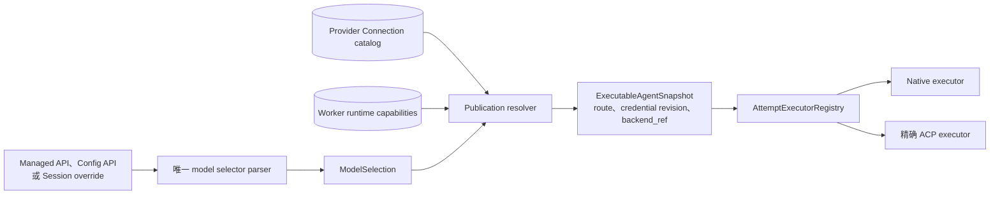
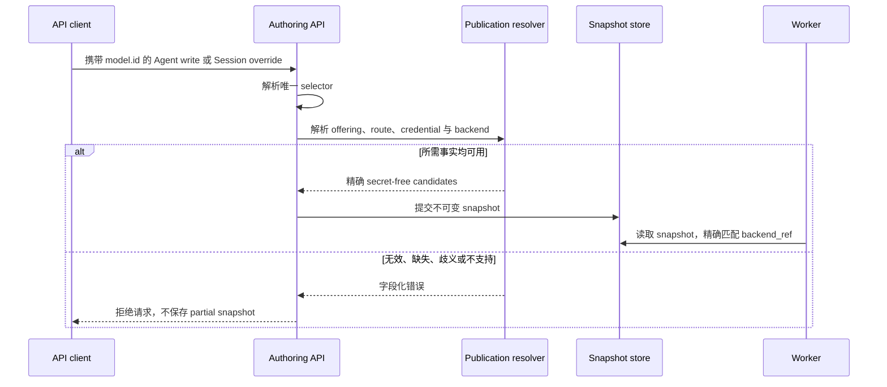

当 API request 需要指定模型与执行 runtime 时，使用本指南。先连接 provider 并导入模型，
再选择一个 selector 并发布。Agent 或 Session 创建成功，且 publication 包含精确 model route
与 `backend_ref` 时，这项任务完成。

Selector 包含三个独立选择：

| 选择 | 例子 | 必须已经存在的位置 |
| --- | --- | --- |
| 模型 | `claude-sonnet-5` | Active Workspace model offering；ACP runtime 自有模型除外 |
| Provider route | `provider`、`api`、`endpoint` qualifier | Provider Connection |
| Executor | Native 或 `executor=acp:codex` | Worker runtime capability |

Sandbox placement 是另一项选择。`acp:codex` 可以使用 namespace、container 或 Kubernetes
Pod；selector 不负责选择这个边界。

## 选择 `model.id`

| 需要 | `model.id` |
| --- | --- |
| 使用唯一匹配的 Native offering | `<model-id>` |
| 固定 Native provider route | `<model-id>;provider=<provider>;api=<dialect>;endpoint=<endpoint>` |
| 通过 ACP runtime 使用 provider 模型 | `<model-id>;provider=<provider>;api=<dialect>;endpoint=<endpoint>;executor=acp:<runtime>` |
| 让 ACP runtime 使用自己的默认模型与登录状态 | `executor=acp:<runtime>` |
| 使用已配置 inference profile | `profile=<profile-id>` |

`api` qualifier 需要 `provider`；`endpoint` 同时需要 `provider` 与 `api`。Runtime id 必须
精确匹配。近似名称会被拒绝，不会路由到另一个 CLI。

```text
claude-sonnet-5;provider=anthropic;api=anthropic_messages;endpoint=primary
claude-sonnet-5;provider=anthropic;api=anthropic_messages;endpoint=primary;executor=acp:claude
executor=acp:codex
```

## 静态所有权



Provider Connection 是 provider、endpoint、credential 与 imported offering 的唯一写入者。
Selector 只引用这些配置，不会创建第二条 route。Agent write 与 Session override 复用同一个
parser 和 publication resolver。

Runtime id、版本、credential、模型交付和持久化由
[ACP runtime 矩阵](/zh/docs/agents/protocols/acp/)维护；backend 与 Sandbox 边界由
[执行模式概念页](/zh/docs/agents/concepts/execution-modes/)维护。

Model selector 不选择应用 ingress。同一份 publication 可以由受支持协议访问；方向与
endpoint 应在[协议接入矩阵](/zh/docs/agents/protocols/connect/)中选择。

## 通过官方 SDK 发布

官方 SDK 仍把 `model.id` 作为字符串。Awaken 在处理 `POST /v1/agents` 时解析它：

```ts
import Anthropic from '@anthropic-ai/sdk';

const client = new Anthropic({
  baseURL: process.env.AWAKEN_BASE_URL ?? 'http://127.0.0.1:8080',
  apiKey: process.env.AWAKEN_API_KEY ?? 'local',
});

const agent = await client.beta.agents.create({
  name: 'Repository assistant',
  model: {
    id: 'claude-sonnet-5;provider=anthropic;api=anthropic_messages;endpoint=primary;executor=acp:claude',
  },
});
```

删除 `executor` qualifier 后，同一 provider route 会通过 Native loop 执行。模型可以相同，
但 Agent 行为仍可能不同，因为 ACP runtime 还拥有自己的 loop、上下文约定与工具协议。

## Override 一个 Session

只有一个 Session 需要不同选择，且不希望修改 Agent publication 时，使用
`agent_with_overrides`：

```ts
const session = await client.beta.sessions.create({
  agent: {
    type: 'agent_with_overrides',
    id: agent.id,
    model: {
      id: 'qwen/qwen3-235b;provider=anyrouter;api=open_ai_responses;endpoint=primary;executor=acp:codex',
    },
  },
  environment_id: process.env.AWAKEN_ENVIRONMENT_ID,
});
```

Awaken 会重新解析完整 override，不会只替换旧 snapshot 中的一个字符串，也不会保存新旧事实
混合的状态。

## 使用 backend 自有配置

需要 draft、validate、publish 三阶段，或 ACP runtime 自己拥有模型与 options 时，使用
`/v1/config/agents/*`：

```json
{
  "name": "Codex workspace agent",
  "model": {
    "mode": "backend_exact",
    "backend_ref": "acp:codex",
    "model_ref": "gpt-5",
    "configuration": {
      "mode": "read-only",
      "options": { "model": "gpt-5" }
    }
  }
}
```

`backend_default` 只提供 `backend_ref`；`backend_exact` 还提供 `model_ref`。Runtime 必须通过
negotiated capability 接受指定 mode 与 options。带自定义 ACP configuration 的
Awaken-managed provider target 应使用 `model.id`。

## 动态校验与执行



## 读取结果

| 结果 | 含义 | 要做什么 |
| --- | --- | --- |
| Agent 或 Session 创建成功 | 一套完整选择已经解析并保存 | 运行 Session，观察已提交 event |
| Selector syntax 被拒绝 | Qualifier 依赖或 runtime id 无效 | 修正错误中指出的字段；没有 partial state 需要清理 |
| Offering、credential 或 provider route 不可用 | Publication 无法生成 executable candidate | 完成已有 Provider Connection，或选择 available offering |
| 精确 ACP capability 不可用 | 请求的 runtime 无法 placement | 注册具备该精确 capability 的 Worker，或选择另一已发布 backend |
| Dispatch 后 Worker lease expiry | Claim fencing 与 reclaim 负责恢复执行所有权 | 除非 terminal placement 结果明确说明 backend 不可用，否则不要修改 selector |
| Partial commit 前允许的 model candidate 失败 | Candidate policy 可以尝试下一个模型 | 无需修改 selector；backend identity 保持不变 |

`/v1/config/executable-models` 用于查看 Native readiness，`/v1/models` 是 Managed
compatibility projection。两者都不是完整 ACP runtime 目录；ACP capability 会在 validate
与 publish 时检查。

模型供应商、Managed wire 兼容性与托管责任是不同的选择。使用 Anthropic 模型不会把
Awaken deployment 变成 Anthropic hosted service。Wire resource 与 beta header 差异见
[Managed Agents 兼容性页面](/zh/docs/agents/compatibility/)。
