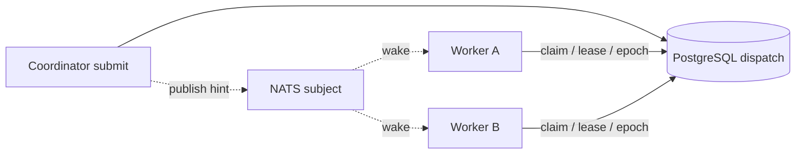

只有当多节点 fleet 已经能通过轮询共享 PostgreSQL dispatch store 正确工作后，才使用
NATS。NATS 传递 best-effort wake hint；它不存储工作、不选择 owner、不续租，也不证明完成。

## 静态边界



Hint 丢失只会增加下次 poll 前的延迟；重复 hint 只会多触发一次 drain。两者都不会改变
store 执行的单 owner claim。

## 一致配置所有参与 Coordinator

```toml
role = "coordinator"
mode = "server"
runtime_database_url = "postgres://<projected-at-deploy-time>"
dispatch_wake = "nats"
dispatch_wake_channel = "awaken_dispatch_wake"
nats_url = "nats://nats.internal:4222"
dispatch_owner = "coordinator-a"
```

部署 binary 必须包含 NATS feature。共享 dispatch store 的每个进程使用唯一
`dispatch_owner`；同一 fleet 使用相同 wake channel。数据库 URL 与 NATS credential
应由部署 secret 投射，不要提交真实值。

`dispatch_wake = "pg-notify"` 是 PostgreSQL 原生替代方案；
`dispatch_wake = "none"` 通过 polling 保持正确性，也是诊断 baseline。

## 验证动态行为

1. 先设 `dispatch_wake = "none"`；在一个节点提交工作，证明另一 Worker 能 claim 并完成。
2. 在所有 fleet 参与者启用 NATS，确认 claim latency 降低。
3. 停止 NATS 后再次提交；工作仍必须在 polling 延迟后完成。
4. 恢复 NATS 并发布重复 hint；只有 store 的有效 claimant 能执行。
5. 杀死 claimant，等待 lease 过期；确认新 owner 使用更高 epoch，旧 owner 被 fenced。

## 停用可选 wake 路径

如果 NATS 没有降低实测 claim 延迟，将 `dispatch_wake` 设为 `"none"` 或
`"pg-notify"`，再重启 Coordinator。Pending work 仍留在 PostgreSQL，并继续通过 polling
处理。不要把 pending record 移进 NATS，也不要引入第二条 queue。

Claim 与 commit 语义见[生产可靠性](../concepts/production-reliability)。
