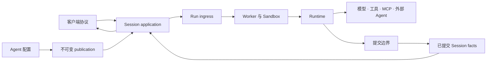
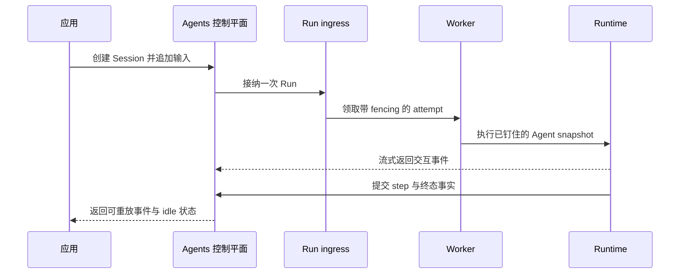

Awaken 是一个自托管的 Agent 运行平台。应用发布 Agent 行为，通过受支持的协议发送工作，
并在等待、重试、Worker 变化或进程重启后，继续从同一个 Session 读取已提交事件。

如果应用不应自行维护 Agent loop、工具执行、执行位置、持久化与恢复，从这里开始。

## 选择最小的系统边界

| 需求 | 使用 | 它负责什么 |
| --- | --- | --- |
| 一次无状态模型响应 | 模型 API | 请求与响应 |
| 位于应用 API 后方的持久 Agent 执行 | Awaken Agents | Agent publication、Session、策略、分派、执行位置与已提交事件 |
| Agent 执行外围的工作负责人、依赖、人工决定与验收 | [Awaken Workforce](/zh/docs/workforce/) | 可追责的工作记录 |

这些边界不应混在一起。Session 记录 Agent 执行，但不代替业务验收记录；前端协议改变输入
与事件如何传输，但不会形成另一套 Agent 实现。

## 应用使用的契约

应用只需使用四个对象：

| 对象 | 稳定责任 |
| --- | --- |
| Agent | 版本化的指令、模型选择、工具、MCP Server、Skills、委托与限制 |
| Environment | 执行位置、隔离、资源与网络约束 |
| Session | 绑定到一个 Agent publication 与 Environment 的持久 Agent 实例 |
| Event | 输入、进展、工具交互、用量、状态与已提交输出 |

Worker、Sandbox、store 与 Runtime 用来实现这份契约。它们是部署和执行组件，不是新的
应用侧记录。

Managed Agents、AI SDK、AG-UI、A2A 与 MCP 都进入这一份契约。请在
[协议接入矩阵](/zh/docs/agents/protocols/connect/)中选择合适的方向。

## 一次 Session turn 如何运行

排队、有限重试、等待审批与 lease 恢复由各自机制处理。只有 Session 暴露终态或 attention
结果时，外部维护动作才开始。[生产可靠性](/zh/docs/agents/concepts/production-reliability/)
说明这些结果及其对应动作。

## 跑通第一条路径

按照[运行第一个 Awaken Session](/zh/docs/agents/get-started/)完成 AllInOne 启动、连接一个
provider、发布一个 Agent、通过官方 Anthropic SDK 发送输入，以及重启后重新打开已提交
Session。

当应用收到 Agent 输出、看到 `session.status_idle`、保存 Session id，并能再次读取同一批
已提交事件时，这条路径完成。

## 从下一项任务继续

| 下一项任务 | 前往 |
| --- | --- |
| 把旧版 Runtime 或本地 Server 迁移到 1.0 | [迁移到 Awaken 1.0](/zh/docs/agents/how-to/migrate-to-1-0/) |
| 连接前端、后端或兼容 Agent | [接入已发布 Agent](/zh/docs/agents/how-to/connect-a-published-agent/) |
| 选择本地、持久化或多 Worker 部署 | [自托管 Agents](/zh/docs/agents/how-to/self-host/) |
| 理解控制、持久化、执行与隔离 | [Agents 架构](/zh/docs/agents/concepts/architecture/) |
| 不重新构建即可修改提示词、模型、工具、Skills 或限制 | [配置 Agent 行为](/zh/docs/agents/how-to/configure-agent-behavior/) |
| 添加 Rust Tool、provider adapter、Plugin 或执行行为 | [扩展 Awaken Agents 内部机制](/zh/docs/agents/runtime/build-agents/) |

Awaken Agents 已开源，首个稳定版即将发布；在此之前，接口与行为仍可能变化。托管服务、
支持承诺、安全认证或经过独立测量的生产结果，需要另行发布明确声明。
