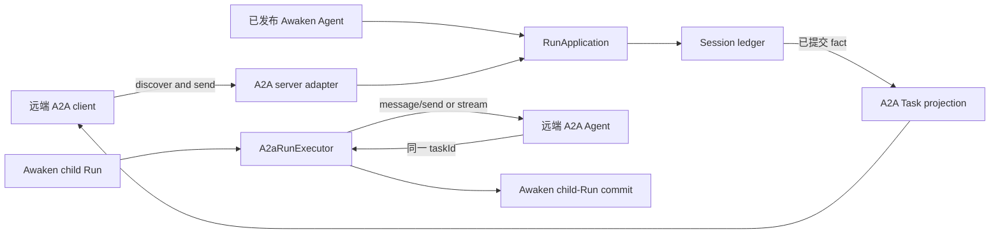
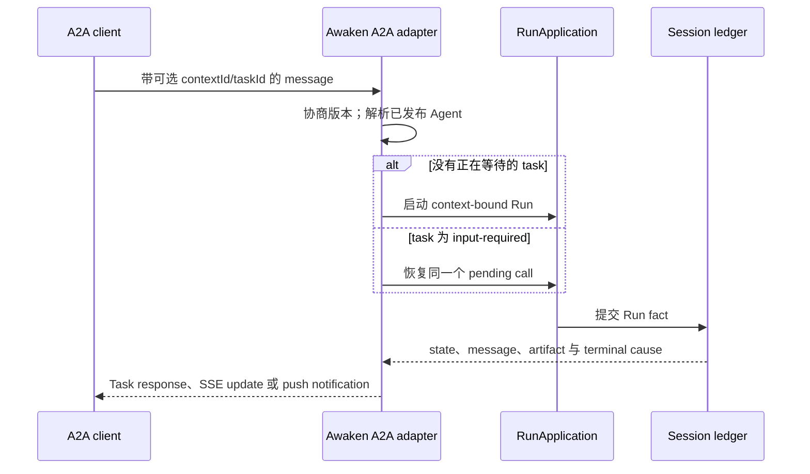

当两个 Agent 必须跨进程、服务或组织边界通信时，选择 A2A。Awaken 支持两个方向：

| 方向 | 适用条件 | Awaken 负责什么 |
| --- | --- | --- |
| 远端 client 调用 Awaken | 另一个 A2A client 需要发现并调用已发布的 Awaken Agent。 | Agent Card 投影、版本协商、Task 投影、stream、subscription、cancel 与 push 配置。 |
| Awaken 调用远端 Agent | 已发布 Awaken Agent 要把有界工作委托给一个 A2A endpoint。 | 远端 task identity、poll/stream continuation、cancel、recovery 与终态 artifact 投影。 |

如果两个组件已经共享同一 runtime 和状态权威，不要为它们增加 A2A。进程内 delegation
没有网络协议及其分布式故障边界。

## 一个 runtime，两条协议边界

Inbound adapter 是共享 `RunApplication` 的 anti-corruption layer，不会建立另一套
Agent runtime 或 Session ledger。Outbound `A2aRunExecutor` 不拥有本地 Environment
或 Hand，也不会回退到 Native execution。

## 发现 Agent 并选择 wire version

标准发现入口是 `/.well-known/agent-card.json`。Awaken 也提供文档列出的 A2A alias。
Card 从已注册 Agent 信息派生，不是可能与 publication 漂移的协议侧 catalog。

REST binding 通过 `A2A-Version` 选择 payload projection：

| Header 值 | Projection |
| --- | --- |
| 缺失、空、`0.3` 或 `0.3.0` | A2A v0.3 |
| `1.0` 或 `1.0.0` | A2A v1 |
| 其他值 | unsupported-version error |

Client 已经使用 A2A JSON-RPC 时，调用 `POST /v1/a2a`。HTTP+JSON、stream、task、
subscription 和 push-notification 路由统一列在
[公共 HTTP API](/zh/docs/agents/reference/api/)中，协议语义页不再维护第二份路由参考。

## 保留 context 与 task identity

调用方提供的 `contextId` 与 `taskId` 会穿过 adapter 边界。Runtime await 映射为
A2A `input-required`，表示 task 正在等待输入，不是执行失败。同一 context 中的后续
message 会恢复原来的 pending call。已提交 terminal cause 映射为 completed、failed、
canceled 或 rejected。

A2A terminal Task 不可变。后续修改需要在相同 `contextId` 中创建新 task，不能重启
原 terminal task。这样，每次已接受输入、artifact 与 outcome 都对应一个清楚的工作单元。

## 调用远端 A2A Agent

将 outbound model id 发布为 `a2a:<absolute-http-url>`。Executor 发送消息，保存返回的
remote task id，并让同一个 task 经过 working、waiting、cancellation、recovery 和
terminal artifact。远端 Agent 保持 opaque，Awaken 不导入它的私有工具、Memory 或 reasoning。

配置和可见的 loopback 验收步骤由
[连接 A2A Agent](/zh/docs/agents/how-to/connect-an-a2a-server/)维护。Delegation 仍是有界
child Run。长期责任转移应该进入具有明确 owner 与 acceptance state 的工作系统，
而不是发明新的 A2A task state。

## 调用方需要作出的决定

| 可见结果 | 含义 | 下一步 |
| --- | --- | --- |
| Unsupported A2A version | Client 请求了 Awaken 未实现的 projection。 | 改用 `0.3.0` 或 `1.0.0`，不要用同一 header 重试。 |
| `input-required` | 同一个 task 正在等待额外输入或权限决定。 | 继续使用它的 `contextId` 与 `taskId`。不要把它当作事故。 |
| completed、failed、canceled 或 rejected | Task 已终止，不能重启。 | 还需继续工作时，在同一 context 新建 task。 |
| A2A error envelope，或带 internal A2A code 的 HTTP `500` | 请求到达 adapter，但没有产生可接受终态。 | 保留 request id、task/context id、status 和脱敏错误；只按该 operation 的幂等性与远端服务契约决定是否重试。 |

Task polling、resubscription 与 push delivery 都是正常协议机制，不是另一套修复路径。
