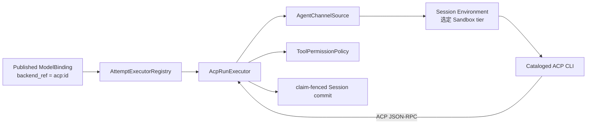
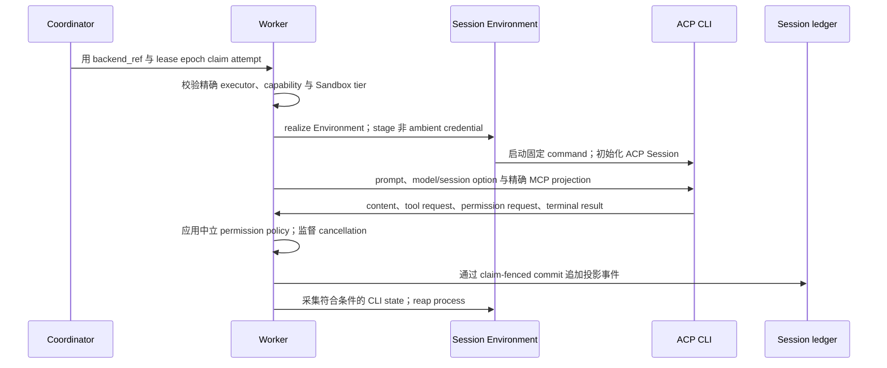

当 Awaken Agent 需要由受支持的外部 Agent CLI 提供 coding-agent 行为时，选择 ACP。
CLI 负责推理和提出工具请求；Session ledger、权限决定、凭据投影、placement、recovery
与最终 commit 仍由 Awaken 负责。

ACP 是面向内部的 Brain 协议，不是另一条前端入口。Managed Agents、AI SDK、AG-UI、
A2A server 和 MCP export 把 Awaken 向调用方投影；ACP 把一个受监督进程适配进中立执行
contract。

## 分开选择 Brain 与隔离边界

一次 ACP attempt 由两个独立选择决定：

1. `acp:<id>` 选择精确的 cataloged CLI contract。
2. `sandbox_tier` 选择进程与文件系统边界。

例如，`acp:codex` 可以在 namespace 或 container 内运行。Codex 不是 isolation tier。
Placement 同时校验两类精确 capability，任一缺失都会 fail closed。

## 静态结构

`ModelBinding.backend_ref` 是不可变的执行选择器，必须精确匹配已注册 executor。
`AttemptExecutorRegistry` 不猜近似值，也不回退到 Native。`AcpRunExecutor` 通过
`AgentChannelSource` 打开 `AgentSession`；模型变化采用 `ModelSwitch::Relaunch`，
不会就地修改 opaque process。

Catalog 是受支持 command、capability probe、模型与凭据投影、Memory 入口和可移植
CLI state 的唯一事实来源。增加 runtime 是 catalog 与 capability contract 变更，
不是增加一个任意 executable 配置。

## 受支持 runtime 矩阵

| Runtime id | 启动方式与固定 image requirement | Memory 入口 | Model API dialect |
| --- | --- | --- | --- |
| `acp:claude` | `claude-agent-acp`；`@agentclientprotocol/claude-agent-acp@0.69.0` 加 Claude Code `2.1.221` | `CLAUDE.md` | `anthropic_messages` |
| `acp:codex` | `codex-acp`；`@agentclientprotocol/codex-acp@1.1.9` 加 Codex `0.146.0` | `AGENTS.md` | `open_ai_responses` |
| `acp:gemini` | 原生 `gemini --acp`；Gemini CLI `0.53.1` | `GEMINI.md` | `gemini` |
| `acp:opencode` | 原生 `opencode acp`；OpenCode `1.18.12` | `AGENTS.md` | `open_ai_chat` |
| `acp:hermes` | 原生 `hermes-acp`；`hermes-agent[acp,bedrock]==0.19.0` | `AGENTS.md` | `open_ai_chat` |

Claude Code 与 Codex 使用表中的固定 ACP wrapper。Gemini、OpenCode 与 Hermes 使用
列出的 direct entrypoint。

### Model、credential 与 Session 差异

Runtime 只能在 backend-owned login/model 与 Awaken-managed provider route 中选择一种。
Backend-owned mode 把 provider material 留在 CLI；managed mode 按 catalog row 投影
已解析 endpoint、model 与 brokered credential。

| Runtime | Backend-owned 精确 model 选择 | Managed model delivery | Managed credential delivery | 可移植 CLI session |
| --- | --- | --- | --- | --- |
| Claude Code | Config override `-c model=…` | Environment | Process secret | `projects`，以稳定 cwd 为 key；排除 `.credentials.json` 与 `settings.json` |
| Codex | ACP session config option `model` | Environment 加生成的 provider config | `.codex/auth.json` artifact | 无；中立 thread history 仍是权威 |
| Gemini CLI | `--model` flag | Environment | Process secret | `tmp`，internal-id keyed；catalog path 为 provisional |
| OpenCode | 不保证，只能使用 CLI default | Environment 加生成的 provider config | Process secret | `storage`，internal-id keyed；catalog path 为 provisional，并排除 `auth.json` |
| Hermes Agent | 不保证，只能使用 CLI default | ACP `session/set_model` | Process secret | 无；中立 thread history 仍是权威 |

对于 `LocalDir` row，已配置的 `SessionHomeProvider` 会在 launch 前恢复符合条件且不含
credential 的 subtree，并在结束后采集。若 host 没有绑定该 provider，执行仍从已提交
Awaken thread history 恢复，但不会跨机器搬运 CLI 原生状态。“无”从不表示 Awaken
Session 丢失。

## Sandbox tier

| Sandbox tier | 强制边界 |
| --- | --- |
| `local` | 无 Sandbox 的 host child process，需要明确作出信任决定 |
| `namespace` | Bubblewrap namespace Sandbox，默认值 |
| `docker` | Docker container |
| `podman` | Podman container |
| `k8s` | Kubernetes Pod |

根据代码信任、文件系统访问、网络策略与部署 capability 选择 tier，不要从 CLI 名称推断。

## 动态行为

Executor 每个 turn 打开新 channel。Cancellation 会 reap child process。权限请求经过
Native run 共用的中立 `ToolPermissionPolicy`。生产路径使用 ACP JSON-RPC codec；
newline codec 只作为同一 projection boundary 后的 fixture transport。

Discovery 执行有界 version/login probe，并只输出不含 secret 的 observation。缺少、超时
或无法识别的证据会拒绝准入。系统不会复制开发者 credential file，也不会静默切换 Brain。

## 系统自动处理的情况

| 条件 | 内建结果 |
| --- | --- |
| 两次 turn 之间模型发生变化 | 用新投影的 model material 重新启动进程。 |
| Client 取消 attempt | Reap 受监督进程；claim fencing 阻止 stale process 提交。 |
| Runtime 没有可移植原生 CLI state | 下一次 turn 从已提交 Awaken thread history 重建。 |
| 符合条件的 `LocalDir` runtime 移到另一已准备 Environment | `SessionHomeProvider` 在 launch 前恢复已采集且不含 credential 的 subtree。 |

这些是生命周期行为，不是故障排查，不需要外部处理。若 ACP handshake 在
`session/new` 返回 id 之前中断，此时 prompt 尚未发送，也没有产生 Agent fact，executor
还会自动重新启动一次。这次有界重试同样不需要人工介入。

## 新建 Run 前需要纠正的情况

| 可观察结果 | Awaken 已经完成的处理 | 下一步 |
| --- | --- | --- |
| 准入拒绝精确 CLI、login、provider route 或 Sandbox capability | 执行尚未越过已准入的 ACP effect boundary；系统不会选择相近 Brain。 | 纠正提示的 prerequisite，保留原定 `backend_ref`，再提交一个新 Run。 |
| 已提交 Run 以 `acp_failure` 结束，消息指出 credential 被拒绝或已过期 | 系统已经完成分类、提交说明消息并 reap 进程。 | 修复已声明的 login 或 credential source，再提交一个新 Run。 |
| 已提交 Run 在 quota 或 rate-limit 信号后以 `acp_failure` 结束 | 系统保留 provider 消息和已有 retry hint；ACP executor 不会重新调度这个 terminal Run。 | 若有 reset 时间，等待其到期；核对所选 provider identity，再提交一个新 Run。 |
| Launch stage 为 `Failed`，或在一次安全 handshake 重试后，已提交 `acp_failure` 仍报告 transport 或 protocol failure | 当前 Run 已终止；partial fact 与失败消息已经提交，进程已经 reap。 | 记录精确 `backend_ref`、runtime pin、`sandbox_tier`、launch stage、`acp_failure` code 和脱敏消息。若消息能识别出 CLI、provider、network 或 Sandbox prerequisite，先纠正再提交新 Run；若不能识别出安全修正，停止重复重放任务，携带这些证据报告问题。 |

ACP permission wait 不是失败：回答已提交的 resume ticket，让同一个 Run 继续。Refusal 或
deadline 是 terminal task outcome，本身不能说明 CLI 损坏。诊断材料中不要附带 access
token、credential file、生成的 provider config 或原始 environment dump。不要仅为强迫
fallback 而修改 `backend_ref`。

## 选择与验证

- 需要 Claude Code 或 Codex 的 coding-agent 行为，并接受固定 wrapper contract 时，
  选择对应 runtime。
- 需要原生 ACP mode 与精确 backend model flag 时，选择 Gemini。
- API dialect 合适时可选 OpenCode 或 Hermes，但不要承诺精确 backend-owned model selection。
- 独立选择 Sandbox tier。

验收时检查 `awaken.runtime=acp:<id>`、已解析 model route、credential mode、Sandbox
policy 与已提交 Session event。请求格式由
[通过 API 选择模型与 ACP runtime](/zh/docs/agents/how-to/select-models-and-acp-runtimes/)维护。

源码包含需要真实 CLI 与 provider credential 的跨目录 recovery test；它默认被忽略，
不是 CI 常规结果。因此，当前证据说明系统实现了该恢复路径，不代表所有 runtime/version
组合都在公开环境持续验证。

整体执行边界见[执行模式](/zh/docs/agents/concepts/execution-modes/)和
[Brain、Hand 与 Session Environment](/zh/docs/agents/concepts/brain-and-hand/)。
