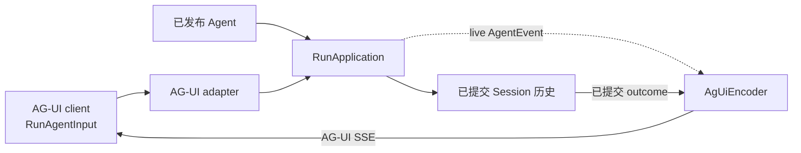
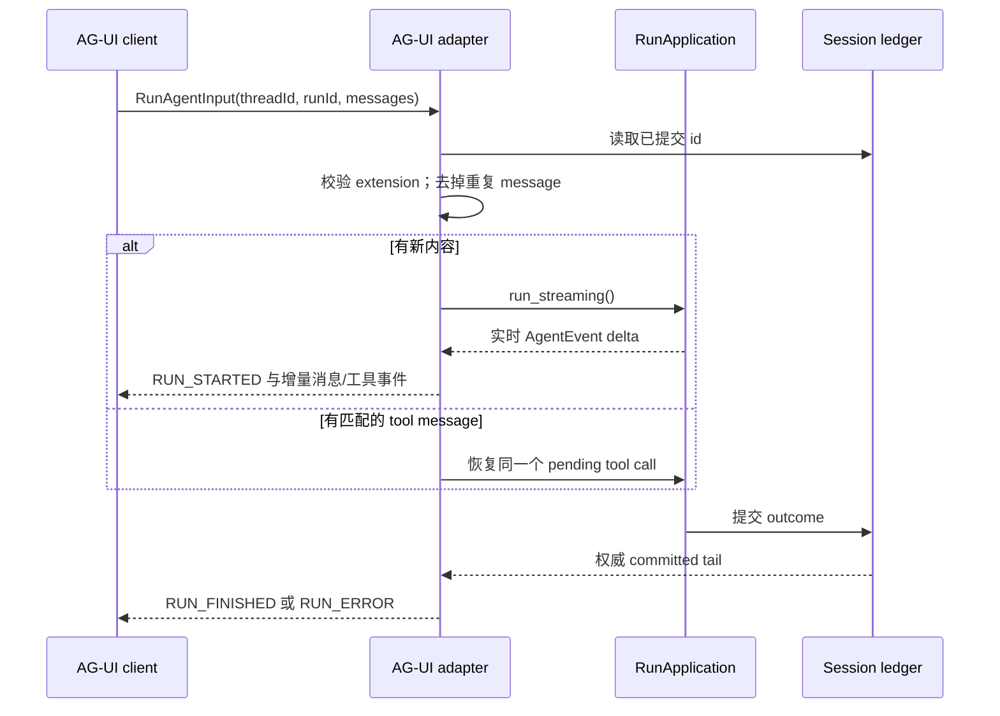

当前端已经使用 AG-UI 时选择这条协议，包括围绕 `HttpAgent` 构建的 CopilotKit
应用。应用发送 `RunAgentInput`，Awaken 返回 AG-UI 事件流；对话仍写入其他应用
协议共用的 Session 历史。

AG-UI 是前端 wire，不是复制 Agent 工具、Memory 或权限策略的地方。这些定义仍属于
已发布 Agent。如果前端还可以选择 AI SDK 或 Managed Agents，先看
[接入矩阵](/zh/docs/agents/protocols/connect/)。

## 边界与归属

Adapter 负责请求校验、AG-UI 事件 framing 和消息历史投影。`RunApplication` 仍是
执行权威，Session ledger 仍是历史权威。系统没有 AG-UI 专属 Agent 定义，也没有
第二套 run state machine。

## 当前契约

默认运行入口是 `POST /v1/ag-ui`。Agent-scoped 与 history path 统一列在
[公共 HTTP API](/zh/docs/agents/reference/api/)中。

| 任务 | 请求边界 | 结果 |
| --- | --- | --- |
| 开始一次输入 | 带有新且受支持内容的 `RunAgentInput` | AG-UI SSE 流 |
| 恢复 pending tool call | 一条匹配的 tool message | 继续同一个 Run |
| 重建 thread | `threadId` 与可选的当前 cursor | 已提交 AG-UI message 的 `{ items, cursor }` 分页 |

新输入接受 user、system、developer 文本，以及 URL 或 inline base64 图片。当前
adapter 不实现每次 run 单独传入的 `tools`、`context`、`parentRunId`、非空
`state`、`forwardedProps` 或 `resume`，也不接受 audio、video、document 或 binary
输入。它会在执行前明确拒绝，而不是静默忽略。

## 运行与恢复

客户端工具用相同 `toolCallId` 返回 `role: "tool"` message。内置工具在权限门等待时，
相同 message 没有 `error` 表示允许；带 `error` 表示拒绝。两者都会恢复原来的 pending
call。提交另一个 call 的结果会 fail closed。

实时事件负责低延迟文本和工具参数，完成状态来自已提交 outcome。断线后通过 message
history 的 `cursor` 分页恢复，不要从浏览器最后看到的 live event 推断 durable state。

## 读取结果

| 可见结果 | 含义 | 应用动作 |
| --- | --- | --- |
| `RUN_STARTED` 后出现消息或工具事件 | 当前输入已准入并在执行。 | 按顺序渲染。 |
| 工具事件尚未出现成功终态 | Run 可能正在等待客户端结果或权限。 | 返回一条匹配的 tool message。等待是正常状态，不是故障。 |
| `RUN_FINISHED` | 已提交 outcome 完成。 | 当前输入结束，并保留其 `threadId`。 |
| 带 code 的 `RUN_ERROR` | 输入被拒绝，或 Run 以分类错误结束。 | 修正输入契约错误；其他情况先读取同一 `threadId` 的已提交历史，并保留 `runId`、code 与脱敏 message。 |
| 历史读取返回 `400` | 当前已提交分页中不存在该 cursor。 | 放弃伪造或过期 cursor，从第一页重新读取。 |
| 历史读取返回 `503` | 历史存储暂时不可用，并不表示 thread 为空。 | 保留当前 `threadId` 与 cursor；服务恢复后以有界退避重试读取，不要用空历史覆盖本地状态。 |

Malformed JSON、错误 content type 和不支持的字段都会成为单一 `RUN_ERROR` 流，且不会
启动 Run。历史存储不可用时返回 `503`，不会伪装成空 thread。浏览器断线也无需手工
清理，adapter 会自动 interrupt 仍在执行的 Run。

## 验证接入

浏览器能看到文字只证明实时 wire 可用。完整验收还要用相同 `threadId` 读取已提交
历史，并在 Console 检查 Session。CopilotKit 的具体接法和生产 proxy 边界由
[通过 AG-UI 集成 CopilotKit](/zh/docs/agents/how-to/integrate-copilotkit-ag-ui/)维护。

公共 HTTP API 仍是完整路由索引。
