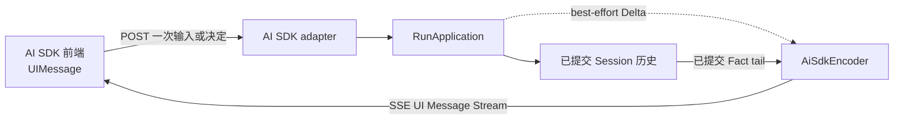
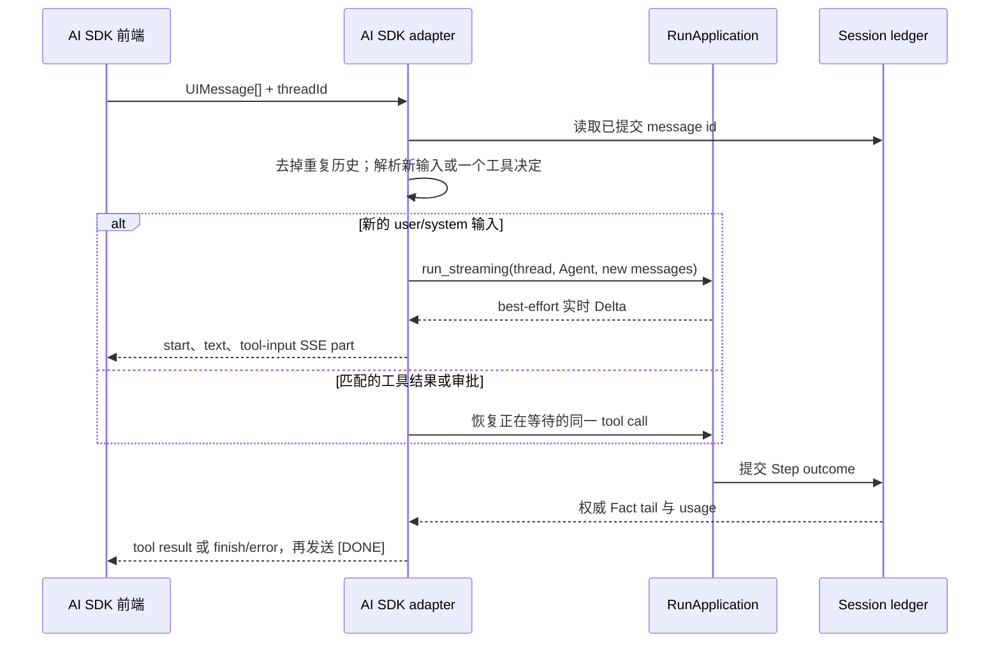

当前端已经使用 Vercel AI SDK 的 `UIMessage` 模型时，选择这条协议。Awaken
接收相同的请求形状，并返回 AI SDK v6 UI Message Stream。前端可以继续使用
熟悉的流解析器，Agent 配置和 Session 历史仍由 Awaken 维护。

如果应用使用 AG-UI `HttpAgent`，选择 [AG-UI](/zh/docs/agents/protocols/ag-ui/)；
如果要让 Anthropic 官方 SDK 成为应用契约，选择
[Managed Agents](/zh/docs/agents/protocols/managed-agents/)。所有协议的横向选择只在
[接入矩阵](/zh/docs/agents/protocols/connect/)中维护。

## 这条边界传递什么



Adapter 只是共享 `RunApplication` 的 wire projection，不会再定义一套 Agent、
工具注册表、权限策略或历史存储。`AiSdkEncoder` 是实时 `Delta` 与已提交
`Fact` tail 共用的唯一有状态投影。

## 发送一次输入

默认入口是：

```text
POST /v1/ai-sdk/chat
```

```json
{
  "messages": [
    {
      "id": "msg-1",
      "role": "user",
      "parts": [{ "type": "text", "text": "概括最新一条支持请求" }]
    }
  ],
  "threadId": "support-demo-1",
  "agentId": "support-agent"
}
```

| 字段 | 应该发送什么 |
| --- | --- |
| `messages` | AI SDK v6 `UIMessage[]`。新的 user/system 文本会成为输入；图片 `file` part 可使用托管 URL 或 base64 Data URL。其他文件媒体和只属于 UI 的 part 不会进入模型。 |
| `threadId` | 同一段对话复用同一个非空值。只有在应用不需要自己选择标识时才省略。 |
| `agentId` | 选择一个已发布 Agent。省略时使用已配置的默认 Agent。 |

Thread 作用域、Agent 作用域和历史读取路由统一列在
[公共 HTTP API](/zh/docs/agents/reference/api/)中。可复制的 React transport 示例由
[集成 AI SDK 前端](/zh/docs/agents/how-to/integrate-ai-sdk-frontend/)维护。

## 一次请求如何完成



每个事件都是一个 SSE `data:` 行，内容为单个 JSON object。响应使用
`x-vercel-ai-ui-message-stream: v1` 标识格式；安静期间发送 keep-alive comment，
最后以 `data: [DONE]` 结束。

实时文本和工具参数让界面更快，但不是恢复依据。完整消息、工具可用状态、
工具结果、usage、等待状态和终态都由已提交 tail 决定。断线重开或需要可靠视图时，
读取 thread history。

## 解释事件

| 前端看到什么 | 含义 | 应用动作 |
| --- | --- | --- |
| `text-start` / `text-delta` / `text-end` | 正在组装一个可展示的文本块。 | 按顺序渲染。`text-end` 只是 block 边界，不代表 Session 已完成。 |
| `tool-input-*` 后出现 `tool-approval-request` | 内置工具正在等待权限决定。 | 用同一个 `toolCallId` 返回 AI SDK `approval-responded` part。 |
| 客户端工具出现 `tool-input-available` | 工具执行属于应用。 | 用相同 `toolCallId` 返回 output 或 error，恢复同一个等待调用。 |
| `finish` 的原因是 `tool-calls` | Run 正在等待，不是失败。 | 处理界面上的工具或审批请求，不要另起无关请求。 |
| `finish` 的原因是 `stop` | 已提交 Step 正常结束。 | 当前输入完成；需要可靠重建时读取历史。 |
| `error` 后跟原因是 `error` 的 `finish` | 请求或 Run 以明确错误结束。 | 展示错误，不要把此前的实时文本当作已提交完成。 |

协议可以发送 reasoning 生命周期边界，但不会发送私有 reasoning bytes。Adapter 会在
进入工具 block 前关闭已打开的 text 或 reasoning block，前端无需修补 block 顺序。

## 应用需要纠正的条件

这里只有协议处理后仍需调用方决定的错误：

| 可见现象 | 检查 | 处理 |
| --- | --- | --- |
| 尚未产生有效输出就出现 `error` | 检查 JSON、`Content-Type` 和 `UIMessage` 字段类型。解析错误会进入事件流，而不是返回纯文本 HTTP 错误。 | 修正请求，只发送一次。 |
| 工具决定返回“没有等待中的 Run”，或对应了错误的 call | 将提交的 `toolCallId` 与已提交历史里的当前 pending tool 对照。 | 刷新历史，只为当前 call 提交决定，不要复用旧界面的决定。 |
| 部分实时输出后出现 `error` | 先读取同一 `threadId` 的已提交历史，再判断是否仍需继续。 | 保留错误文本和当前 id；不要仅因浏览器只显示了前缀就重复发送相同输入。 |

浏览器断线不需要手工清理。Adapter 会自动 interrupt 仍在执行的 Run，避免它脱离
客户端继续消耗资源。重新打开已提交历史即可；不要在 `/v1/ai-sdk` 下猜测 reconnect、
cancel 或 draft-preview URL。

## 相关

- [集成 AI SDK 前端](/zh/docs/agents/how-to/integrate-ai-sdk-frontend/)
- [Session 与事件](/zh/docs/agents/concepts/sessions-and-events/)
- [事件](/zh/docs/agents/runtime/reference/events/)
