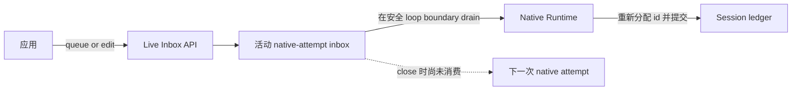
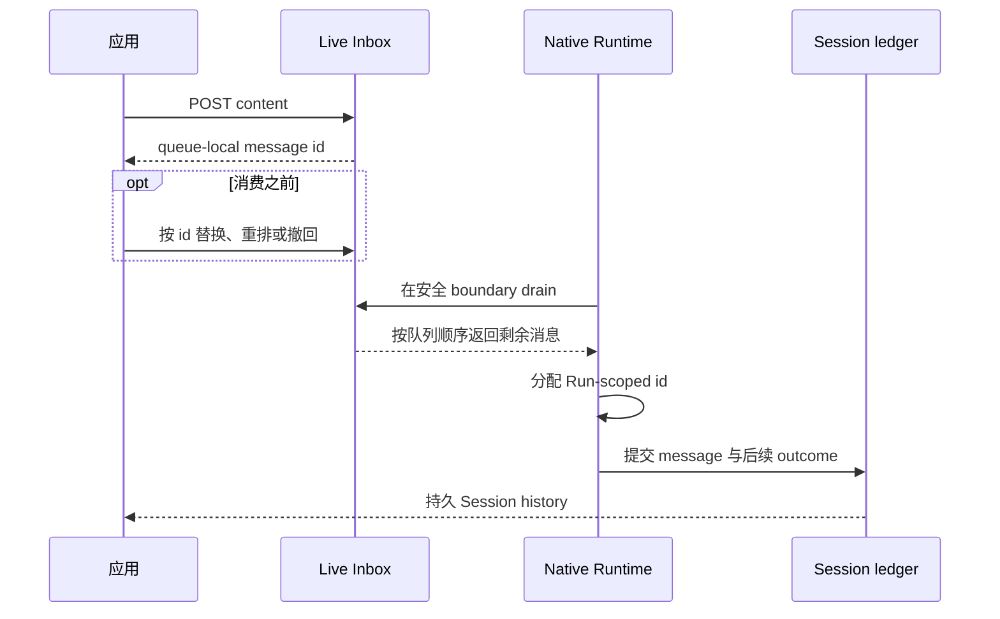

只有原生 Run 正在执行，而且应用要修改 Agent 尚未消费的输入时，才使用 Live Inbox。
消息仍在队列中时，可以排入、替换、重排或撤回。

这是一个 best-effort 操控窗口，不是持久消息入口。如果输入必须保留、当前没有活动 Run，
或所选 executor 是 ACP，请发送普通 Session event。该扩展明确位于 `/v1/awaken`
命名空间，不属于 Managed Agents compatibility surface。

## 可以编辑的边界



队列位于进程内，附着于一次活动 native attempt。只有在 Runtime 尚未于安全 loop
boundary drain 之前，消息才可编辑。Drain 会移除 queue identity，分配 Run-scoped
message id，并在下一次模型决定前把内容折入 transcript。让输入成为权威事实的是
Session commit，不是它曾出现在队列中。

尚未消费的 entry 会带入同一 Runtime host 拥有的下一次 native attempt。当前实现
不会为 ACP executor 打开该 inbox，队列本身也不是跨进程恢复通道。

## 排入与编辑

所有操作共用 base path：

```text
/v1/awaken/sessions/{session_id}/live-inbox
```

| 意图 | 请求 | 成功结果 |
| --- | --- | --- |
| 读取可编辑窗口 | `GET` base path | `{ active, version, messages }` |
| 排入内容 | `POST` base path，body 为 `{ "content": [...] }` | queue-local 稳定 `{ "id": ... }` |
| 替换内容 | `PUT /{message_id}`，body 为 `{ "content": [...] }` | `204 No Content` |
| 撤回内容 | `DELETE /{message_id}` | `204 No Content` |
| 重排队列 | `PUT /order`，按目标顺序提交当前所有 id | `204 No Content` |

重排必须是当前队列的完整排列，不是局部移动。先读取新 snapshot，再让每个返回 id
恰好出现一次。过期排列被拒绝时，队列保持不变。

## 一条消息如何进入历史



Snapshot 之后提交的编辑并不保证一定赶在消费之前。HTTP 结果会明确告诉应用，队列
是否仍接受了这次操作。

## 应用必须处理的条件

| 结果 | 它能说明什么 | 处理 |
| --- | --- | --- |
| Base path 返回 `404 Not Found` | 当前 Workspace scope 下找不到或不可见该 Session。 | 检查 Session id 与 Workspace-bound credential。边界不会透露具体是哪项检查失败。 |
| Message id 返回 `404 Not Found` | 该 id 已不可编辑：可能已消费、已撤回，或从未属于这个队列。 | 读取新 snapshot；消息不在时，改查已提交 Session history，不要重复编辑。 |
| `409 Conflict` | 提交的 order 不是当前队列完整排列，且重排没有生效。 | 重新 `GET`，只用新 snapshot 中的 id 重试一次。 |
| `410 Gone` | 当前没有 native attempt 接受 live input。 | 停止编辑，改用普通持久 Session event 发送内容。 |
| `500 Internal Server Error` | Session ownership 无法读取，因此尚未尝试 queue mutation。 | 内容保留在调用方；Session read 恢复后再试，或在持久 event 路径可用时改走该路径。 |

正常消费不需要故障排查。消息从 editable snapshot 消失，可能只是系统已经 drain；
要区分输入已被接受还是此前已撤回，应查看 committed history。

## 相关

- [Session 与事件](/zh/docs/agents/concepts/sessions-and-events/#live-inbox)
- [管理 Session](/zh/docs/agents/how-to/manage-a-session/)
- [公共 HTTP API](/zh/docs/agents/reference/api/)
