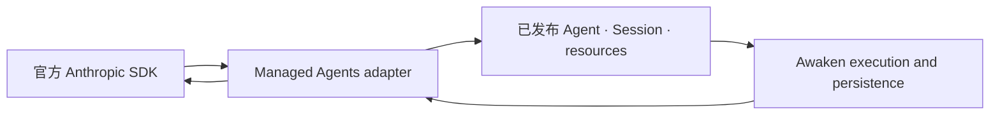

**Managed Agents** 提供通过 Anthropic SDK 创建有版本 Agent 并继续 Session 的应用契约。
Awaken Agents 把已测试子集实现为自托管协议 adapter，复用已有 Agent、Session 与执行
权威。如果应用已经使用这套 SDK 模型，并希望由团队自己运营基础设施，就选择这个协议。

如果是新应用，先完成 **[运行第一个 Awaken Session](/zh/docs/agents/get-started/)**。
这是从 SDK 配置到 Session 回到 `idle` 的最短已测试路径。本页解释这条路径之下的边界。

## 哪些会改变，哪些保持不变

| 应用需要改变 | 应用可以保留 |
|---|---|
| SDK base URL、部署认证与适用的 beta opt-in | 已测试兼容边界内的官方 SDK request 与 response 类型 |
| 服务的部署与运维方式 | Agent 与 Session 的资源标识 |
| API 背后的 provider、Worker、Environment、Sandbox 与存储配置 | 通过 Managed wire 读取 Session event、history 并继续 Session 的方式 |

已测试 SDK 版本、所需 beta header、支持的资源族、已知差异与 Awaken 扩展只有一个权威页面：
**[Anthropic SDK 兼容性](/zh/docs/agents/compatibility/)**。迁移已有客户端前先阅读该页。
兼容经过测试的 wire 表面，不代表 Awaken 实现了每一个 Anthropic API，也不代表两者提供
相同的托管服务。

## 静态结构：一个 wire adapter，一套 runtime

`awaken-protocol-managed` 是 Anthropic 词汇进入 Awaken 的反腐层。它拥有 wire DTO、
请求校验、响应投影与 HTTP router；它调用已有 Session runtime，不构造第二套 runtime，
也不保存第二份 Agent 或 Session 数据。

同一个已发布 Agent、Session identity、permission decision 与 committed event 也可由
Console 和其他协议 adapter 观察。

## 动态行为：从请求到已提交事件

1. Adapter 校验认证、路由族的 beta opt-in 与 Managed Agents request shape。
2. 它通过已有 application 与 persistence port 解析已发布 Agent 和 Session。
3. Worker 执行选定的 Native、ACP 或 A2A backend。
4. Runtime 先提交事件，adapter 再将其投影为 event history 与 SSE。
5. 校验、placement 与执行失败使用 Managed Agents error envelope；不支持的 backend
   不会被静默替换。

## 增加功能前先验证一条连接

用容易辨认的输入创建一个 Session，保留其 id，持续读取 event，直到 Session 回到
`idle`；再确认 Console 显示同一个 id、Agent、status 与 committed history。这能证明
客户端与自托管 runtime 正在观察同一个 Session，但不能证明更大范围的 SDK 兼容性；
后者应以兼容性页面为准。

继续完成 **[运行第一个 Awaken Session](/zh/docs/agents/get-started/)**。

## 参考

- [Anthropic SDK 兼容性](/zh/docs/agents/compatibility/)：已测试版本、beta header、差异与扩展
- [公共 HTTP API](/zh/docs/agents/reference/api/)：公共路由族的唯一索引
- [Session 与事件](/zh/docs/agents/concepts/sessions-and-events/)：Session 生命周期与已提交事件模型
