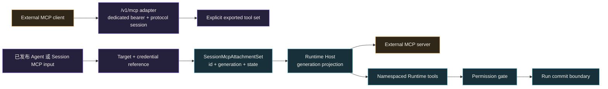
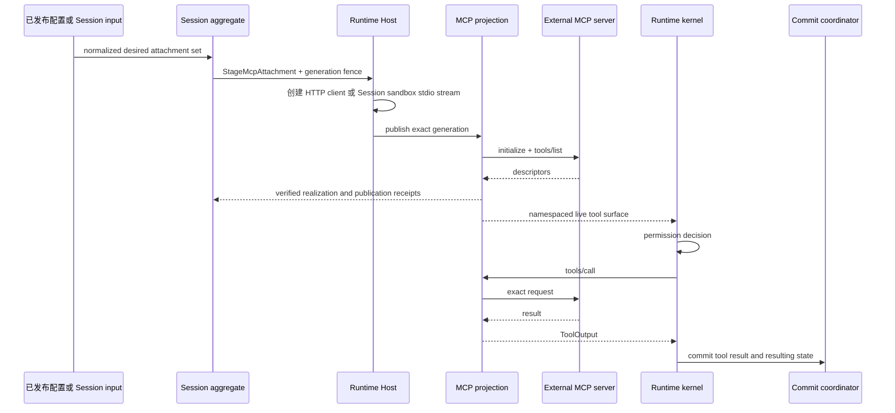

MCP 可以从两个方向连接。先选择方向，再配置 transport 或 credential。

| 目标 | Awaken 的位置 | 连接完成的可见信号 |
|---|---|---|
| 让外部 MCP client 调用 Awaken 管理工具 | MCP server | Client 完成 `/v1/mcp` 初始化，且 `tools/list` 只包含显式导出集 |
| 让 Awaken Agent 调用外部 MCP server | MCP client 与 host | Session trace 中出现准确的 namespaced tool id、permission decision 与 committed result |

两个方向共享工具治理，但不是同一条连接。一个方向成功，不能证明另一个方向已经接通。

## 当前 MCP 集成支持什么

Awaken 当前可协商到 `2025-11-25` 版本。下表描述的是产品行为，不以代码中是否存在某个
wire type 作为支持依据。

| 能力 | Agent 连接 MCP server | 外部 Client 连接 Awaken |
|---|---|---|
| 工具发现与调用 | 支持。工具使用 `mcp__server__tool` ID，并执行 Agent 的 MCP ToolSet 策略。 | 支持显式导出的工具集。 |
| Transport | 支持 Streamable HTTP 和 Session 所属的 sandbox stdio。 | Streamable HTTP 支持 `POST`、`GET`、`DELETE`；嵌入式 Server 可使用 stdio。 |
| 目录变化 | 工具变化会刷新实时命名空间目录；transport 边界也会消费 Prompt 与 Resource 通知。 | 导出源变化时发送 `tools/list_changed`。 |
| Progress | 有条件支持。Transport 可以接收 `notifications/progress`，但导入工具尚未把进度投影到 Session Event 或 Trace。 | 当导出工具实现进度接口，且调用方提供 `progressToken` 时支持。 |
| Cancellation | 有条件支持。替换或 drain generation 会停止本地接入和执行中的 future；当前尚不保证已把取消传递给对端。 | 执行中的请求接受 `notifications/cancelled`。 |
| Prompts | 可选。为该集成开启 **Prompts as Skills**。 | 当前只导出 Tools，不导出 Prompts。 |
| Resources | Transport 边界已有 `resources/list` 与 `resources/read`，但尚未形成 Agent 输入闭环。 | 当前只导出 Tools，不导出 Resources。 |
| Sampling、Elicitation、Roots | 当前产品装配未声明。 | 未声明。 |
| MCP Tasks | 未声明，也未实现。 | 未声明，也未实现。 |

MCP Tasks 与 Awaken 后台工具执行解决的是相关但不同的问题。MCP Tasks 是两个 MCP peer
之间协商的协议扩展；Awaken 后台执行是针对已有工具的 Runtime 策略，不会为 MCP 连接增加
`tasks/get`、`tasks/update` 或 `tasks/cancel`。当前 MCP 项目将 Tasks 定义为
[实验扩展](https://modelcontextprotocol.io/extensions/tasks/overview)，因此必须明确协商并测试，
不能因为出现 `taskSupport` 字段就推断为已经实现。

Console 的 MCP 页面展示同一份平台基线。已配置的 binding 不是实时能力探测；依赖某个
server 的可选行为之前，仍须运行一次真实 Session。

## 静态结构：协议边界不拥有 Agent 权限

Transport 健康或 tool 可见都不会授予 Agent 权限。模型调用仍须命中已发布 descriptor，
并通过已有 permission path。Server adapter 不枚举 Runtime registry，因此 shell tool
和从另一个 MCP server 导入的 tool 不会被意外导出。

## Awaken 作为 MCP server

启动前在 `config.toml` 设置非空 `mcp_bearer_token`。未设置时，公共 `/v1/mcp` route
不存在；设置后，每个请求都必须携带匹配的 `Authorization: Bearer …`。

| 方法 | 路径 | 作用 |
|---|---|---|
| `POST` | `/v1/mcp` | 发送一条 JSON-RPC message；`initialize` 创建 protocol session |
| `GET` | `/v1/mcp` | 为已初始化的 protocol session 打开 SSE notification stream |
| `DELETE` | `/v1/mcp` | 结束 `Mcp-Session-Id` 指定的 protocol session |

`initialize` 不能预带 `Mcp-Session-Id`；后续请求使用 server 返回的 id。请求体是单个
JSON-RPC object，不接受 batch。Bearer 校验发生在 protocol session 创建之前。

当前发布前接口以这个配置的 bearer 作为认证边界。不要把它描述成 MCP 完整
OAuth authorization profile 的实现。对可信边界之外开放前，还应放入部署原有的网络与
身份控制之内。

## Awaken 消费外部 MCP server

当前 1.0-dev 路径从已发布 Agent 或 Session input 接收 HTTP(S) target，或显式
`sandbox_stdio` command。

- HTTP target 具有 canonical URL identity，并可绑定准确的 credential reference。
- Sandbox stdio target 使用不含 secret 的 command 与 argument identity。可执行文件在
  冻结的 Session Environment 中解析和启动，不在 Runtime Host 上运行。它的 credential
  通过显式 secret-environment binding 提供，不使用 HTTP 风格的 target credential。

两种形式都会成为不含 secret 的 `McpAttachmentDraft`。Session aggregate 拥有 attachment
id、generation 与 state。Runtime 返回与完整 stage request 相符的 receipt 后，该
generation 才能进入 active。Publish 与 drain effect 使用准确 `McpGenerationRef`，绝不只用
server name 作为身份。

在 Console 中，从 **Agent → 构建 → Skills 与 MCP** 配置这项能力。一个 MCP server
对应一个 MCP ToolSet 策略。默认值决定后续发现的工具是否可用、调用前是否需要审批；
指定工具覆盖可以收窄这个默认值。连接与策略必须成对存在，缺失、重复或没有对应 server
的策略都会使草稿校验失败。

Attachment lifecycle 是系统正常行为。成功的 realization 从 `Requested` 进入
`Realizing`，再进入 `Active`；替换 active generation 时，旧 generation 经 `Draining`
进入 `Removed`。尚未 realization 的 request 可以直接进入 `Removed`，realization error
则进入终态 `Failed`。Reconciliation 与 receipt 校验推进或拒绝这些状态转换；
这些状态不是交给外部维护者执行的修复步骤。

Environment 暂时未 ready 时，系统会保留 durable Session，并通过受 fence 约束的路径重试。
它可能表现为 `503`，同时 Session 处于 `rescheduling`；不要把这种状态写成人工 MCP 修复流程。

## 动态行为：发现、授权、调用、提交

验证向内接入时，要同时检查已发布的 server 与 credential binding、Session trace 中的准确
tool id、permission decision 和 committed tool result。`tools/list` 只证明完成发现，不能
证明权限已经授予或结果已经持久化。

## 故障排查

只有故障经过上述系统行为后仍未消失，并且存在公共修正入口时，才使用下表。

| 现象 | 检查 | 处理 |
|---|---|---|
| 创建 Session 返回 `400 invalid_request_error`，或指出未知 Vault id | 阅读 response type 与 message；把 MCP target、server name、Environment policy 和 Vault id 与提交的 request 对照 | 修正 request 或 binding，再创建一个新 Session |
| 更新已有 Session 返回 `500 api_error` | 再次读取该 Session。替换无法 stage 时，原先 active 的 `agent.mcp_servers` binding 仍然可见；把提交的 target 与 credential reference 和预期值对照 | 修正不一致之处，再发送一次相同的 `POST /v1/sessions/{id}` update。如果这些值原本就正确，停止重试并收集下方证据 |
| 新 Session 返回 `500 api_error`，并且无法读取该 Session | 先确认它不是临时 `503` readiness 情况 | 停止重试，记录时间、route、Agent 与 Environment id、HTTP status、error type 和 message，再提交支持请求 |

如果表中步骤仍未解决问题，请先记录准确 command 或 route、时间、已有的稳定 Agent 或
Session id、HTTP status 与 response error。不要附带 bearer token、credential material
或未经脱敏的 request body。

继续阅读 **[使用 MCP 工具](/zh/docs/agents/runtime/how-to/use-mcp-tools/)**，完成嵌入路径。

## 参考

- [协议接入矩阵](/zh/docs/agents/protocols/connect/)
- [Session 与事件](/zh/docs/agents/concepts/sessions-and-events/)
- [能力与权限](/zh/docs/agents/runtime/explanation/capability-and-permissions/)
- [模型发布与 credential 执行边界](/zh/docs/agents/reference/provider-model-config/)
