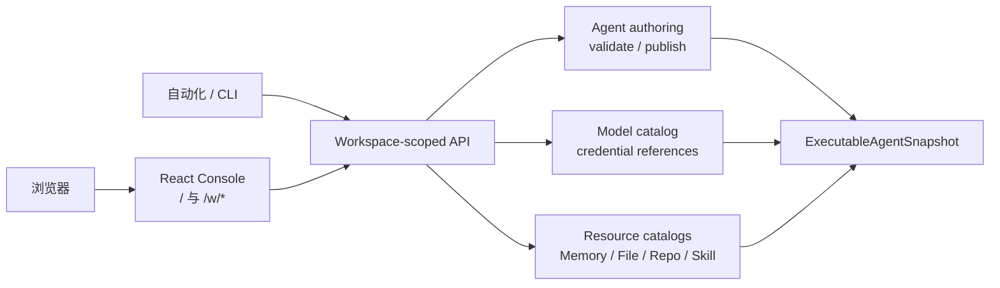
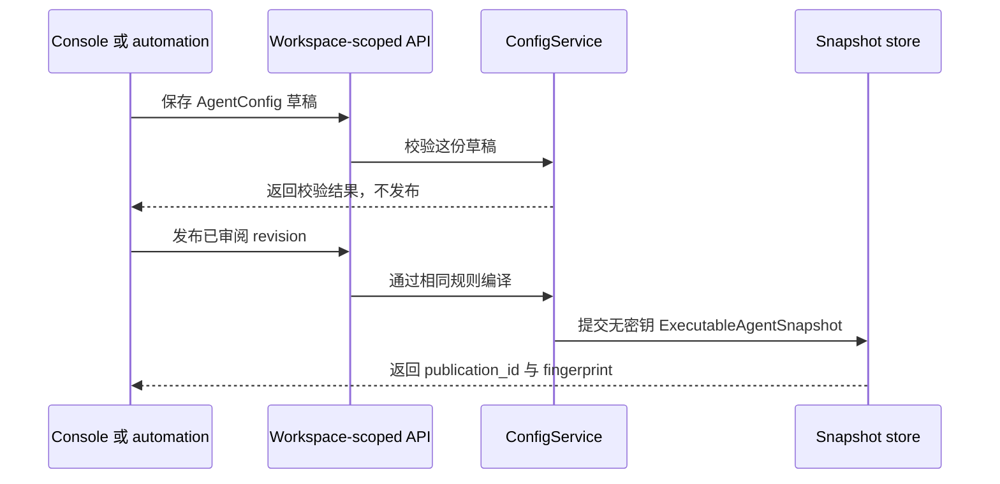

需要交互地修改并在发布前检查时，使用 Console；需要自动化、可审阅 payload 和可重复
环境时，使用管理 API。两条路径调用同一组 Workspace-scoped service，并发布同一种
`ExecutableAgentSnapshot`。Console 不是另一份配置存储。

| 要做什么 | 路径 | 完成标志 |
| --- | --- | --- |
| 交互式探索或审阅一次变更 | 启动 `awaken` 或 `awaken all-in-one`，然后打开 `/` | 校验通过，并显式发布了预期 revision |
| 从自动化应用同一变更 | 使用 trusted Workspace identity 调用管理 API | API 返回 `publication_id` 与 `fingerprint`，自动化记录它们 |

进程在 `/` 与 `/w/*` 提供内嵌 React application。精确 route 由[公共 API
索引](./api)维护，精确管理字段由[生成的 OpenAPI 契约](./management-openapi)维护。

## 静态结构

## 唯一配置生命周期

Agent 编辑器保存的是可变 `AgentConfig` 草稿。`validate` 使用与发布相同的解析和编译
规则进行只读检查；`publish` 才生成内容寻址、无明文密钥的
`ExecutableAgentSnapshot`。Session 和 Worker 只消费已发布快照，不读取 Console
表单或临时默认值。

Console 中的 MCP、Skill 和多 Agent 选择已属于 `AgentConfig`；File、Memory 与
Repository 默认输入由 `/v1/config/agents/:agent_id/resources` 维护。Awaken
没有 `Project` scope，也没有 `/v1/config/projects/*` 配置分支。

保存草稿和通过校验都不会自动发布。关闭浏览器不会丢失已接受的写入，因为结果由 API 与
领域存储持有，而不是由表单状态持有。

## 写入前完成认证

所有管理请求都应在入口解析为可信 Workspace。`identity_mode = "no-login"` 只能用于
显式本地机器。设置 `identity_mode = "self-managed"` 后，`/v1/config/*` 与
`/v1/vaults/*` 使用 bearer `ApiToken` 或 `x-api-key`，token 在存储中使用 argon2id
哈希。空 `data_dir` 首次启动会以仅 owner 可读权限把 bootstrap admin token 写到
`<data_dir>/admin-token`。`identity_mode = "awaken-cloud"` 把 identity 委派给配置的
Cloud boundary。

凭据值只在创建时进入密封存储，读取、目录、发布快照和审计视图均保持无密钥。产品
命令不会把进程环境作为 provider 或 credential 配置来源。

只处理已经对外呈现的失败：

| 可观察结果 | 系统已经做了什么 | 需要做什么 |
| --- | --- | --- |
| `401 authentication_error` | 在写入配置前拒绝了请求 | 提供当前有效的 bearer token 或 `x-api-key`；self-managed 首次启动时，从受保护文件读取 bootstrap token |
| `403 permission_error` | 完成认证，并拒绝了该操作或 foreign Workspace | 使用预期 Workspace 和允许该操作的 authorization |
| 校验失败、`agent_publication_unresolvable`，或 source/resource revision 已过期 | 没有生成新的 executable registration | 读取当前草稿与 resource revision，修正 response 指出的事实，重新校验，再显式发布 |
| `503 agent_registration_unavailable` | storage 已成功时保留不可变 publication，不生成第二个 fingerprint | 等待 registration 恢复 readiness，再重复同一 publish；重试会复用持久化 fingerprint，启动恢复也会 replay durable registration |
| `409 agent_registration_conflict` | 保留冲突的持久化事实，不静默选择其中一个 | 停止发布；记录 problem `code`、`detail`、Workspace、Agent id 和预期 source/resource revision，再与当前配置比较 |

遇到这些 response 不要直接修复领域存储。被拒绝的写入不会留下 Console 独有的半份配置，
registration 重试也不需要删除已经持久化的 publication。

## 路由归属

为避免 Console 页面、How-to 与路由参考各维护一份容易漂移的清单，本页不再复制具体
端点：

- [公共 HTTP API](/zh/docs/agents/reference/api/) 是路由族的唯一索引；
- [配置 provider、模型与凭据](/zh/docs/agents/how-to/configure-providers-models-credentials)
  维护可执行的操作步骤；
- [模型发布与凭据执行边界](/zh/docs/agents/reference/provider-model-config)
  解释发布期与运行期契约。

## 代码坐标

- `web/src/`：React Console
- `crates/bin/awaken-cli/src/console_assets.rs`：嵌入式静态资源
- `crates/control/awaken-config-service/src/config_service.rs`：Agent 草稿、校验与发布
- `crates/control/awaken-admin-config-api/src/router.rs`：catalog、credential 与资源配置
- `crates/control/awaken-control/src/authz.rs`：管理路由授权映射
