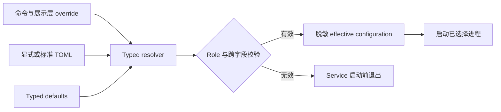
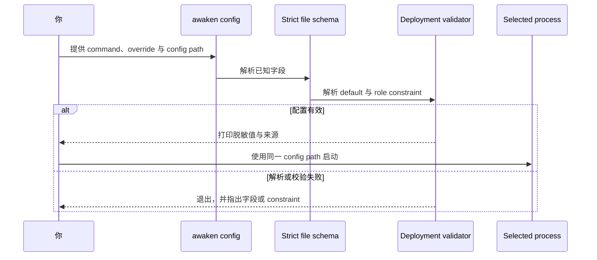

写 TOML 前先选择要运行的进程。为该进程使用一份配置文件，校验生效结果，再用同一份文件
启动同一个命令。

| 任务 | 命令 | 配置边界 |
| --- | --- | --- |
| 评估完整本地产品 | `awaken all-in-one` | 合并运行 Control、Coordinator、Resources、本地 Worker、Console 与协议 API |
| 单独运行编写与发布 | `awaken control` | Control store 与经过认证的 Coordinator 边界 |
| 单独运行 Session 与 Worker 协调 | `awaken coordinator` | Coordinator store、dispatch、commit 与经过认证的 Control 边界 |
| 增加执行容量 | `awaken-worker --config <path> --server <url>` | 严格、无数据库的 Worker schema |
| 准备共享 server schema | `awaken database migrate --config <path>` | Application process 启动前的显式 migration |

不要在这些边界之间复制字段。严格 schema 会拒绝未知或与 role 不兼容的值，不会忽略它们。

## 值解析

`awaken` 产品命令严格按以下顺序解析三个来源：

1. `--port`、`--data-dir`、`--no-browser` 等展示层 override；
2. 显式 `--config <path>` 或标准 `~/.awaken/config.toml`；
3. typed default。

进程环境不是部署、模型、业务或凭据配置来源。使用 `awaken config` 或
`awaken config --json` 检查生效的脱敏结果和值来源。



## 通用字段

| TOML key | 用途 | 默认值 / 约束 |
| --- | --- | --- |
| `role` | `all-in-one`、`control`、`coordinator` 或 `worker` | `all-in-one`；退役的 `serve`/`server` 名称会被拒绝 |
| `mode` | `local` 或 `server` schema-lifecycle policy | `local` |
| `data_dir` | 内嵌数据、生成的本地 seal key 与本地 artifact | `~/.awaken` |
| `bind` | `IP:PORT` 形式的服务监听地址 | `127.0.0.1:8080` |
| `run_local_pool` | 允许 AllInOne 消费自己的 dispatch | `true`；仅 AllInOne |
| `no_browser` | 禁止自动打开浏览器 | `false` |
| `suite_hub_url` | 可选的 browser-console suite navigation | 未设置 |
| `identity_mode` | `no-login`、`self-managed` 或 `awaken-cloud` | 部署 policy |
| `cloud_models` | `disabled` 或 `enabled` | `disabled`；启用时要求 Awaken Cloud identity |
| `org_id`, `iam_workspaces` | 本地 organization 与允许的 Workspace scope | 经过校验的 typed value |

未知 TOML 字段会导致解析失败。角色子命令（`control`、`coordinator`、`worker`）
会覆盖文件中的 `role`，因此被调用进程不能从文件悄悄取得更宽角色。

## Store 与 schema lifecycle

| TOML key | 所有者 | 规则 |
| --- | --- | --- |
| `runtime_database_url` | Coordinator dispatch/commit | PostgreSQL URL；拆分 Coordinator 必填 |
| `resource_database_url` | Resources component | 共享 Resource 内容的 PostgreSQL URL |
| `catalog_db`, `credential_db`, `config_db`, `admin_db`, `data_subject_db` | Control | 内嵌路径或 PostgreSQL URL |
| `environment_db`, `sessions_db`, `captured_content_db` | Coordinator | 内嵌路径或 PostgreSQL URL |
| `management_database_url_file` | AllInOne 部署快捷方式 | 文件内包含一个共享 PostgreSQL URL；不能与逐 store URL 混用 |
| `postgres_max_connections` | 共享 PostgreSQL pool | 正整数 |

Local mode 在启动时迁移内嵌 store。共享 server 部署必须先于 application Pod 运行：

```console
awaken database migrate --config /etc/awaken/config.toml
```

Server mode 的应用启动只校验已有 schema，不写 DDL。Worker 拒绝全部权威数据库字段；
Control 拒绝 Coordinator 执行数据库；Coordinator 拒绝 Control 数据库与 Control seal key。

## 私有服务边界与 secret

| TOML key | 使用者 | 规则 |
| --- | --- | --- |
| `coordinator_internal_url` | 拆分 Control | 精确 executable-Agent registration 目的地 |
| `executable_agent_registration_token_file` | Control 与 Coordinator | 二者读取同一份 operator-projected 最小权限 bearer 文件 |
| `control_internal_url` | 拆分 Coordinator | 已认证 Control application boundary |
| `control_service_token_file` | Control 与 Coordinator | 反向边界 token 文件 |
| `control_seal_key` / `control_seal_key_file` | AllInOne 或 Control | 二选一；Worker 与拆分 Coordinator 均拒绝 |
| `mcp_bearer_token` | MCP export | 非空时才挂载 route |
| `cloud_iam_service_token_file` | Cloud identity integration | 优先使用文件投射，不把 token 内联 |

`awaken config` 永不输出 token 值、数据库 URL 或 seal-key material。

## Worker 字段

独立进程命令是 `awaken-worker --config <path> --server <coordinator-url>`；TOML 中也可用
`worker_server` 提供 URL。它使用严格 schema，可接受的字段如下：

| TOML key | 用途 |
| --- | --- |
| `role`, `mode`, `worker_server`, `worker_server_ca_certificate_file` | 可选 role/mode 断言与 Coordinator connection |
| `worker_id`, `worker_zone`, `worker_build_digest`, `worker_capabilities`, `worker_max_concurrent` | Worker identity、placement fact 与 capacity |
| `worker_request_credential_file` | Worker request authentication material |
| `worker_credential_material_root`, `worker_credential_trust_domain` | Worker trust domain 内的精确凭据投射 |
| `worker_admin_listen`, `worker_drain_grace_secs` | health/admin listener 与 graceful drain |
| `worker_credential_probe_interval_secs`, `worker_credential_observation_ttl_secs` | liveness observation；TTL 必须大于非零 probe interval |
| `sandbox_tier`, `sandbox_dir`, `sandbox_allow_local_fallback`, `k8s_namespace`, `container_image`, `acp_clis` | 独立 Worker 接受的 Sandbox 子集 |

Worker 不持有数据库。它在 registration 时获得 claim-fenced File、Memory、Skill、
Repository verification、credential 与 commit client。

## Product launcher 的 execution、Sandbox 与 wake 字段

以下字段属于 `awaken` product launcher 配置。不要把其中的 warm pool、proxy、package
builder 或 wake 字段复制到独立 `awaken-worker` 文件；严格的 Worker schema 会拒绝未知 key。

| TOML key | 值 / 作用 |
| --- | --- |
| `sandbox_tier` | `local`、`namespace`、`docker`、`podman` 或 `k8s`；默认 `namespace` |
| `sandbox_dir`, `container_image`, `container_forward_proxy`, `k8s_namespace` | Sandbox placement 与 container 输入 |
| `sandbox_allow_local_fallback` | 显式 opt-in；默认 `false` |
| `sandbox_warm_pool_size` | 非负 warm capacity；默认 `0` |
| `package_image_registry`、`package_registry_auth_file`、`package_registry_insecure` | 派生 image repository、Worker 侧 registry credential 与显式不安全 registry 开关 |
| `package_image_builder` | `docker`、`podman` 或 `k8s`；必须同时配置 `package_image_registry` |
| `package_local_cache_ttl_secs` | 非零的本地派生 image retention |
| `acp_clis`, `acp_default_cli`, `acp_session_blob_root` | 接受的本地 ACP Brain 与 portable Session storage |
| `dispatch_wake` | `none`、`pg-notify` 或 `nats` |
| `dispatch_wake_channel`, `nats_url`, `dispatch_owner` | wake channel/broker 与唯一 claim owner |

任务说明见[配置 Sandbox tier](../how-to/configure-sandbox-tiers)和
[使用 NATS wake signal](../how-to/use-nats-wake-signal)。

## Observability 与内容采集

产品命令从同一 TOML 读取 `log_filter`、`log_format`、`trace_file`、`otlp_*` /
`otel_*` 字段、`content_capture` 与 `content_redaction`。`log_format` 是 `text`
或 `json`；内容采集是 `off`、`structured` 或 `full`。启用 full 之前先配置保留与隐私 policy。

## 最小 profile

本地 AllInOne：

```toml
role = "all-in-one"
mode = "local"
data_dir = "/srv/awaken"
bind = "127.0.0.1:8080"
run_local_pool = true
no_browser = false
```

无数据库 Worker：

```toml
role = "worker"
mode = "server"
worker_server = "http://awaken-coordinator:8080"
worker_credential_material_root = "/run/awaken/credentials"
worker_credential_trust_domain = "awaken.worker"
```

## 启动前校验



| 结果 | 系统行为 | 需要的动作 |
| --- | --- | --- |
| `awaken config --config <path>` 打印脱敏配置 | File、default 与 command override 组成一份有效 profile | 检查 effective role 与 path，再启动同一进程 |
| 报告未知字段、退役 role 或不兼容字段 | Service 启动前停止校验 | 修正该字段，或把它移到上表所示配置 owner |
| 本地 profile 需要 embedded schema migration | Local startup 自动执行 | 无 |
| 共享 server schema 缺失或过期 | Application startup 只检查，不写 DDL | 使用同一配置运行 `awaken database migrate`，再启动 application process |
| 启动报告 listener address 已被占用 | Bind 失败并退出，不会自动选择其他端口 | 修改 `--port`、`bind` 或 `internal_bind` 后重新启动 |

部署 TOML 刻意不提供 Hand placement。获得 claim 的 Worker 会实现 Session
冻结的 Environment，而该 Environment 是 Native 或 ACP 执行所用唯一 Hand
的 owner。独立的 `awaken-sandbox hand` relay 是底层执行原语，不是第二条
产品 placement 路径。
