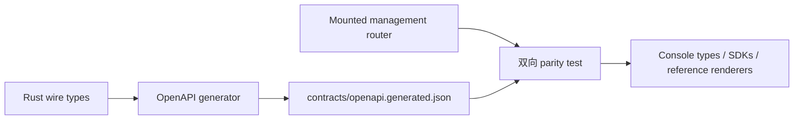

需要检查管理请求、生成 client 或审阅 API 变更时，使用
`contracts/openapi.generated.json`。它由 Rust wire types 生成，并与进程实际挂载的
router 校验。本页不复制它的字段或 operation。

以下两项检查都通过，artifact 才可以交给 consumer：

```console
scripts/contract/generate-contracts.sh --check
cargo test -p awaken-admin-config-api --features schema --test openapi_contract
```

第一条命令证明仓库中的 artifact 与 generator 一致；第二条命令双向证明文档与 mounted
router 一致。

## 先选择契约所有者

| 需要查什么 | 使用什么 |
| --- | --- |
| `/v1/config/*` 的精确字段与 operation | `contracts/openapi.generated.json` |
| 所有公共 route family | [公共 HTTP API](./api) |
| Managed Agents request/response type | 已测试的 Anthropic SDK 与[兼容页](../compatibility) |
| AI SDK、AG-UI、A2A、ACP 或 MCP payload | 对应的[协议页](../protocols/) |

生成契约覆盖 `/v1/config/*` 下的 provider connections、executable models、credentials、
pools、inference profiles、resolution 与 Agent resource bindings。其他 surface 继续使用
已有权威。

## 静态生成链



Wire types 拥有 schema，route registry 拥有 operation，parity test 防止任何一边变成第二份
不完整 API。

## 修改契约

在 Awaken 源码 checkout 中重新生成完整 contract bundle：

```console
scripts/contract/generate-contracts.sh
```

该脚本从同一来源写入 OpenAPI document、JSON Schemas 与 TypeScript types。OpenAPI
document 声明 `3.1.0`。不要手工编辑任何生成 artifact。

然后运行开头的两项检查。不同失败代表不同问题：

| 检查结果 | 含义 | 下一步 |
| --- | --- | --- |
| `--check` 报告 artifact 过期 | 源码与已提交生成文件不同 | 重新生成、审阅 generated diff，再运行检查 |
| 已文档化 operation 得到 routing `404` 或 `405` | 文档声明了 router 未挂载的 operation | 发布前修正 route registry 或 mount |
| mounted operation 缺失 | 运行 API 没有生成契约条目 | 生成 client 前把它加入 registry |
| schema reference 无法解析 | generated component graph 不完整 | 修正 wire schema 或 generator |

这些是变更门禁，不是运行故障。两项检查都通过且 consumer 可以读取固定版本 artifact
时，不需要维护者处理。

## 消费 artifact

```console
npx @redocly/cli lint contracts/openapi.generated.json
npx openapi-typescript contracts/openapi.generated.json -o management-api.d.ts
```

这些命令只是 consumer，不是新的 contract owner。生成 client 必须同时固定 Awaken 源码
revision，使部署可以重现当时使用的精确 schema。

## 相关

- [公共 HTTP API](./api)：所有公共 surface 的 route-family map；
- [Provider connection 指南](../how-to/configure-providers-models-credentials)：唯一 provider 写入路径；
- [模型发布与凭据边界](./provider-model-config)：发布时所有权与执行行为。
