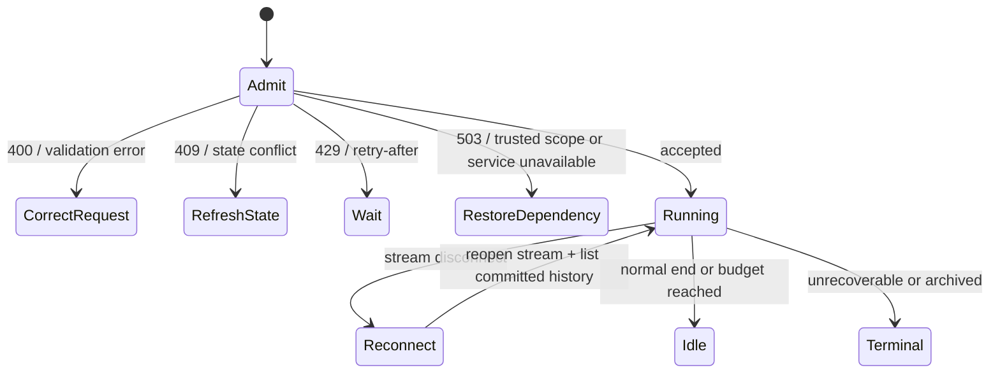

先看返回状态和已提交的 Session 历史。许多看起来像故障的结果，系统已经处理完毕，或者
本来就是策略决定。只有可观察契约要求改变请求、恢复依赖或作出显式业务决定时，才需要
动作。

## 先判断是否需要动作

| 可观察结果 | Awaken 会做什么 | 需要做什么 |
| --- | --- | --- |
| 带 `retry-after` 的 `429 rate_limit_error` | 拒绝本次 admission，bucket 随时间补充 | 等待 `retry-after`；同一 create intent 保留同一 idempotency key |
| stream 断开 | 保留已提交历史；live delta 仍是 preview | 重连并列出已提交历史；不要修复存储或 replay delta |
| 暂态 provider/tool 失败后成功 | 在对应执行策略内完成重试 | 本次 attempt 无需处理 |
| `session.budget_reached` | 只提交一次转换，并停止下一次模型请求 | 显式决定这项工作是否应获得新预算 |
| retry exhaustion | 提交文档定义的 terminal 或 indeterminate outcome | 只有业务意图仍需再次尝试时，才检查已提交事实 |
| 内容采集低于 requested level，并带 reason | 应用 deployment、request 与 consent 边界 | 除非要作出有授权的 policy 或 consent 变更，否则无需处理 |
| 重复的 erasure receipt | 幂等返回结果，不重建数据 | 无需处理 |

这些情况不需要修复步骤。下面解释具体限额，以及能够修正的少量 surfaced result。

## 静态结构

| 关注点 | 权威 | 可观察契约 |
| --- | --- | --- |
| Managed request admission | trusted Workspace resolution 后的 organization-scoped limiter | create/read bucket、response headers、`429 rate_limit_error`、`retry-after` |
| Session 成本 admission | Session-root budget state 与不可变 price snapshot | 累计 `session.usage`、一次 `session.budget_reached` 转换、达到上限后不再发起新模型请求 |
| Runtime failure | 对应 protocol 与 application service | 类型化 status 与 error envelope；不静默切换 backend 或 credential |
| 内容采集 | deployment ceiling × request × data-subject consent | effective capture 不超过最低允许级别，并返回 reason |
| 删除 | neutral data-subject aggregate | 返回 removed record 数量的幂等 receipt |

自托管部署拥有实现这些契约的持久化、备份、retention job、身份、网络与 secret-management
控制。Hosted delivery 可以提供这些控制，但不能改变应用可见状态机。

## Request limits

Managed API 默认 bucket 按 organization 计：

| Operation class | 默认容量 |
| --- | ---: |
| Create operations | 每分钟 300 次 |
| Read operations | 每分钟 1,200 次 |

计量 response 包含 `anthropic-ratelimit-requests-limit`、
`anthropic-ratelimit-requests-remaining` 与 `anthropic-ratelimit-requests-reset`；被拒绝的
request 还包含 `retry-after`。如果 edge 无法解析 trusted Workspace scope，或 limiter
不可用，admission 以 `503` fail closed，不能退回调用方自报 tenant。

## Session budget 与 usage

Managed Session 或 Deployment 可以设置 USD list-cost ceiling。Amount 是以最小货币单位表示的
正规范整数字符串。Awaken 冻结预算使用的 price input，累计核对模型与工具用量，并发出
`session.usage` snapshot。

累计 list cost 达到 ceiling 时，Awaken 只提交一次 `session.budget_reached`，并停止接受下一次
模型请求。Session 可以带 budget stop reason 回到 `idle`；达到预算不是成功业务结果，也不会
删除之前的历史。

## 动态行为

只有以下结果需要在自动收敛之外作出修正：

| 证据 | 需要的动作 |
| --- | --- |
| `400 invalid_request_error` | 修正字段、beta selector、数量或状态前提；禁止原样重试 |
| `409` conflict | 读取最新 resource/version，重新计算 command，仅在原 intent 仍成立时重试 |
| `503 api_error` | 确认 trusted Workspace resolution 与 deployment readiness；恢复 unavailable dependency 后再重试 |
| 显式 dead letter | 修正已记录原因；只有重复 external effect 安全时，才 requeue 一个指定 Run |

`503` 是 fail-closed。原样重复请求既不会产生合法 Workspace，也不会恢复 unavailable
service。显式 dead letter 也不是普通 retry exhaustion 的结果；只有经过审阅的 quarantine
命令才会产生它。

## 内容采集与删除

Effective capture 是三个独立边界的 meet：类型化 deployment ceiling、调用方 requested level
与 data-subject consent。没有 consent 时，full request 最多得到 structured capture；授予
consent 也不会强迫调用方请求 full capture。环境中的变量不是第二条配置路径。

Awaken 在 User Profiles 旁扩展 `POST /v1/user_profiles/{id}/erasure`。该命令需要 User
Profiles beta，返回 erasure receipt，并且幂等。未知 subject 没有 erasure authority，返回
`404`，而不是伪造成功删除。

Receipt 是完成标志。已有 subject 的 removed count 为零是合法结果，重复命令时也一样；
它不表示还需要运行某个隐藏 cleanup procedure。

## 相关

- [部署与运营 Awaken](../how-to/self-host)：拓扑、store、migration、secret 与 rollback；
- [生产可靠性](../concepts/production-reliability)：dispatch、fencing、恢复与 side-effect 边界；
- [Managed Agents 兼容性](../compatibility)：beta selector 与兼容资源族。
