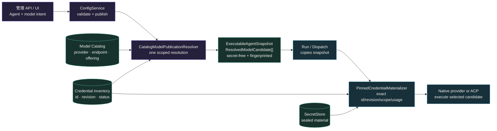
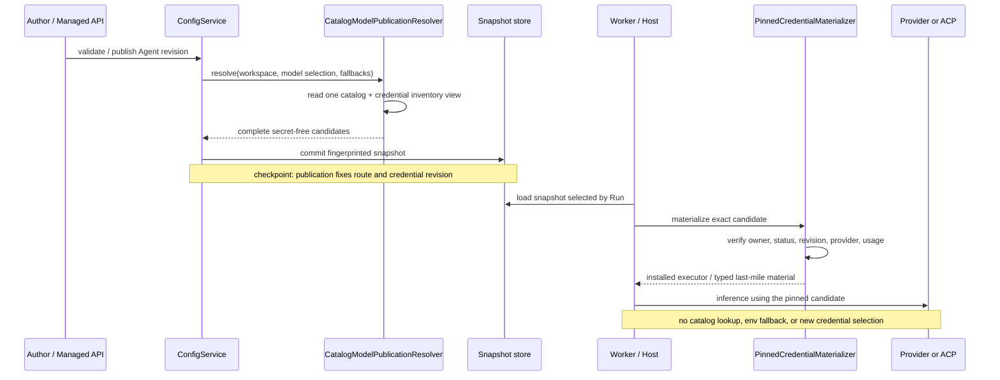

发布 Agent 前，需要用本页回答两个问题：

1. 每个候选会使用哪个 provider route、endpoint 和 credential revision？
2. Agent 发布以后，执行期能否改变这个选择？

第二个问题的答案是否定的。**配置平面负责选择，执行平面负责精确物化。** 一次 Agent
发布会把模型、provider 路由、endpoint、凭据引用和有序 fallback 候选冻结进
`ExecutableAgentSnapshot`。

具体的管理 API 操作放在
[配置 provider、模型与凭据](/zh/docs/agents/how-to/configure-providers-models-credentials/)；
那里不重复这些类型和边界。本页拥有架构与契约边界。

## 先决定应该修改哪里

| 想改变什么 | 在哪里修改 | 必须完成什么 |
| --- | --- | --- |
| provider metadata、endpoint 或 offering | Model Catalog 与 Provider Connection 路径 | 校验并重新发布 Agent |
| credential material 或 status | 通过管理 API 修改 credential store | 校验精确候选；pinned revision 改变时重新发布 |
| primary model 或 fallback 顺序 | Agent model selection | 校验并发布新的 Agent revision |
| 发布后的某个 Run | 不修改 catalog | 执行冻结候选，或返回类型化失败 |

## 静态结构：一份发布快照是唯一执行输入

| 所有者 | 持有的事实 | 不允许做的事 |
|---|---|---|
| Model Catalog | provider、协议 endpoint、offering、模型属性 | 保存明文凭据或决定某个 Run 的最终状态 |
| Config publication | 将编写意图解析为完整候选并计算 fingerprint | 把未解析引用交给 Runtime |
| `ResolvedModelCandidate` | 完整 `ModelBinding`、版本化 route pin、Workspace scope、精确 `CredentialAccess`、endpoint | 携带明文 |
| Materializer | 校验并打开快照已经指名的凭据 | 枚举凭据、改用新 revision、选择别的 route/holder |
| Runtime / ACP adapter | 执行已选择的候选 | 读取 catalog、从进程环境补配置、静默降级 |

`ModelBinding` 是小型运行身份：`provider_identity_ref + model_ref + backend_ref`。
`ResolvedModelCandidate` 在它之外补齐实际执行所需、但仍然无密钥的 provisioning 事实。
本地 provider、兼容网关和自托管 endpoint 都属于同一种 `Provider` 候选；只有测试或显式
嵌入式组合使用 `HostExecutor`。

## 动态行为：发布时选择一次，执行时只做精确校验

模型级编写（只填写 `model_ref`）只在发布边界被补全：恰好一个 Active offering 匹配时
成功，没有匹配或存在歧义都会拒绝发布。显式 provider/backend 轴不会被重写。
primary 与 fallback 的顺序同样属于快照 fingerprint；运行期只能在这组已发布候选中
执行，不能去全局目录寻找替代品。

## 先读结果，再改变配置

| 可观察结果 | 系统行为 | 需要的动作 |
| --- | --- | --- |
| 发布报告没有匹配或存在多个匹配 | 不发布 snapshot | 让 model selection 无歧义，再重新校验 |
| 暂态 attempt 失败，同一 endpoint 重试成功 | selected candidate 不变 | 无需动作；这是正常重试 |
| 已冻结的 fallback candidate 成功 | 执行期只使用下一个已发布候选 | 本次 Run 无需处理；只有重复发生时再审阅 primary |
| 物化过程拒绝 credential owner、status、revision、provider 或 usage | 在使用其他 credential material 前 fail closed | 修正 response 指出的 credential fact，并发布固定预期 revision 的 snapshot |
| 所有冻结候选都已耗尽 | Run 进入文档定义的失败或 indeterminate outcome | 先检查已提交 Run，再决定新 attempt 是否安全 |

不要为了让某个 Run 继续而搜索全局 catalog 或注入环境值。这样会产生第二条选择路径，
使 replay 描述的执行不同于 published fingerprint。

## 1.0-dev 已实现的边界

- `ConfigService` 构造时必须获得一个 `ModelPublicationResolver`，不存在隐式 provider
  fallback。
- `CatalogModelPublicationResolver` 在 Workspace 范围内生成完整、无密钥的
  `ResolvedModelCandidate`。
- `CredentialKind::Env` 只为旧数据解码保留；新建和物化都失败关闭。环境变量只能产生
  无密钥的编写建议，不能成为运行配置。
- Native 与 ACP 共用 `PinnedCredentialMaterializer`，并校验精确 credential id、revision、
  Workspace、provider、status 和 usage。
- 管理 API 的 inference profile / credential-pool resolve 是**运营 dry-run**。它可以验证
  目录和凭据组合，但不是 Run 的第二份执行权威；发布快照才是。

推理重试与发布候选 fallback 也不是同一件事：前者重试同一已选 endpoint 的暂态失败；
后者只能切换到快照中已经冻结的下一个完整候选。

## 相关

- [配置 provider、模型与凭据](/zh/docs/agents/how-to/configure-providers-models-credentials/)
- [通过 API 选择模型与 ACP runtime](/zh/docs/agents/how-to/select-models-and-acp-runtimes/)
- [Agents 架构](/zh/docs/agents/concepts/architecture/)
- [治理](/zh/docs/agents/concepts/governance/)
