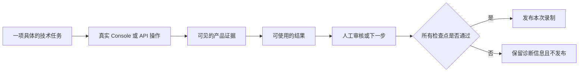

六条视频回答不同的产品问题。请按你正在解决的问题选择，不必依次观看。

演示使用受控测试输入。SDK 调用、Session、Console 状态、工具执行、审批边界、
服务重启和产物都来自正在运行的 Release 构建。部分故事采用固定的 Agent 响应，
避免演示结果依赖模型是否主动调用工具；视频会在适用时明确说明。这些内容是产品
演示，不是已上线的客户案例。

## 选择一条故事

| 故事 | 展示的任务 | 画面中的证据 | 看完得到什么 |
| --- | --- | --- | --- |
| 从证据到决定 | 读取固定证据文件，返回可审核决定 | 只读输入、工具 Trace、有依据的 `HOLD`、后续动作和保留的审批权 | Awaken 能交付可追踪结果，而不是没有来源的回答 |
| 完全在 Console 中构建 | 配置 API 兼容性审查 Agent，用破坏性接口变更测试它，再发布已审阅版本 | 模型、指令、工具、权限、资源、上下文、两种协议视图、兼容性结论和发布差异 | Agent 的重要控制项在精确版本可复用前都能在 UI 中查看和审查 |
| 使用 Anthropic SDK 接入 | 从 Anthropic Managed Agents 客户端开始工作，并在 Console 检查同一 Session | 官方 SDK 请求、已提交事件、同一 Session 标识和 Console 回读 | 现有后端可以接入，不必创建第二套历史模型 |
| 人工控制的动作 | 检查固定的仓库源码，并准备受保护的审核产物 | 源码 revision 与哈希、已完成读取、等待中的写入、人工批准和可下载产物 | Agent 可以到达有后果的工具，同时由人保留权限 |
| 跨重启继续 | 工作项等待批准时重启 Awaken，然后继续原任务 | 原 Session、待审批动作、新 AllInOne 进程、一次恢复写入和附属产物 | 已接受的工作及其审批边界可以跨常规服务恢复保留 |
| 定期运行 | 把仓库快照变成持续执行的异常简报 | 只读快照、Deployment、立即运行、独立结果 Session 和人工下一步 | 经过测试的 Agent 可以成为持续工作，而不是不可见的 cron 任务 |

这组视频覆盖一条完整旅程：构建 Agent、接入应用、执行真实工作、保留受保护动作的
人工权限、恢复已提交工作，并把验证过的 Agent 变成定期任务。

## 什么样的视频可以发布

公开视频必须有具体任务、可使用的结果、可见的人工控制点和明确的下一步。无需编造
客户、岗位、截止时间或紧急事件来增加戏剧性。

只有新的 Release 录制通过全部检查点，成片才是当前结果。如果依赖、产品操作或断言
失败，本次运行会保留诊断信息并拒绝发布；之前成功的旧文件不能替代本次失败结果。

本页引用的源码证据用于证明产品机制，不能证明某个 MP4 已通过。录制命令随 Release
产物维护，不在本页公开。检查点失败时，本次运行没有建立所声称的效果，也不会发布
当前成片。

## 检查视频证明了什么

在依据演示做出判断前，请确认画面中有四项内容：

1. 开场说明任务和最终结果。
2. 每项表述都指向可见的 Console 或 API 证据。
3. 结尾用产物、决定或下一步完成闭环。
4. 录制说明验证时使用的 Awaken revision。

先通过 [Awaken 入门](/zh/docs/agents/get-started/) 复现基础旅程，再根据所选视频阅读
[构建 Agent](/zh/docs/agents/how-to/configure-agent-behavior/)、
[接入应用](/zh/docs/agents/protocols/) 或
[管理 Session](/zh/docs/agents/how-to/manage-a-session/)。

在 [Awaken 仓库](https://github.com/AwakenWorks/awaken) 中查看实现。如果这些证据有助于
评估，请 Star 仓库，让其他团队也能找到它。
